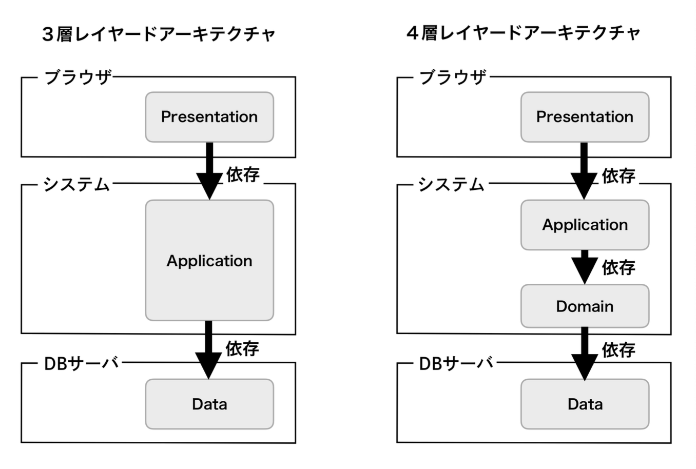
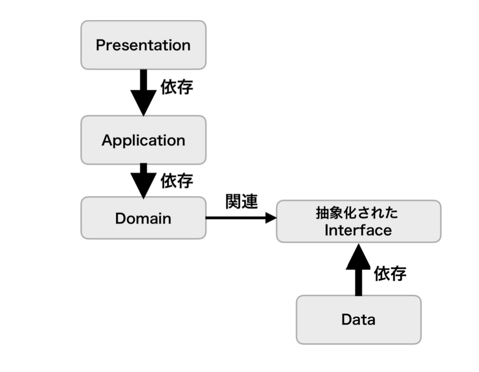
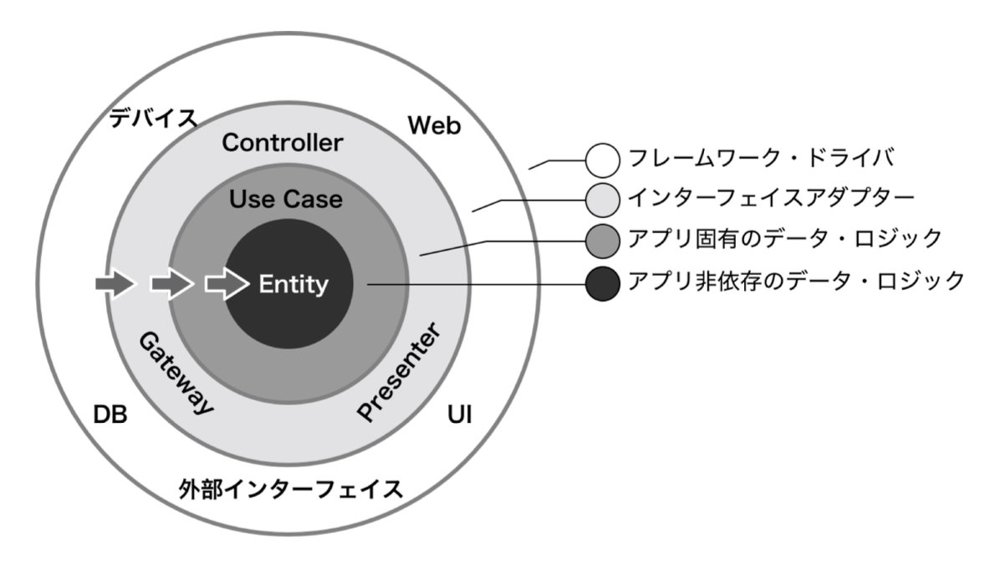
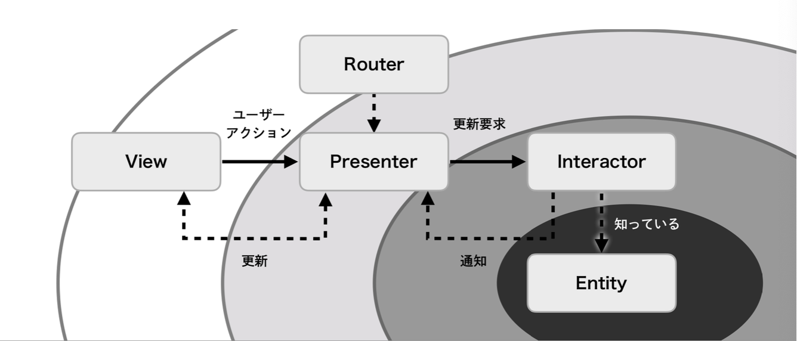

# アーキテクチャパターン

## 2種類のアーキテクチャ

* **GUIアーキテクチャ**
  * システム本来の関心領域(ドメイン)を、UI(プレゼンテーション)から引き離した(**PDS: Presentation Domain Separation**)構造パターン
  * UIにもシステム本来の関心にも該当しない処理については考慮しない

* **システムアーキテクチャ**
  * UIという単位にとらわれず、システム全体の構造を示す構造パターン

### GUIアーキテクチャ

**「プレゼンテーションは、どのようにコンポーネントをレイアウト情報を装飾するかに興味があり、ドメインは、情報をどのようにモデリングし処理するかに興味がある。関心が違うならばレイヤーとして切り分けるべきだ」というコンセプト**

* プレゼンテーションとドメインのレイヤーを分離するメリット
  1. 理解がしやすい
  2. 分業がしやすい
  3. 重複コードの排除
  4. テスタビリティの向上

### システムアーキテクチャ

**ドメインの先でどのようにレイヤーを切り分けるべきか、システム全体をどのように接合すべきかを表す**

#### レイヤードアーキテクチャ

* 3層・4層レイヤードアーキテクチャ

* 最終形態のレイヤードアーキテクチャ

#### Clean Architecture

#### VIPER

**Clean Architecture + MVP(Passive View) + Router**

