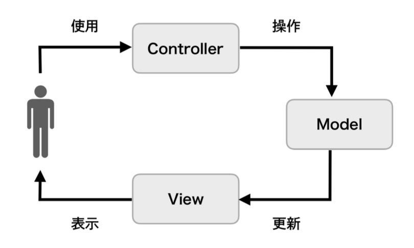

# MVC



## 概要

**プログラムを「入力」「出力」「データの処理」の3つの要素に分けることで、アプリケーションの処理から入力と出力とを分離・独立させてプログラムの本質である「データ処理」そのものに専念しやすくするのを抽象化したアーキテクチャ**

### メリット

* ViewとModelが完全に独立しているため再利用性が高くなる

### デメリット

* Controllerが他のすべてを参照して処理をするため、再利用性が低くなる

### Model

**各種ビジネスロジックのかたまり**

### View

**画面の描画を担当する**

### Controller

**何かしらの入力に対する適切な処理を行うだけでなく、ModelオブジェクトとViewオブジェクトも保持する。Modelオブジェクトに処理を依頼し、受け取った結果を使ってViewオブジェクトへ描画を指示する**

### SwiftUIとの共存

SwiftUIではView自身が状態の変更を監視して更新する機能を備えているため、Controllerの役割がなくなってModelとViewだけで実現可能になっている

## サンプルアプリ

**GitHub内のリポジトリを検索する**

### App

* API

``` swift
enum APIError: Error {
    case badURL
    case badRequest
    case decodeError
    case unknown
}

final class APIClient {
    func fetch(query: String) async throws -> [GitHubRepositoryEntity.Item] {
        let query = query.addingPercentEncoding(
            withAllowedCharacters: .urlQueryAllowed
        ) ?? ""

        guard let url = URL(
            string: "https://api.github.com/search/repositories?q=\(query)"
        ) else {
            throw APIError.badURL
        }

        let (data, response) = try await URLSession.shared.data(from: url)

        guard
            let httpResponse = response as? HTTPURLResponse,
            httpResponse.statusCode == 200
        else {
            throw APIError.badRequest
        }

        do {
            return try JSONDecoder().decode(
                GitHubRepositoryEntity.self,
                from: data
            ).items
        } catch {
            throw APIError.decodeError
        }
    }
}
```

### Entity

``` swift
struct GitHubRepositoryEntity: Codable {
    let items: [Item]

    struct Item: Codable, Hashable {
        let id: Int
        let name: String
        let description: String?
    }
}
```

### Model

``` swift
final class GitHubRepositoryModel: ObservableObject {
    @Published var repositories: [GitHubRepositoryEntity.Item] = []

    private let apiClient: APIClient

    init(apiClient: APIClient) {
        self.apiClient = apiClient
    }

    func fetch(query: String) async {
        do {
            let response = try await apiClient.fetch(query: query)

            Task { @MainActor in
                repositories = response
            }
        } catch {
            print(error.localizedDescription)
        }
    }
}
```

``` swift
struct GitHubRepositoryView: View {
    @StateObject var model: GitHubRepositoryModel

    init(model: GitHubRepositoryModel) {
        self._model = .init(wrappedValue: model)
    }

    var body: some View {
        List(model.repositories, id: \.self) { repository in
            Text(repository.name)
                .bold()
        }
        .task {
            await model.fetch(query: "Swift")
        }
    }
}
```

### 構築

* 起動

``` swift
@main
struct MyApp: App {
    var body: some Scene {
        WindowGroup {
            GitHubRepositoryView(
                model: GitHubRepositoryModel(
                    apiClient: APIClient()
                )
            )
        }
    }
}
```