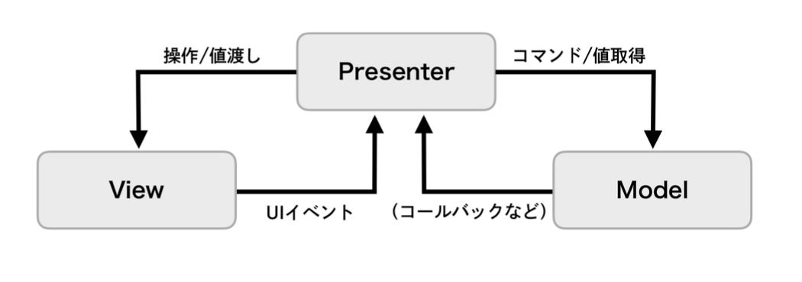
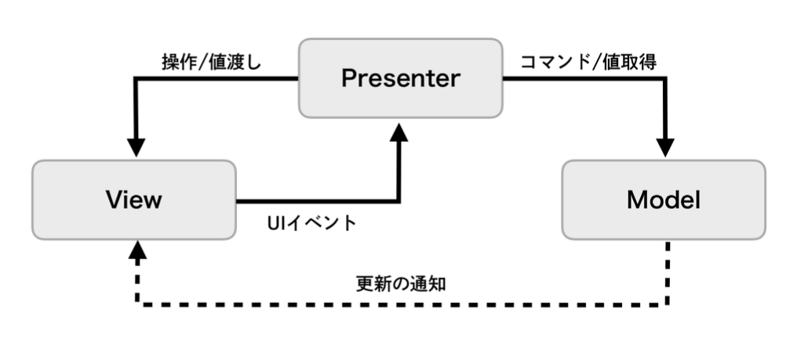

# MVP

* Passive View



* Supervising Controller



## 概要

**画面の描画処理とプレゼンテーションロジックとを分離するGUIアーキテクチャ**

### メリット

* テストの容易性と作業分担がしやすくなる
  * 保守をしやすくする

* Presenterがプレゼンテーションロジックを持つので、テストがしやすくなる

### デメリット

* Passive Viewの場合は簡易な処理でも必ずPresenterを介してModelに処理を受け渡すことになるため、処理が冗長になる可能性がある

### データの同期方法

**フロー同期**

* 上位レイヤーのデータを下位レイヤーに都度セットしてデータを同期する(手続き的な同期方法)
* 【メリット】データフローが追いやすくなる(画面間のデータ共有などでは、隣り合った画面の遷移先の画面(上位レイヤー)が遷移元の画面(下位レイヤー)の参照を持ちやすいため)
* 【デメリット】共通したデータを参照しているすべての箇所の参照を持たないといけないため、参照の管理が煩雑になる

**オブザーバー同期**

* 監視元である下位レイヤーが監視先である上位レイヤーからObserverパターンを使って送られるイベント通知を受け取ってデータを同期する(宣言的な同期方法)
* 【メリット】共通した監視先を持つ複数の箇所で、データを同期しやすい(お気に入りのデータ管理など、複数のタブや階層が離れた画面においても、それぞれの画面が共通のデータ領域の変更を監視しているため、同期箇所で他の画面の参照を持つ必要がない)
* 【デメリット】データが変更されるたびに同期処理が実行されるため、いつデータが同期されるか追いづらくなる

### Model

**UIに関係しない純粋なドメインロジックやそのデータを持つ。画面表示がどのようなものでも共通な、アプリの機能実現のための処理が置かれる(他のコンポーネントに依存しない)**

### Presenter

**ViewとModelを仲介し、プレゼンテーションロジックを担当する。Modelはアプリのビジネスロジックを知っているが、それが画面上でどのように表示されるかを知るべきでない。Viewをシンプルにするために、複雑なプレゼンテーションをジックを持たせたくはないが、Modelに画面表示に関するロジックを持たせたくないため使用する**

### View

**ユーザー操作の受け付けと、画面表示を担当する**

### SwiftUIとの共存

SwiftUIではView自身が状態の変更を監視して更新する機能を備えているため、従来のようにPresenterがViewのためのインターフェースを保持するのではなく、ViewがPresenterを保持してPresenter内の値をデータバインディングで値を検知・更新するのが良さそうになる。MVCと比較してPresenterでプレゼンテーションロジックを保持できる。

## サンプルアプリ

**GitHub内のリポジトリを検索する**

### App

* API

``` swift
enum APIError: Error {
    case badURL
    case badRequest
    case decodeError
    case unknown
}

final class APIClient {
    func fetch(query: String) async throws -> [GitHubRepositoryEntity.Item] {
        let query = query.addingPercentEncoding(
            withAllowedCharacters: .urlQueryAllowed
        ) ?? ""

        guard let url = URL(
            string: "https://api.github.com/search/repositories?q=\(query)"
        ) else {
            throw APIError.badURL
        }

        let (data, response) = try await URLSession.shared.data(from: url)

        guard
            let httpResponse = response as? HTTPURLResponse,
            httpResponse.statusCode == 200
        else {
            throw APIError.badRequest
        }

        do {
            return try JSONDecoder().decode(
                GitHubRepositoryEntity.self,
                from: data
            ).items
        } catch {
            throw APIError.decodeError
        }
    }
}
```

### Entity

``` swift
struct GitHubRepositoryEntity: Codable {
    let items: [Item]

    struct Item: Codable, Hashable {
        let id: Int
        let name: String
        let description: String?
    }
}
```

### Model

``` swift
final class GitHubRepositoryModel: ObservableObject {
    @Published var repositories: [GitHubRepositoryEntity.Item] = []

    private let apiClient: APIClient

    init(apiClient: APIClient) {
        self.apiClient = apiClient
    }

    func fetch(query: String) async {
        do {
            let response = try await apiClient.fetch(query: query)

            await MainActor.run {
                repositories = response
            }
        } catch {
            print(error.localizedDescription)
        }
    }
}
```

### Presenter

``` swift
final class GitHubRepositoryPresenter: ObservableObject {
    @Published var repositories: [GitHubRepositoryEntity.Item] = []

    private let model: GitHubRepositoryModel

    init(model: GitHubRepositoryModel) {
        self.model = model
    }

    func fetch(query: String) async {
        do {
            let response = try await model.fetch(query: query)

            await MainActor.run {
                repositories = response
            }
        } catch {
            print(error.localizedDescription)
        }
    }
}
```

### View

``` swift
struct GitHubRepositoryView: View {
    @StateObject var presenter: GitHubRepositoryPresenter

    init(presenter: GitHubRepositoryPresenter) {
        self._presenter = .init(wrappedValue: presenter)
    }

    var body: some View {
        List(presenter.repositories, id: \.self) { repository in
            Text(repository.name)
                .bold()
        }
        .task {
            await presenter.fetch(query: "Swift")
        }
    }
}
```

### 構築

* 起動

``` swift
@main
struct MyApp: App {
    var body: some Scene {
        WindowGroup {
            GitHubRepositoryView(
                presenter: GitHubRepositoryPresenter(
                    model: GitHubRepositoryModel(
                        apiClient: APIClient()
                    )
                )
            )
        }
    }
}
```