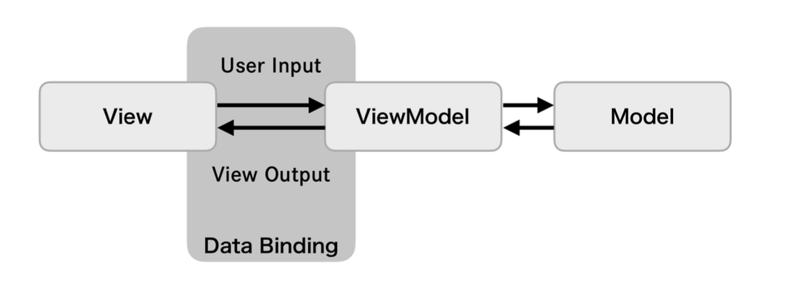

# MVVM



## 概要

**画面の描画処理とプレゼンテーションロジックとを分離するGUIアーキテクチャ。GUI構造をModel/ View / ViewModelの3つに分け、画面の描画処理をViewに、画面描画のロジックをViewModelのコンポーネントに閉じ込める**

### メリット

* 関数型リアクティブプログラミングと相性が良い
  * 手続き的ではなく宣言的にロジックを表現できる

### デメリット

* 関数型リアクティブプログラミングの学習コストがかかる

### データバインディング

データバインディングは2つのデータの状態を監視し同期する仕組みで、片方のデータ変更をもう一方が検知して、データを自動的に更新する。ViewとViewModelはデータバインディングで関連付けられる

宣言的なバインディングにより、ViewModel自身の状態を更新するだけでViewの描画処理が発火するため、ViewModel内にViewに対する手続き的な描画指示を書く必要がなくなる

### Model

**UIに関係しない純粋なドメインロジックやそのデータを持つ。画面表示がどのようなものでも共通な、アプリの機能実現のための処理が置かれる(他のコンポーネントに依存しない)**

### ViewModel

**ViewとModelを仲介し、プレゼンテーションロジックを担当する。画面表示のために必要な状態とロジックを担う。Viewの状態と自身が持つ状態はデータバインディングで関連付けることで状態を更新するため、Viewの参照を保持しない**

* Viewに表示するためのデータを保持する
* Viewからイベントを受け取り、Modelの処理を呼び出す
* Viewからイベントを受け取り、加工して値を更新する

### View

**ユーザー操作の受け付けと、画面表示を担当する。ViewModelが保持する状態とデータバインディングし、ユーザー入力に応じてViewModelが自身が保持するデータを加工・更新することで、バインディングした画面表示を更新する**

## サンプルアプリ

**GitHub内のリポジトリを検索する**

### App

* API

``` swift
enum APIError: Error {
    case badURL
    case badRequest
    case decodeError
    case unknown
}

final class APIClient {
    func fetch(query: String) async throws -> [GitHubRepositoryEntity.Item] {
        let query = query.addingPercentEncoding(
            withAllowedCharacters: .urlQueryAllowed
        ) ?? ""

        guard let url = URL(
            string: "https://api.github.com/search/repositories?q=\(query)"
        ) else {
            throw APIError.badURL
        }

        let (data, response) = try await URLSession.shared.data(from: url)

        guard
            let httpResponse = response as? HTTPURLResponse,
            httpResponse.statusCode == 200
        else {
            throw APIError.badRequest
        }

        do {
            return try JSONDecoder().decode(
                GitHubRepositoryEntity.self,
                from: data
            ).items
        } catch {
            throw APIError.decodeError
        }
    }
}
```

### Entity

``` swift
struct GitHubRepositoryEntity: Codable {
    let items: [Item]

    struct Item: Codable, Hashable {
        let id: Int
        let name: String
        let description: String?
    }
}
```

### Model

``` swift
final class GitHubRepositoryModel: ObservableObject {
    @Published var repositories: [GitHubRepositoryEntity.Item] = []

    private let apiClient: APIClient

    init(apiClient: APIClient) {
        self.apiClient = apiClient
    }

    func fetch(query: String) async {
        do {
            let response = try await apiClient.fetch(query: query)

            await MainActor.run {
                repositories = response
            }
        } catch {
            print(error.localizedDescription)
        }
    }
}
```

### ViewModel

``` swift
final class GitHubRepositoryViewModel: ObservableObject {
    @Published var repositories: [GitHubRepositoryEntity.Item] = []

    private let model: GitHubRepositoryModel

    init(model: GitHubRepositoryModel) {
        self.model = model
    }

    func fetch(query: String) async {
        do {
            let response = try await model.fetch(query: query)

            await MainActor.run {
                repositories = response
            }
        } catch {
            print(error.localizedDescription)
        }
    }
}
```

### View

``` swift
struct GitHubRepositoryView: View {
    @StateObject var viewModel: GitHubRepositoryViewModel

    init(viewModel: GitHubRepositoryViewModel) {
        self._viewModel = .init(wrappedValue: viewModel)
    }

    var body: some View {
        List(viewModel.repositories, id: \.self) { repository in
            Text(repository.name)
                .bold()
        }
        .task {
            await viewModel.fetch(query: "Swift")
        }
    }
}
```

### 構築

* 起動

``` swift
@main
struct MyApp: App {
    var body: some Scene {
        WindowGroup {
            GitHubRepositoryView(
                viewModel: GitHubRepositoryViewModel(
                    model: GitHubRepositoryModel(
                        apiClient: APIClient()
                    )
                )
            )
        }
    }
}
```