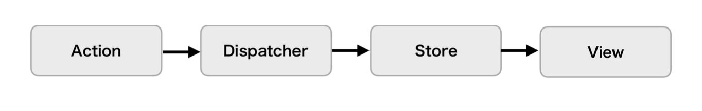
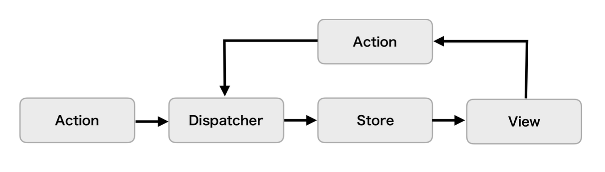
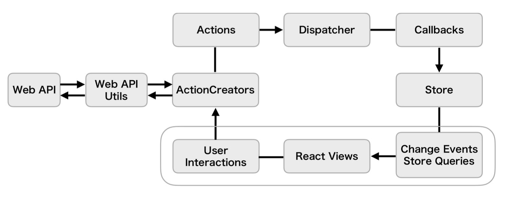
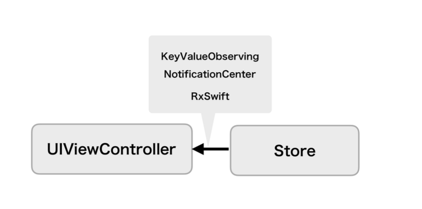
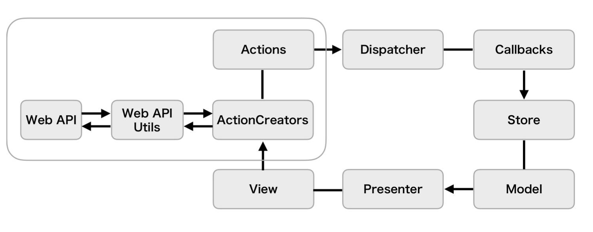
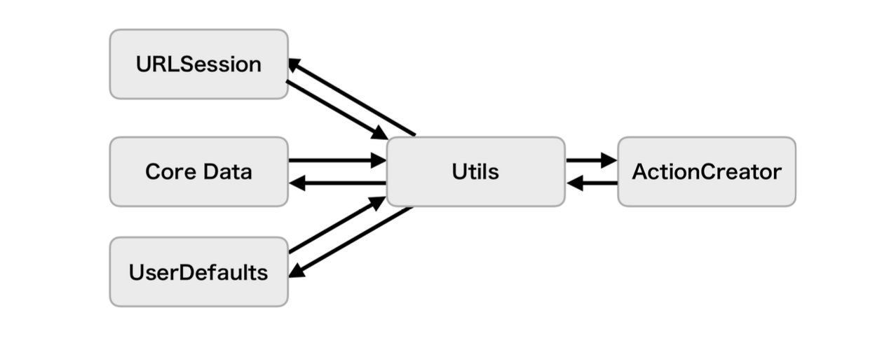
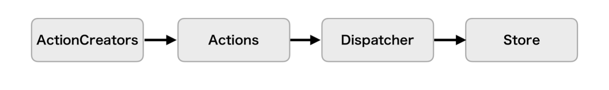
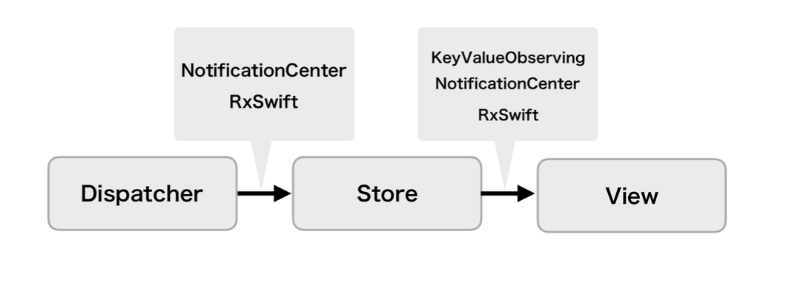

# Flux





## 概要

**データフローが単一方向であるGUIアーキテクチャ**

### メリット

* Action・Dispatcher・Store・Viewの4つのコンポーネントと、データフローが単一方向という制約で構成されるため、どこで状態の変更が起きているのかの見通しが立てやすくなる

* それぞれのコンポーネントが独立しているため、スケールがしやすい

### デメリット

* 学習コストがかかる

* アプリの規模が大きくなるにつれて、Actionが肥大化していく

* Storeを変更するために、Actionを生成しDispatcherを通すというフローに対して、アプリの規模次第では煩わしさを感じる場合がある

### Viewの構成とデータフロー



UIViewControllerやUIViewがViewの役割を果たし、ユーザーの入力によるユーザーインタラクションとして扱う。例えば、ボタンのアクションなどからユーザーの入力を受け取ることで、Viewのデータフローが発生する。

状態を管理するのはStoreの役割であるため、Viewが状態を持つことはない。Viewへ向かうデータフローは、Storeの状態をViewに反映するデータフローとなる。そのため、状態に関するコードを記述する必要がなくなり、肥大化を避けることができる。



### Action(Action Creator)の構成とデータフロー



ActionCreatorは以下の役割を持ったコンポーネントになる。

* 何らかの処理を行い、その結果からActionの生成
* 生成したActionをDispatcherへ送信

データフローは、ユーザーの入力をもとにActionCreatorの実行を処理する。ActionCreatorはAPIサーバやローカル上からデータを取得し、取得したデータをもとにActionを生成し、Dispatcherに送信する。



### Dispatcherの構成とデータフロー



ActionCreatorからActionを受け取りStoreに伝える。

StoreにActionを伝える方法は以下のようになる。

* Dispatcher内のregister(callback:)をStore側から呼び出し、Callbackを登録してActionを受け取る
* ActionCreatorがDispatcherにActionを送信する際に、Dispatcherのdispatch(_:)を呼び出してActionを送信し、Dispatcherのregister(callback:)で登録されているすべてのStoreに対してCallbackを通じてActionを伝える

### Storeの構成とデータフロー



DispatcherからActionを受け取り、Actionのtypeとdataをもとに自身の状態を更新する。最終的にその状態がViewに反映される。

## サンプルアプリ

**GitHub内の特定のキーワードに対してのリポジトリを表示する**

### App

* Service

``` swift
enum APIServiceError: Error {
    case responseError
    case parseError(Error)
}

protocol APIRequestType {
    associatedtype Response: Decodable

    var path: String { get }
    var queryItems: [URLQueryItem]? { get }
}

protocol APIServiceType {
    func response<Request>(from request: Request) -> AnyPublisher<
        Request.Response,
        APIServiceError
    > where Request: APIRequestType
}

final class APIService: APIServiceType {
    private let baseURL: URL

    init(baseURL: URL = .init(string: "https://api.github.com")!) {
        self.baseURL = baseURL
    }

    func response<Request>(from request: Request) -> AnyPublisher<
        Request.Response,
        APIServiceError
    > where Request: APIRequestType {
        let pathURL = URL(string: request.path, relativeTo: baseURL)!

        var urlComponents = URLComponents(
            url: pathURL,
            resolvingAgainstBaseURL: true
        )!
        urlComponents.queryItems = request.queryItems

        var request = URLRequest(url: urlComponents.url!)
        request.addValue(
            "application/json",
            forHTTPHeaderField: "Content-Type"
        )

        let decoder = JSONDecoder()
        decoder.keyDecodingStrategy = .convertFromSnakeCase

        return URLSession.shared.dataTaskPublisher(for: request)
            .map { data, _ in data }
            .mapError { _ in APIServiceError.responseError }
            .decode(type: Request.Response.self, decoder: decoder)
            .mapError(APIServiceError.parseError)
            .receive(on: DispatchQueue.main)
            .eraseToAnyPublisher()
    }
}

enum ExperimentKey: String {
    case showIcon
}

protocol ExperimentServiceType {
    func experiment(for key: ExperimentKey) -> Bool
}

final class ExperimentService: ExperimentServiceType {
    func experiment(for key: ExperimentKey) -> Bool {
        // call api to get variant for the key
        true
    }
}

enum TrackEventType {
    case listView
}

protocol TrackerType {
    func log(type: TrackEventType)
}

final class TrackerService: TrackerType {
    func log(type: TrackEventType) {
        // ログ送信
    }
}
```

### Request

``` swift
struct SearchRepositoryRequest: APIRequestType {
    typealias Response = SearchRepositoryResponse

    var path: String {
        "/search/repositories"
    }

    var queryItems: [URLQueryItem]? {
        [
            .init(name: "q", value: "SwiftUI"),
            .init(name: "order", value: "desc")
        ]
    }
}
```

### Entity

``` swift
struct SearchRepositoryResponse: Decodable {
    var items: [Repository]
}

struct Repository: Decodable, Hashable, Identifiable {
    var id: Int64
    var fullName: String
    var description: String?
    var stargazersCount = 0
    var language: String?
    var owner: User
}

struct User: Decodable, Hashable, Identifiable {
    var id: Int64
    var login: String
    var avatarUrl: URL
}
```

### ActionCreator

``` swift
final class GitHubActionCreator {
    private var cancellables = [AnyCancellable]()

    private let dispatcher: GitHubListDispatcher
    private let apiService: APIServiceType
    private let trackerService: TrackerType
    private let experimentService: ExperimentServiceType

    private let trackingSubject = PassthroughSubject<TrackEventType, Never>()
    private let responseSubject = PassthroughSubject<SearchRepositoryResponse, Never>()
    private let errorSubject = PassthroughSubject<APIServiceError, Never>()
    private let onAppearSubject = PassthroughSubject<Void, Never>()

    init(
        dispatcher: GitHubListDispatcher = .shared,
        apiService: APIServiceType = APIService(),
        trackerService: TrackerType = TrackerService(),
        experimentService: ExperimentServiceType = ExperimentService()
    ) {
        self.dispatcher = dispatcher
        self.apiService = apiService
        self.trackerService = trackerService
        self.experimentService = experimentService

        bindData()
        bindActions()
    }

    private func bindData() {
        let responsePublisher = onAppearSubject
            .flatMap { [apiService] _ in
                apiService.response(from: SearchRepositoryRequest())
                    .catch { [weak self] error -> Empty<SearchRepositoryResponse, Never> in
                        self?.errorSubject.send(error)
                        return .init()
                    }
            }

        let responseStream = responsePublisher
            .share()
            .subscribe(responseSubject)

        let trackingDataStream = trackingSubject
            .sink(receiveValue: trackerService.log)

        let trackingStream = onAppearSubject
            .map { .listView }
            .subscribe(trackingSubject)

        cancellables += [
            responseStream,
            trackingDataStream,
            trackingStream
        ]
    }

    private func bindActions() {
        let responseDataStream = responseSubject
            .map(\.items)
            .sink { [dispatcher] in
                dispatcher.dispatch(.updateRepositories($0))
            }

        let errorDataStream = errorSubject
            .map { error -> String in
                switch error {
                case .responseError: "network error"
                case .parseError: "parse error"
                }
            }
            .sink { [dispatcher] in
                dispatcher.dispatch(.updateErrorMessage($0))
            }

        let errorStream = errorSubject
            .map { _ in }
            .sink { [dispatcher] in
                dispatcher.dispatch(.showError)
            }

        let experimentStream = onAppearSubject
            .filter { [experimentService] _ in
                experimentService.experiment(for: .showIcon)
            }
            .sink { [dispatcher] in
                dispatcher.dispatch(.showIcon)
            }

        cancellables += [
            responseDataStream,
            errorDataStream,
            errorStream,
            experimentStream
        ]
    }

    func onAppear() {
        onAppearSubject.send(())
    }
}
```

### Action

``` swift
enum GitHubListAction {
    case updateRepositories([Repository])
    case updateErrorMessage(String)
    case showError
    case showIcon
}
```

### Dispatcher

``` swift
final class GitHubListDispatcher {
    static let shared = GitHubListDispatcher()

    private var cancellables = [AnyCancellable]()

    private let actionSubject = PassthroughSubject<GitHubListAction, Never>()

    func register(callback: @escaping (GitHubListAction) -> Void) {
        let actionStream = actionSubject.sink(receiveValue: callback)
        cancellables += [actionStream]
    }

    func dispatch(_ action: GitHubListAction) {
        actionSubject.send(action)
    }
}
```

### Store

``` swift
final class GitHubListStore: ObservableObject {
    static let shared = GitHubListStore()

    @Published private(set) var repositories: [Repository] = []
    @Published private(set) var errorMessage = ""
    @Published var isShownError = false
    @Published var shouldShowIcon = false

    init(dispatcher: GitHubListDispatcher = .shared) {
        dispatcher.register { [weak self] action in
            guard let self else {
                return
            }

            switch action {
            case let .updateRepositories(repositories):
                self.repositories = repositories
            case let .updateErrorMessage(message):
                self.errorMessage = message
            case .showError:
                self.isShownError = true
            case .showIcon:
                break
            }
        }
    }
}
```

### View

``` swift
struct GitHubListView: View {
    @StateObject var store: GitHubListStore = .shared

    @State private var path = [Repository]()

    private var actionCreator: GitHubActionCreator

    init(actionCreator: GitHubActionCreator = .init()) {
        self.actionCreator = actionCreator
    }

    var body: some View {
        NavigationStack(path: $path) {
            List(store.repositories) { repository in
                NavigationLink(value: repository) {
                    Text(repository.fullName)
                }
            }
            .alert("Error", isPresented: $store.isShownError) {}
            .navigationTitle(Text("Repositories"))
            .navigationDestination(for: Repository.self) { repository in
                GitHubRowView(repository: repository, path: $path)
            }
        }
        .onAppear {
            actionCreator.onAppear()
        }
    }
}

struct GitHubRowView: View {
    var repository: Repository

    @Binding var path: [Repository]

    var body: some View {
        VStack(spacing: 32) {
            Text(repository.fullName)
                .font(.title)

            Button("戻る") {
                path.removeLast()
            }
        }
    }
}
```

### 構築

* 起動

``` swift
@main
struct MyApp: App {
    var body: some Scene {
        WindowGroup {
            GitHubListView()
        }
    }
}
```