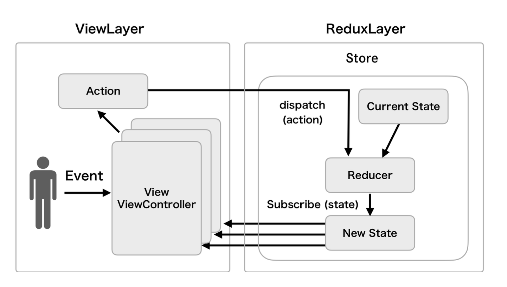
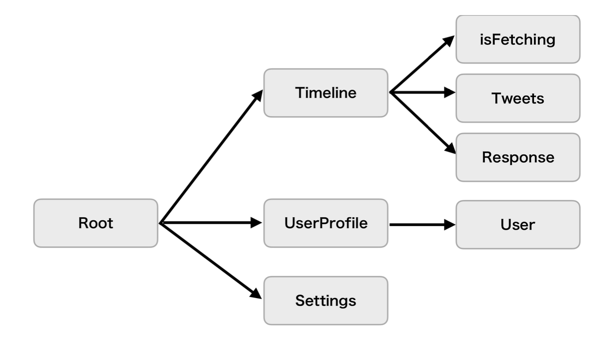
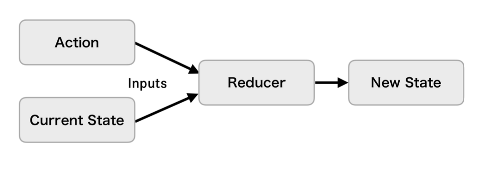
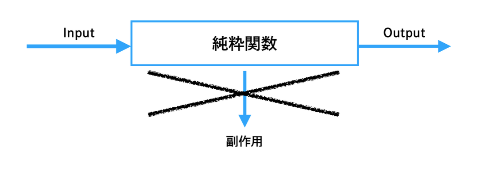
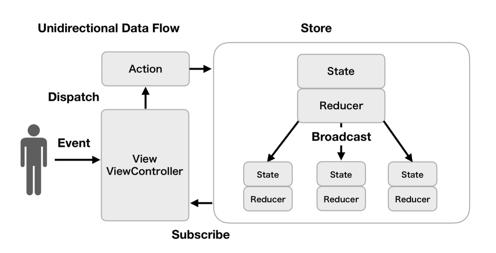

# Redux

## 概要

**複雑性に起因してアプリケーションの状態がいつ、どうして、どのように更新されるのかをコントロールし把握・理解することは困難になっている。複雑性の根源を変化と非同期性を混合することになると考え、これらの課題を解決して状態変化を予測可能にしたGUIアーキテクチャ**

* Fluxアーキテクチャの情報の伝播を1方向に制限する特徴と踏襲し、いつどのように更新が起きるかを明瞭にする
* Elmアーキテクチャの純粋関数による副作用の排除や、イミュータブルな状態表現の制約を踏襲し、厳格で整合性のとれた状態管理を実現する

### メリット

* 一貫性のある状態管理ができる
* 単一方向のデータフローでデータの流れを理解しやすい

### デメリット

* 学習コストがかかる

### Action

**Reduxレイヤーに対して任意のビジネスロジックの実行や状態の更新を依頼するためのメッセージ。値オブジェクトで表現する**

### State

**アプリケーションの状態を表現するデータの集合**

### Reducer

**Actionと現在のStateを入力にとり、新しいStateを出力する関数**

### Store

**StateとReducerを保持するアプリケーションで単一のインスタンス。ActionのディスパッチとReducerの実行、ViewレイヤーからのStateの購読の機能を提供する**

### 3つの原則

* 信頼できる一意となる状態を唯一とする(Single source of truth)
* 状態はイミュータブルで表現する(State is read-only)
* 状態の更新は純粋関数で記述する(Changes are made with pure functions)

#### 信頼できる一意となる状態を唯一とする

アプリケーションの状態は複雑で多義にわたるため、これらの多様な状態は各画面単位で管理したり部分的にシングルトンで管理したりと、状態のインスタンスの参照と管理を適材適所に分残してアプリケーションを構築することがある。

Reduxではこのような各状態のインスタンスがあちこちに分散することなく、アプリケーション全体の状態を単一のオブジェクトツリー(State)で管理する。Stateは関数を所有しないデータのみで表現されるシンプルなオブジェクトで構成される。

単一のオブジェクトツリーで構成することで、アプリケーションの開発時のデバッグが容易になる恩恵もある。

#### 状態(State)はイミュータブルで表現する

作成されたStateが値を変えることのできない不変なインスタンスであることを意味する。Reducerにより新たなStateが生成されるまでの間、Viewレイヤーで参照している現在のStateはまったく変更されないことが保証される。

イミュータブルな現在のStateを参照している間は、アプリケーション全体で一意で整合性のとれた状態のもとでViewレイヤーの処理を行うことができる。

#### 状態(State)の更新は純粋関数で記述する

新たなStateの作成を担うReducerは純粋関数であり、関数の評価において副作用を発生させることがない。(関数に入力されていない要素が出力とは関係ない箇所で変化しない)

純粋関数は以下のような特性を持っている

* 与えられた要素や関数外の要素を変化させず、戻り値以外の出力を行わない(副作用の排除)
* 取り扱うすべての要素が引数として宣言されている(引数以外の要素を参照しない)
* 入力に対して出力が常に一意である(同じ入力には常に同じ出力を返す)

### 単一方向のデータフロー

Actionを起点とする手続きを1回のフローとして、このフローを幾度も重ねることでアプリケーション全体の振る舞いをユーザーに提供する。

単一方向のデータフローとして、ViewレイヤーとReduxレイヤーの各々のロジックは相互に依存せず、それぞれの独立性を高く維持することで複雑性を軽減している。

Viewレイヤーの関心はActionの種類とActionに付与するデータおよびStateのデータ構造のみ。ViewレイヤーはReducerを直接実行することはなく、どんなReducerが存在するか知るすべもなく、Reducerがどのように記述されているかについてもまったく関知しない。また、ViewレイヤーはStoreにより通知されるStateがイミュータブルであるため、状態の値を直接変更することはできない。

状態の変化を伴うロジックは、Viewレイヤーから完全に隔離されたReduxレイヤーの管轄下に配置される。ビジネスロジックの中心的な役割を担うReducerは、Actionのディスパッチ元がViewレイヤーのどこで、結果のStateがViewレイヤーでどのように利用されるのかについて関知しない。Reducerの関心事はアプリケーション全体のStateを新しくすべて作り直すことのみになる。