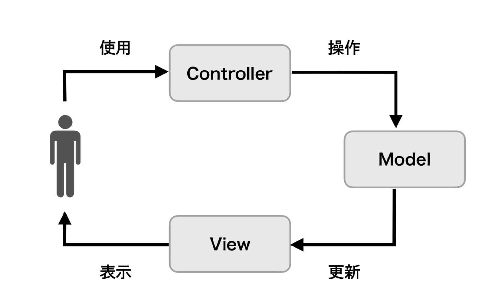
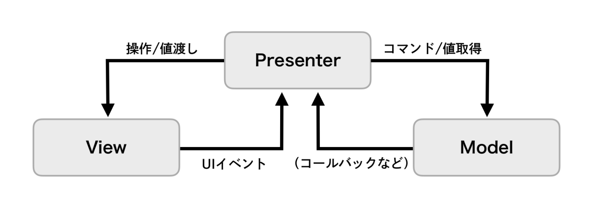
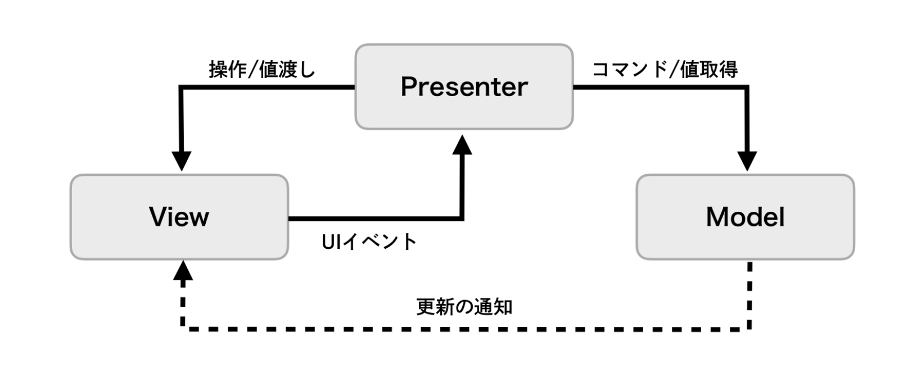
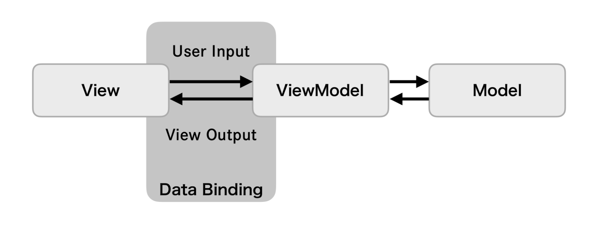
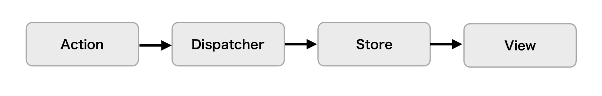

# アプリパターン設計(一言で説明してみる)

## 設計とは？

再現性のある問題に対する共通の解決策
  - 問題を定型化して捉えられる
  - 解決策を客観的に比較できる
  - メンバーの共通言語となる

## 設計の原則

``` swift
// 【問題2: 移植性のなさ】
// 【依存関係逆転の原則】
//   ・上位レベルのモジュールは下位レベルのモジュールに依存すべきでない。両方とも抽象に依存すべきである
//   ・抽象は詳細に依存してはならない。詳細が抽象に依存すべきである
//
// 【問題3: もろさ、不必要な複雑さ】
// 【インターフェース分離の原則】
//   ・クライアントに、クライアントが利用しないメソッドへの依存を強制してはならない
final class CommonMessageAPI {
    func fetchAll(
        ofUserId: Int,
        completion: @escaping ([Message]?) -> Void { ... }
    )

    func fetch(
        id: Int,
        completion: @escaping (Message?) -> Void { ... }
    )

    func sendTextMessage(
        text: String,
        completion: @escaping (TextMessage?) -> Void { ... }
    )

    func sendImageMessage(
        image: UIImgge,
        text: String?,
        completion: @escaping (ImageMessage?) -> Void { ... }
    )
}

final class MessageSender {
    private let api = CommonMessageAPI()
    let messageType: MessageType
    var delegate: MessageSenderDelegate?

    // MessageType.officialをセットするのは禁止!!
    init(messageType: MessageType) {
        self.messageType = messageType
    }

    // 送信するメッセージの入力値
    var text: String? { // TextMessage, ImageMessageどちらの場合も使う
        didSet {
            if !isTextValid {
                delegate?.validではないことを伝える()
            }
        }
    }
    var image: UIImage? { // ImageMessageの場合に使う
        didSet {
            if !isImageValid {
                delegate?.validではないことを伝える()
            }
        }
    }
    // 通信結果
    private(set) var isLoading: Bool = false
    private(set) var result: Message? // 送信成功したら値が入る

    // 【問題1: 複雑なバリデーションロジックの保持】
    // 【単一責任原則】
    //   ・クラス(型)を変更する理由は2つ以上存在してはならない
    private var isTextValid: Bool {
        switch messageType {
        case .text: return text != nil && text!.count <= 300 // 300字以内
        case .image: return text == nil || text!.count <= 80 // 80字以内 or nil
        case .offcial: return false // 必ずfalse
        }
    }
    private var isImageValid: Bool {
        return image != nil // imageの場合だけ考慮する
    }
    private var isValid: Bool {
        switch messageType {
        case .text: return isTextValid
        case .image: return isTextValid && isImageValid
        case .offcial: return false // 必ずfalse
        }
    }

    func send() {
        guard isValid else {
            delegate?.validではないことを伝える()
            return
        }

        isLoading = true

        switch messageType {
        case .text:
            api.sendTextMessage(text: text!) { [weak self] in
                self?.isLoading = false
                self?.result = $0
                self?.delegate?.通信完了を伝える()
            }

        case .image:
            api.sendImageMessage(image: image!, text: text) { ... }

        case .official:
            fatalError()
        }
    }
}
```

``` swift
protocol MessageInput {
    associatedtype Payload
    func validate() throws -> Payload
}

protocol MessageSenderAPI {
    associatedtype Payload
    associatedtype Response: Message

    func send(
        payload: Payload,
        completion: @escaping (Response?) -> Void
    )
}

final class MessageSender<API: MessageSenderAPI, Input: MessageInput> where API.Payload == Input.Payload {
    enum State {
        case inputting(validationError: Error?)
        case sending
        case send(API.Response)
        case connectionFailed

        init(evaluating input: Input) { ... }

        mutating func accept(response: API.Response?) { ... }
    }

    private(set) var state: State {
        didSet {
            delegate?.stateの変化を伝える()
        }
    }

    let api: API

    var input: Input {
        didSet {
            state = State(evaluating: input)
        }
    }

    var delegate: MessageSenderDelegate?

    init(api: API, input: Input) {
        self.api = api
        self.input = input
        self.state = State(evaluating: input)
    }

    func send() {
        do {
            let payload = try input.validate()
            state = .sending
            api.send(payload: payload) { [weak self] in
                self?.state.accept(response: $0)
            }
        } catch let e {
            state = .inputting(validationError: e)
        }
    }
}
```

## アーキテクチャ

アプリの大まかなレイヤー(層)分割の捉え方

* GUIアーキテクチャ
  * システム本来の関心領域(ドメイン)を、UI(プレゼンテーション)から引き離す
  * UIにもシステム本来の関心にも該当しない処理は考慮しない
    * 例) サーバーAPIからのデータを試み、そこで発生したネットワークエラーをハンドリングする
    * 例) データをストレージに永続化する

* システムアーキテクチャ
  * UIという単位にとらわれず、システム全体の構造で捉える

## MVC(GUIアーキテクチャ)

* プログラムを「入力」「出力」「データの処理」の3つの要素に分け、それぞれ**Controller**、**View**、**Model**と定義したアーキテクチャ(**Model-View-Controller**)



* **Model** → 各種ビジネスロジックのかたまり
* **View** → 画面の描画を担当
* **Controller** → 何かしらの入力に対する適切な処理を行うだけでなく、ModelオブジェクトとViewオブジェクトを保持する。Modelオブジェクトに処理を依頼し、受け取った結果を使ってViewオブジェクトへ描画を指示する。

## MVP(GUIアーキテクチャ)

* コンポーネント間を疎結合にすることでテスト容易性と作業分担のしやすさを目的とし、それぞれを**Presenter**、**View**、**Model**と定義したアーキテクチャ(**Model-View-Presenter**)

### Passive View



* **Model** → Presenterからのみアクセスされ、Viewとは直接の関わりを持たない
* **View** → Presenterからの描画指示に従うだけで、完全に受け身な立ち位置
* **Presenter** → すべてのプレゼンテーションロジックを受け持つ

### Supervising Controller



* **Model** → Presenterからのみアクセスされ、必要に応じてViewに対してイベントを通知する
* **View** → PresenterとModelの双方から描画処理を受け、簡単なプレゼンテーションロジックを受け持つ
* **Presenter** → 複雑なプレゼンテーションロジックを担う

## MVVM(GUIアーキテクチャ)

* それぞれを**ViewModel**、**View**、**Model**と定義し、画面の描写処理をViewに、画面描写のロジックをViewModelコンポーネントに閉じ込めるアーキテクチャ(**Model-View-ViewModel**)

* View-ViewModel間はデータバインディングで関連付けられ、ViewModelの状態変更に同期してViewの状態も更新され、画面に反映される。宣言的なバインディングにより、ViewModelの自身の状態を更新するだけで、Viewの描画処理が発火され、手続的な描画指示の必要がなくなる

* 関数型リアクティブプログラミングと相性が良い(Combine, RxSwift, RactiveSwift)



* **Model** → UIに関係しない純粋なドメインロジックやそのデータを保持する
* **View** → ユーザー操作の受け付けと、画面表示を担当する。ViewModelが保持する状態とデータバインディングし、ユーザー入力に応じてViewModelが保持するデータを加工・更新することで、バインディングした画面表示を更新する
* **ViewModel** → View-Model間の画面表示のための仲介役で次の責務を担う
  * Viewに表示するためのデータを保持する
  * Viewからイベントを受け取り、Modelの処理を呼び出す
  * Viewからイベントを受け取り、加工して値を更新する

## Flux(GUIアーキテクチャ)

* データフローが単一方向であるアーキテクチャ



* 