# アプリパターン設計(一言で説明してみる)

## 設計とは？

**設計とは関心の分離によって複雑な問題を単純な問題の群として切り分けること**

そもそものソフトウェア設計の考え方
  - すべてのコンピュータシステムは何らかの問題への関心を持ち、その問題に対する解決策を提供する
    - 複雑な問題は、より単純な問題の群として切り分けるためにシステムが部品(モジュール)の集合として構成される必要がある。それぞれの部品は狭い関心を持ち、一つの問題にだけ対処する(関心の分離)
    - 複雑な問題は、より単純な問題の群として切り分ける、つまり設計パターン(再現性のある問題に対する共通の解決策)が強い味方となる

※ 設計パターン(再現性のある問題に対する共通の解決策)を知るメリット
  - 問題を定型化して捉えられる
  - 解決策を客観的に比較できる
  - メンバーの共通言語となる

※ アーキテクチャも「設計パターン」
  - 「アプリを動かす」という複雑な問題領域を、大まかに複数の層(レイヤー)へと切り分ける考え方の一つ

## 設計の原則

**設計の原則とは責務(解決すべき問題の領域)の分割単位が適切かどうかを検証するための物差し**

原則はコードから**臭い**を取り除くもの
  - 硬さ(変更しにくいシステム、1つの変更によってシステムの他の部分に影響が及び、多くの変更を余儀なくさせるようなソフトウェア)
  - もろさ(1つの変更によって、その変更とは概念的に関連のない箇所まで壊れてしまうようなソフトウェア)
  - 移植性のなさ(他のシステムでも再利用できる部品をモジュールとして切り離すことが困難なソフトウェア)
  - 扱いにくさ(正しいことをするよりも、誤ったことをするほうが容易なソフトウェア)
  - 不必要な繰り返し(同じような構造を繰り返し含み、抽象化してまとめられる部分がまとまっていないソフトウェア)
  - 不必要な複雑さ(本質的な意味を持たない構造を内包しているようなソフトウェア)
  - 不透明さ(読みにくく、分かりにくい、その意図が上手く伝わっていないソフトウェア)

## アーキテクチャ

アプリの大まかなレイヤー(層)分割の捉え方

* GUIアーキテクチャ
  * システム本来の関心領域(ドメイン)を、UI(プレゼンテーション)から引き離す
  * UIにもシステム本来の関心にも該当しない処理は考慮しない
    * 例) サーバーAPIからのデータを試み、そこで発生したネットワークエラーをハンドリングする
    * 例) データをストレージに永続化する

* システムアーキテクチャ
  * UIという単位にとらわれず、システム全体の構造で捉える

## MVC(GUIアーキテクチャ)

* プログラムを「入力」「出力」「データの処理」の3つの要素に分け、それぞれ**Controller**、**View**、**Model**と定義したアーキテクチャ(**Model-View-Controller**)
  * アプリケーションの処理から入力と出力とを分離・独立させたことで、プログラムの本質である**「データ処理」**そのものに専念しやすくなる

### 基本構造

* **Model** → 各種ビジネスロジックのかたまり
* **View** → 画面の描画を担当
* **Controller** → 何かしらの入力に対する適切な処理を行うだけでなく、ModelオブジェクトとViewオブジェクトを保持する。Modelオブジェクトに処理を依頼し、受け取った結果を使ってViewオブジェクトへ描画を指示する。

## MVP(GUIアーキテクチャ)

* コンポーネント間を疎結合にすることでテスト容易性と作業分担のしやすさを目的とし、それぞれを**Presenter**、**View**、**Model**と定義したアーキテクチャ(**Model-View-Presenter**)

### コンポーネント間の同期方法

* **フロー同期** → 上位レイヤーのデータを下位レイヤーに都度セットしてデータを同期する(手続的同期方法)
* **オブザーバー同期** → 監視元である下位レイヤーが監視先である上位例やからObserverパターンを使って送られるイベント通知を送ってデータを同期させる(宣言的同期方法)

### 基本構造

* **Model** → UIに関係しない純粋なドメインロジックやそのデータを持つ
* **View** → ユーザー操作の受け付けと、画面表示を担当する
* **Presenter** → ViewとModelの仲介役となり、プレゼンテーションロジックを担う

### Passive View(フロー同期)

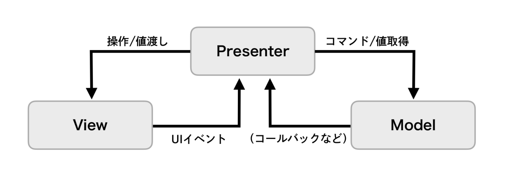

* **Model** → Presenterからのみアクセスされ、Viewとは直接の関わりを持たない
* **View** → Presenterからの描画指示に従うだけで、完全に受け身な立ち位置
* **Presenter** → すべてのプレゼンテーションロジックを受け持つ

### Supervising Controller(フロー同期 + オブザーバー同期)

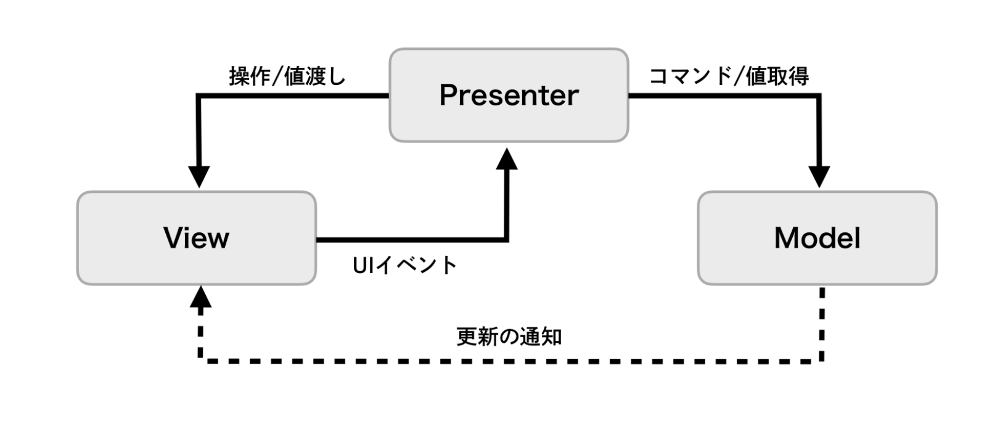

* **Model** → Presenterからのみアクセスされ、必要に応じてViewに対してイベントを通知する
* **View** → PresenterとModelの双方から描画処理を受け、簡単なプレゼンテーションロジックを受け持つ
* **Presenter** → 複雑なプレゼンテーションロジックを担う

## MVVM(GUIアーキテクチャ)

* 関数型リアクティブプログラミングと相性が良く(Combine, RxSwift, RactiveSwift)、それぞれを**ViewModel**、**View**、**Model**と定義し、画面の描写処理をViewに、画面描写のロジックをViewModelコンポーネントに閉じ込めるアーキテクチャ(**Model-View-ViewModel**)

* View-ViewModel間はデータバインディングで関連付けられ、ViewModelの状態変更に同期してViewの状態も更新され、画面に反映される。宣言的なバインディングにより、ViewModelの自身の状態を更新するだけで、Viewの描画処理が発火され、手続的な描画指示の必要がなくなる

※ データバインディング → 2つのデータの状態を監視し同期する仕組みで、片方のデータ変更をもう一方が検知して、データを自動的に更新する

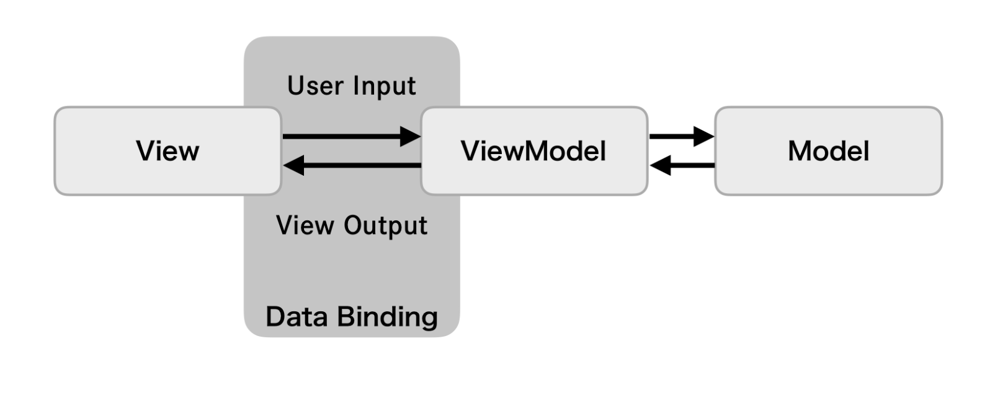

### 基本構造

* **Model** → UIに関係しない純粋なドメインロジックやそのデータを持つ
* **View** → ユーザー操作の受け付けと、画面表示を担当する
* **ViewModel** → ViewとViewModelの仲介役となり、3つの責務を持つ
  1. Viewに表示するためのデータを保持する
  2. Viewからイベントを受け取り、Modelの処理を呼び出す
  3. Viewからイベントを受け取り、加工して値を更新する

## Flux(GUIアーキテクチャ)

* データフローが単一方向であるアーキテクチャ

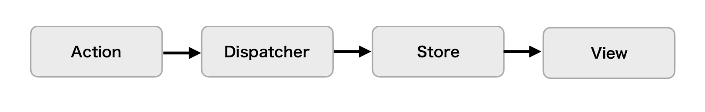

### 基本構造

* **Action** → 実行する処理を特定するためのtypeと、実行する処理に紐づくdataを保持したオブジェクト
* **Dispatcher** → Actionを受け取り、自身に登録されているStoreに伝える
* **Store** → 状態を保持し、Dispatcherから伝わったActionのtypeとdataに応じて、状態を変更する
* **View** → Storeの状態を購読し、その変更に応じて画面を更新する

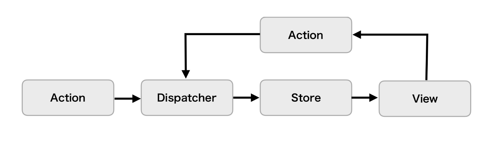

※ ユーザーの入力を受けたViewは、その入力をもとにActionを生成し、Dispatcherに渡される。Storeの状態はAction経由でのみ変更される

### Viewの構成とデータフロー(UIViewController, UIView)
  * 構成
    * ユーザーの何らかの入力によるイベント、Viewが状態を持つことはない
  * データフロー → Storeの状態をViewに反映する
    * NotificationCenterの通知機能やObserverパターンのライブラリを使用する

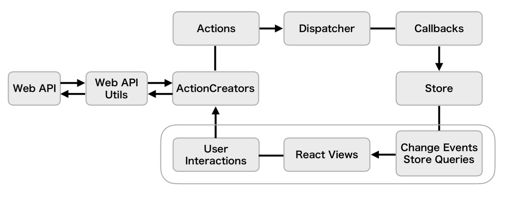

### Action(ActionCreator)の構成とデータフロー
  * 構成
    * 何らかの処理を行い、その結果からActionの生成
    * 生成したActionをDispatcherへ送信
  * データフロー → ユーザーの入力をもとにActionCreatorの処理を実行する

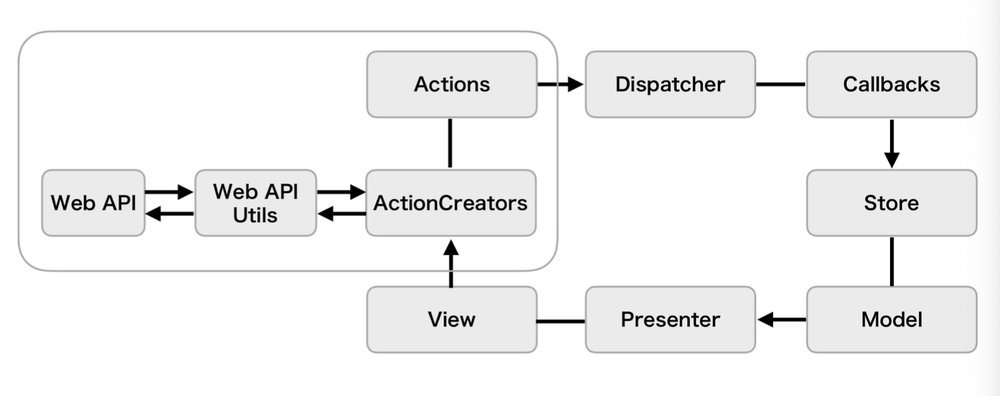
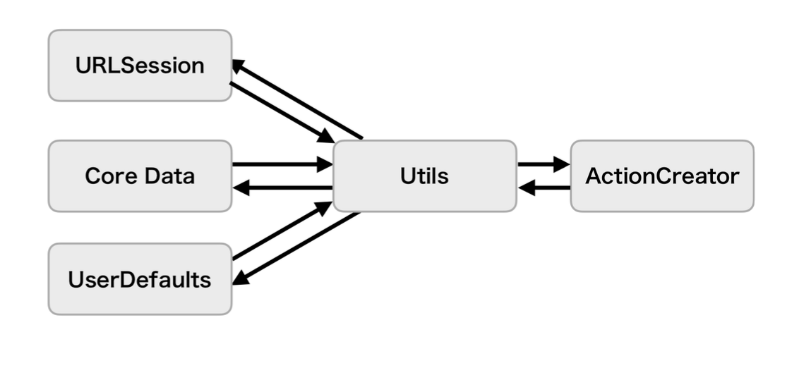

### Dispatcherの構成とデータフロー
  * 構成
    * ActionCreatorからActionを受け取りStoreへ伝達
  * データフロー
    * Dispatcherのregister(callback:)をStore側で呼び出し、Callbackを登録してActionを受け取る
    * ActionCreatorがDispatcherのdispatch(_:)を使ってActionを送信し、Dispatcherのregister(callback:)で登録されているすべてのStoreに対して、Callbackを通じてActionを伝える
      * NotificationCenterの通知機能やRxSwiftのPublishSubjectやRxCocoaのPublishRelayなどを使用する

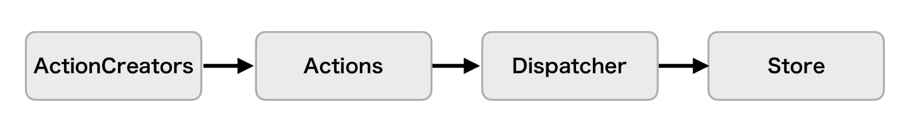

* Storeの構成とデータフロー
  * 構成
    * DispatcherからActionを受け取り、Actionのtypeとdataをもとに自身の状態を更新し、最終的にその状態がViewに反映される
  * データフロー
    * Dispatcherのregister(callback:)を使ってCallbackを登録し、そのCallbackからActionを受け取る
    * Storeの状態に変更があった場合に変更通知を送信し、Viewがその変更通知を受け取る
      * NotificationCenterの通知機能やRxSwiftのPublishSubjectやRxCocoaのPublishRelayなどを使用する

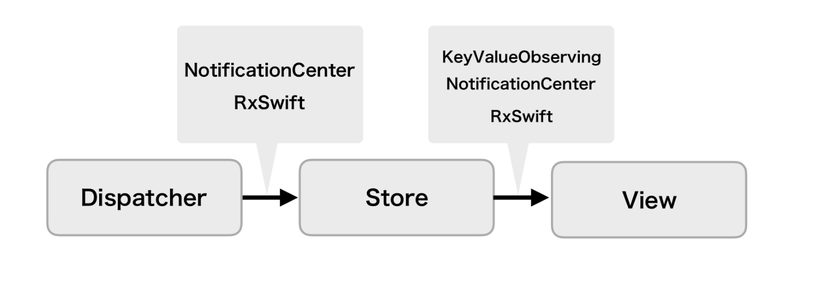

### 全体データフロー

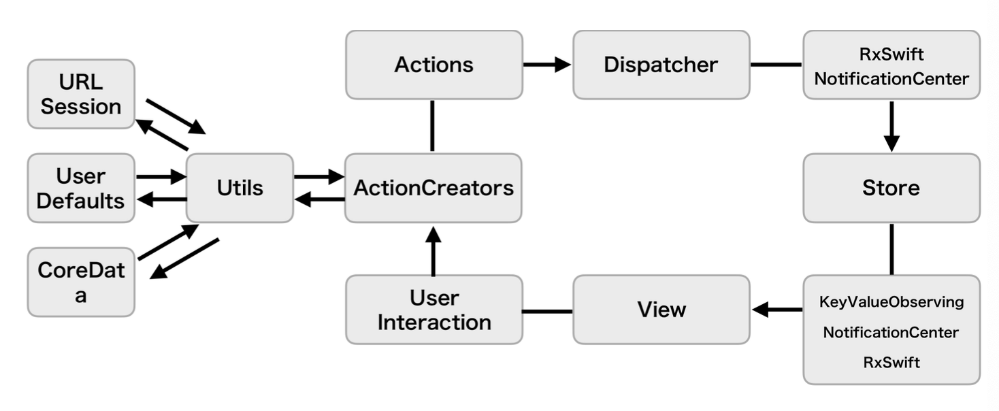

## Clean Architecture(システムアーキテクチャ)

* UIだけでなくアプリケーション全体、Modelの内部表現まで踏み込んだアーキテクチャパターン。

* あるシステムの1機能を実現するアプリケーションを考える時、その実現する機能の領域(ドメイン)と技術の詳細に注目し、4つのコンポーネントに切り分ける
  * **Entity** → アプリケーションに依存しない、ドメインに関するデータ構造やビジネスロジック
  * **Use Case** → アプリケーションで固有なロジック
  * **インターフェイスアダプター** → Use Case・フレームワークとドライバで使われるデータ構造を互いに変換する
  * **フレームワークとドライバ** → データベース(DB)、Webなどのフレームワークやツールの「詳細」

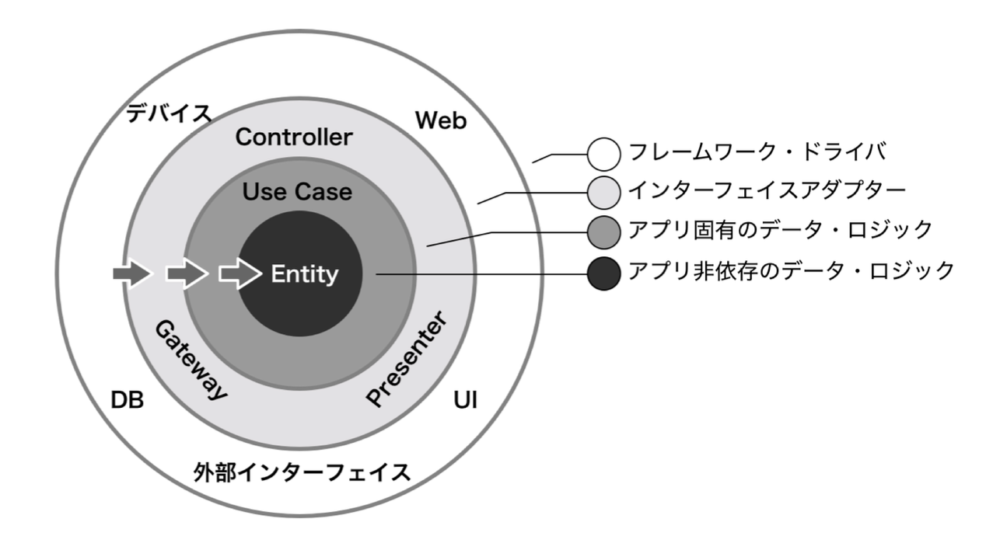

### 依存性のなさ(依存性が低い→高い)

* Entity → Use Case → インターフェイスアダプター → フレームワークとドライバ
  * 依存の方向を外から内への一方向にすることで、変えやすい部分を変えやすく、維持しておきたい部分はそのままにしやすくできる

### 依存関係のルール

* Entity
  * 処理の方法に依存しないビジネスロジックで、データ構造やメソッドの集合体
  * 外側の層には依存しないため、Use Caseや他の層にによってどのように使われるかを気にしない

* Use Case
  * Entityを使ってアプリケーション固有のビジネスロジック(構築対象のアプリケーションに対してのみ有効な処理)を実現する
  * UIに関する処理を持たない

* インターフェイスアダプター
  * 円の内外に合わせてデータやイベントを変換するためのレイヤー
  * Use CaseやEntityで扱っているデータ表現をSQLやUI用のデータに変換したり、逆にデータベースやWebからのデータをUse CaseやEntityで使われる表現に変換するなど、両縁のためにつなぎの役割をこなす(PresenterやController)
  * Use Caseと最外層とを接続する役割を担うことから、Use Caseの入出力ポートを外側の何かに接続するかを決定する責務を持つ

* フレームワークとドライバ
  * UI、データベース、デバイスドライバ、Web APIクライアントなどの最外層として、実装の詳細で、環境や顧客の要求変化にもっとも影響を受ける場所
  * UIの実装先OSの種類、フレームワークといった環境も扱う(UIKitやAlamofireなど)

## The Composable Architecture

* SwiftUIが状態管理にアプローチする方法に対しての、5つの大きな問題を定型化し、これを解決するためのアーキテクチャ(SwiftUI版のRedux)

1. アプリケーション全体の状態を管理する方法
2. 値の型のような単純な単位でアーキテクチャをモデル化する方法
3. アプリケーションの各機能をモジュール化する
4. アプリケーションの副作用をモデル化する
5. 各機能の包括的なテストを簡単に記述する方法

* 「副作用のない純粋関数」を用いて「人間が理解しやすい単方向の予測可能な状態変化のフロー」**でしか**コードを書けなくなる
  * 「複雑怪奇で難解なコード」を生み出すリスクが大幅に下がる

* 「状態管理、Composable、テスト」に重点を置いた、複数の要素や部品などを結合して、構成や組み立てが可能なアーキテクチャとなる

### 背景

* 宣言的UIの登場で、UIのコンポーネント化(部品化)が進む
  * → SwiftUIでUIのコンポーネント化(部品化)が容易になるため
  * → 部品を組み合わせて画面を構成する(Compose)作業が必要になる

* 部品化されたUIを、組み立てやすいアーキテクチャが求められている
  * 宣言的UIの環境ではComposable(部品を組み立て可能)なアーキテクチャが求められている
  * 「UIの部品化がしやすい」「その部品を組み合わせやすい」アーキテクチャであれば、宣言的UIのメリットを最大限享受できる

※ MVVMはComposableではない

MVVMの状態管理には`@Environment`, `@EnvironmentObject`, `@StateObject`, `@ObservedObject`などのProperty Wrapperの使い分けと共に、データフローがかなり複雑になっていく。

特に、コンポーネント階層の下流にコンポーネントをどんどん埋め込んでいくと、より複雑になる。コンポーネントが増えれば増えるほど、状態変化トリガーや状態監視の管理も難しくなり、どのコンポーネントが状態を保持し、その状態変更トリガーがどこから行われるかということが、コードを一見しただけでは分からなくなる。

コンポーネント化が進めば進むほど、ViewModelの状態管理は複雑になるため、宣言的UIにはMVVMは合わない

→ 解決策がThe Composable Architecture(TCA)

### 導入メリット

* 宣言的UIに適したComposableなアーキテクチャを導入できる
* 処理やデータの流れがシンプルになる
  * 異なるコンポーネントを通過するデータの流れが明確に定義され、一方向である
  * コードや処理の理解を容易にする
* 大規模アプリになっても、コードがスケールする(容易に分割できる)
* ビジネスロジックの切り出しが容易
* ロジック(reducer)やstateを合成できる。状態管理とロジックを組み合わせることが容易
* テストが書きやすい

### 導入デメリット

* 学習コストが高い
  * コンポーネント階層が深くなると、Storeの設計や、Store情報の受け渡し方法に頭を悩ませる
    * Storeの情報(環境情報なども)をProps渡しするのが煩雑になる
    * Storeの分割をどうするかを悩む
* TCAのライブラリ自体の信頼性がまだ低い
* 作成されてから日がまだ浅い

### SwiftUIにMVVMは、なぜ合わないのか

* Composableではない
  * 宣言的UIでUIの部品化が進むと、コンポーネント間の接続の問題(状態管理とその状態をどうやって運ぶか)が発生するが、MVVMはコンポーネント間の接続の問題を解決するアーキテクチャではない
* 異なるコンポーネントを通過するデータフローが明確に定義されず、フローの方向がぐちゃぐちゃになる(コードの理解を難しくする)
  * Property Wrapperの種類の多さから、ViewModelをどこに管理して、どうやって運ぶかという問題に、いちいち頭を悩ませる必要がある
  * ViewModelの無秩序化によって、コードが複雑になりスケールしない
  * ViewModelとModelのやりとりが煩雑になる