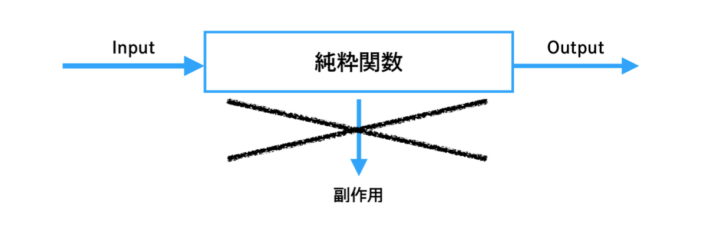

## Redux(GUIアーキテクチャ)

* Fluxアーキテクチャのアイデアと、関数型言語のElmによる複雑性に対するアプローチの影響を受けて誕生したアーキテクチャ
  * Fluxアーキテクチャの情報の伝播を1方向に制限する特徴と踏襲し、いつどのように更新が起きるかを明瞭にする
  * Elmアーキテクチャの純粋関数による副作用の排除や、イミュータブルな状態表現の制約を踏襲し、厳格で整合性のとれた状態管理を実現する

* Reduxは**状態変化を予測可能にしよう**と試みる
  * **リーダビリティ(読みやすさ)** → 予測可能な形でコードを構造化することで読むコストを下げる


### 基本構造

* **Action** → Reduxレイヤーに対して任意のビジネスロジックの実行や状態の変更を依頼するためのメッセージ(値オブジェクトで表現)
* **State** → アプリケーションの状態を表現するデータの集合
* **Reducer** → Actionと現在のStateを入力にとり、新しいStateを出力する関数
* **Store** → StateとReducerを保持するアプリケーションで単一のインスタンスで、ActionのディスパッチとReducerの実行、ViewレイヤーからのStateの購読機能を有する

### 3つの原則

1.  信頼できる一意となる状態を唯一とする(Single source of truth)

各状態のインスタンスをあちこちに分散することなく、アプリケーション全体の状態を単一のオブジェクトツリー(State)で管理する。Stateは関数を所有しないデータのみで表現されるシンプルなオブジェクトで構成される。


状態を単一のオブジェクトツリーで構成することで、アプリケーションの開発時のデバッグが容易になる恩恵もある。複雑な状態変化や振る舞いが伴うアプリケーションでは、実行時の状態が観察しやすくなる。

2. 状態はイミュータブルで表現する(State is read-only)

作成されたStateが値を変えることのできない不変なインスタンスであることを意味する。Reducerにより新たなStateが生成されるまでの間、Viewレイヤーで参照している現在のStateはまったく変更されないことが保証される。そのため、イミュータブルな現在のStateを参照している間は、アプリケーション全体で一意で整合性のとれた状態のもとでViewレイヤーの処理を行うことができる。


Stateの変更はActionがディスパッチを介してReducerのみ実施できるように制約される。Reducerは現在のStateとディスパッチされたActionの2つを入力に受け、新しい出力をする関数で、現在のStateはイミュータブルであるため値の変更を行わず、現在のStateのコピーを作成する。Reducerに記述されたビジネスロジックの実行結果をコピーしたStateに適用し、新たなStateとして出力する。このようにして、ReducerではStateの変更を実施する。

3. 状態の変更は純粋関数で記述する(Changes are made with pure functions)

新たなStateの作成を担うReducerは関数として表現する。ここでいう関数とは、オブジェクト指向なクラスやメソッドによる記述ではなく、Reducer自身が関数(Reducer関数)として記述され、さらに純粋関数であることが求められる。



純粋関数は関数の評価において副作用を発生させない点が最大の特性であり、関数に入力されていない要素が出力とは関係ない箇所で変化することがないことを意味する。

※ 純粋関数の特性

1. 与えられた要素や関数外の要素を変化させず、戻り値以外の出力を行わない(副作用の排除)
2. 取り扱うすべての要素が引数として宣言されている(引数以外の要素を参照しない)
3. 入力に対して出力が常に一意である(同じ入力には常に同じ出力を返す)

### 単一方向のデータフロー


単一方向のデータフローを厳守するように設計され、ユーザーの操作やシステムが起因となるすべての状態変化は、Actionのディスパッチによる形式化された手続きにもとづいてのみ開始される。この手続きは、いつ、どこから、どのような状態を変化しようとしたのかを明確にし、開発者に対して変更の要因を把握できるように促す。

StoreはActionがディスパッチされるとReducerによって新たなStateを作成し、Viewレイヤーで購読している箇所に新たなStateを一斉にに通知する。Viewレイヤーは通知された新しいStateをもとに画面の描画や任意の処理を行う。

以上のActionを起点とする手続きを1回のフローとして、このフローを幾度も重ねることでアプリケーション全体の振る舞いをユーザーに提供する。(規律と規制のとれた状態管理はロジックがより予測しやすく開発者の理解の手助けとなる)

Viewレイヤーの関心はActionの種類とActionに付与するデータおよびStateのデータ構造のみとなる。ViewレイヤーはReducerを直接実行することはできず、どんなReducerが存在するか知るすべもなく、Reducerがどのように記述されているかについてもまったく関知しない。また、ViewレイヤーはStoreにより通知されるStateがイミュータブルであるため、状態の値を直接変更することはできない。

状態の変化を伴うロジックは、Viewレイヤーから完全に隔離されReduxレイヤーの管轄下に配置される。Reduxレイヤーでビジネスロジックの中心的な役割を担うReducerは、Actionのディスパッチ元がViewレイヤーのどこで、結果のStateがViewレイヤーでどのように利用されるのかについて関知しない。Reducerの関心事はアプリケーション全体のStateを新しくすべて作り直すことだけである。

Actionをディスパッチした呼び出し元が、ディスパッチ呼び出しの戻り値として新しいStateを即時に取得することはできない。伝達と結果の受け取りが、いわゆるメソッドの呼び出しのように実行時の対にはなっていないためである。結果である新たなStateは、ViewレイヤーでStoreを購読している箇所(画面など)へ通知される。

作用の伝達と結果の通知が分離されることで、ViewレイヤーとReduxレイヤー間の依存性を弱めている。これら2つの独立性の観点により、双方のレイヤーが関知し合わず、影響範囲が局所的に閉じた構造を実現している。

### ReSwiftでのReduxアーキテクチャ適用

* State → アプリケーションの全体の状態を表すデータ


``` swift
// private(set)アクセス修飾子を付与することで、Viewレイヤーから変更できないことを明示化する
struct AppState: ReSwift.StateType {
    private(set) var timelineState: TimelineState
    private(set) var userProfileState: UserProfileState?
}

struct TimelineState: ReSwift.StateType {
    private(set) var tweets: [Tweet]
    private(set) var response: [Tweet]
}

struct UserProfileState: ReSwift.StateType {
    private(set) var userProfile: UserProfile
}
```

* Action → Stateに対して、何かイベントが発生したことを伝えるためのメッセージ


``` swift
extension TimelineState {
    enum Action: ReSwift.Action {
        case requestStart()
        case requestSucess(response: [Tweet])
        case requestError(error: Error)
    }
}

struct ForceLogoutAction: ReSwift.Action {}
```

* ActionCreator → ディスパッチが可能な関数でActionを出力する


``` swift
typealias ActionCreator = (
    state: ReSwift.State,
    store: ReSwift.StoreType
)

// ActionCreatorは副作用が許容されている
func fetchGitHubRepositories(state: State, store: Store<State>) -> Action? {
    guard case let .loggedIn(conf) = state.authState.loggedInState else {
        return nil
    }

    Ocktokit(conf).repositories { response in
        DispatchQueue.main.async {
            store.dispatch(SetRepositories(repositories: response))
        }
    }
    return nil
}

store.dispatch(fetchGitHubRepositories)
```

* Reducer → 現在のStateとディスパッチされたActionを入力として、新しいStateを出力する純粋関数


``` swift
typealias Reducer<ReducerStateType> = (
    action: Action,
    state: ReducerStateType?
) -> ReducerStateType

func appReduce(action: ReSwift.Action, state: AppState?) -> AppState {
    var state = state ?? AppState()
    state.timelineState = TimelineState.reducer(
        action: action,
        state: state.timelineState
    )
    state.userProfile = UserProfileState.reducer(
        action: action,
        state: state.userProfile
    )
    return state
}

// 純粋関数でreducerを作成する
extension TimelineState {
    public static func reducer(
        action: ReSwift.Action,
        state: TimelineState?
    ) -> TimelineState {
        guard let action = action as? TimelineState.Action else {
            return state
        }

        var state = state ?? TimelineState()

        switch action {
        case let .requestStart:
            state.fetching = true
            state.error = nil
        case let .requestSuccess(response):
            state.fetching = false
            state.response = response
        case let .requestError(error):
            state.fetching = false
            state.error = error
        }

        return state
    }
}
```

* Store → StateとReducerを保持し、Actionをディスパッチする。新たなStateが生成されたことをViewレイヤーで検知する購読機能を有する


``` swift
open class Store<State: ReSwift.StateType>: ReSwift.StoreType {
    var state: State! { get }

    private var reducer: Reducer<State>

    open func dispatch(_ action: Action) {
        // ...
    }

    open func subscribe<S: StoreSubscriber>(_ subscriber: S) {
        // ...
    }

    open func unsubscribe(_ subscriber: AnyStoreSubscriber) {
        // ...
    }

    // ...
}

let store = ReSwift.Store<AppState>(
    reducer: appReduce,
    state: nil,
    middeleware: []
)
appDelegate.store = store

let someViewController = SomeViewController(store)
```

* ディスパッチ → ActionやActionCreatorをReducerに伝達するStoreの機能を担う。ディスパッチの対象がActionCreatorの場合は、ActionCreator関数を評価して結果のActionをReducerに伝達する。またMiddleware関数の実行を行う


``` swift
final class TimelineViewController: UIViewController {
    let store: Store<AppState>

    init(store: Store<AppState>) {
        self.store = store
    }

    override func viewDidLoad() {
        super.viewDidLoad()

        store.dispatch(TimelineState.Action.requestStart)
        store.dispatch(TimelineState.Action.requestActionCreator)
    }
}
```

* 購読 → Reducerによって新しいStateが生成されたことを、Viewレイヤーが検知できるようにする


``` swift
final class TimelineViewController: UIViewController, StoreSubscriber {
    let store: Store<AppState>

    init(store: Store<AppState>) {
        self.store = store
    }

    override func viewWillAppear(animated: Bool) {
        super.viewWillAppear(animated)

        store.subscribe(self) { subscription in
            subscription.select { state in
                state.response
            }
        }
    }

    override func viewWillDisappear(animated: Bool) {
        super.viewWillDisappear(animated)

        store.unsubscribe(self)
    }

    func newState(state: Response<[Repository]>?) {
        if case let .Success(response) = state {
            dataSource = response
            tableView.reloadData()
        }
    }
}
```

* Middleware → ディスパッチされたActionがReducerに実行されるまでの間に、任意の関数を逐次的に実行するための機構


``` swift
public typealias DispatchFunction = (Action) -> Void
public typealias Middleware<State> = (
    @escaping DispatchFunction,
    @escaping () -> State?
) -> (@escaping DispatchFunction) -> DispatchFunction

let loggingMiddleware: ReSwift.Middleware<AppState> = { dispatch, getState in
    return { next in
        return { action in
            print("[Action] \(action)")
            print("[Before State] \(getState())")
            next(action)
            print("[After State] \(getState())")
        }
    }
}

let appStore = Store<AppState>(
    reducer: appReduce,
    state: nil,
    middleware: [loggingMiddleware]
)
```

## The Composable Architecture

* SwiftUIが状態管理にアプローチする方法に対しての5つの大きな問題を定型化し、これを解決するためのアーキテクチャ
  1. 状態管理 → シンプルな値型を使用してアプリケーションの状態を管理し、多くの画面で状態を共有して、ある画面での状態の変更を別の画面ですぐにobserveできるようにする方法
  2. 組み立て・構成 → 大きな機能を小さなComponentに分解し、それぞれを独立したモジュールに抽出し、簡単にそれらを繋いで機能を形成する方法
  3. 副作用 → 可能な限りテスト可能で理解しやすい方法で、アプリケーションの特定の部分を下界と対話させる方法
  4. テスト → アーキテクチャで構築された機能をテストするだけでなく、多くのComponentで構成された機能の統合テストを書いたり、副作用がアプリケーションに与える影響を理解するためにE2Eテストを書いたりする方法。これにより、ビジネスロジックが期待通りに動作していることを強く保証することができる
  5. 開発者にとっての使いやすさ → 上記の全てを、できるだけ少ないコンセプトと動作するパーツからならシンプルなAPIで実現する方法

### 背景

* 宣言的UIの登場で、UIのComponent化(部品化)が進む
  * SwiftUIの登場でUIのComponent化(部品化)が容易になるため
  * 部品を組み合わせて画面を構成する(Compose)作業が必要になる

* 部品化されたUIを、組み立てやすいアーキテクチャが求められている
  * 宣言的UIの環境ではComposable(部品を組み立て可能)なアーキテクチャが求められている
  * 「UIの部品化がしやすい」「その部品を組み合わせやすい」アーキテクチャであれば、宣言的UIのメリットを最大限享受できる

* MVVMはComposableではない
  * MVVMの状態管理には`@Environment`, `@EnvironmentObject`, `@StateObject`, `@ObservedObject`などのProperty Wrapperの使い分けと共に、データフローがかなり複雑になっていく。
  * 特に、Component階層の下流にCompoenntをどんどん埋め込んでいくと、より複雑になる。Componentが増えれば増えるほど、状態変化トリガーや状態監視の管理も難しくなり、どのComponentが状態を保持し、その状態変更トリガーがどこから行われるかということが、コードを一見しただけでは分からなくなる。
  * Component化が進めば進むほど、ViewModelの状態管理は複雑になるため、宣言的UIにはMVVMは合わない

### 基本構造

* **State** → ビジネスロジックを実行し、UIをレンダリングするために必要なデータを記述する型
* **Action** → ユーザーのアクション、通知、イベントソースなど、アプリ内で起こりうる全てのアクションを表す型
* **Reducer** → Actionが与えられた時に、アプリの現在のStateを次のStateに更新させる方法を記述する関数
* **Store** → 実際にアプリの機能を動かすruntime。全てのユーザーアクションをStoreに送信し、StoreはReducerとEffectを実行できるようにし、Storeの状態変化をobserveしてUIを更新できるようにする

### 例

* 数字を増減させる「+」「-」ボタンが表示されるUIを考えてみる。面白くするために、タップするとAPIリクエストを行い、その数字に関するランダムな事実を取得し、その事実をAlertで表示するボタンがあるUIだとする

``` swift
// 実装
import ComposableArchitecture

// ドメインと機能の振る舞いを保持するReducerに準拠した新しい型の定義
struct Feature: Reducer {
    // 現在のカウントを表す数値と、表示したいアラートのタイトルを表すString(nilはアラートを表示しないのでオプショナル)で構成される状態を表すための型の定義
    struct State: Equatable {
        var count = 0
        var numberFactAlert: String?
    }

    // アプリの機能を表すための型の定義
    // ユーザーがアラートをdismissするものやAPIリクエストからresponseを受け取る時に発生するものなどわかりにくいものもある
    enum Action: Equatable {
        case factAlertDismissed
        case decrementButtonTapped
        case incrementButtonTapped
        case numberFactButtonTapped
        case numberFactResponse(String)
    }

    // 機能の実際のロジックや振る舞いをハンドリングする役割を持つreduceメソッドの実装
    // 現在のstateを次のstateに変更する方法を記述し、どのようなeffectsを実行する必要があるのかも記述する
    // actionsによってはeffectsを実行する必要がないものもあり、その場合は.noneをreturnする
    func reduce(into state: inout State, action: Action) -> Effect<Action> {
        switch action {
        case .factAlertDismissed:
            state.numberFactAlert = nil
            return .none

        case .decrementButtonTapped:
            state.count -= 1
            return .none

        case .incrementButtonTapped:
            state.count += 1
            return .none

        case .numberFactButtonTapped:
            return .run { [count = state.count] send in
                let (data, _) = try await URLSession.shared.data(
                    from: URL(string: "http://numbersapi.com/\(count)/trivia")!
                )
                await send(.numberFactResponse(string(decoding: data, as: UTF8.self)))
            }

        case let .numberFactResponse(fact):
            state.numberFactAlert = fact
            return .none
        }
    }
}

// 機能を表示するためのViewの定義
// StateOf<Feature>を保持して、stateへの全ての変更をobserveして再レンダリングできるようにし、stateを変化させるためにユーザーのactionsをstoreに送信できるようにする
// .alert view modifierが必要とするIdentifableを満たせるように、factアラート用にstructのwrapperを導入する
struct FeatureView: View {
    let store: StoreOf<Feature>

    var body: some View {
        WithViewStore(store, observe: { $0 }) { viewStore in
            VStack {
                HStack {
                    Button("-") { viewStore.send(.decrementButtonTapped) }
                    Text("\(viewStore.count)")
                    Button("+") { viewStore.send(.incrementButtonTapped) }
                }

                Button("Number fact") { viewStore.send(.numberFactButtonTapped) }
            }
            .alert(
                item: viewStore.building(
                    get: { $0.numberFactAlert.map(FactAlert.init(title:)) },
                    send: .factAlertDismissed
                ),
                content: { Alert(title: Text($0.title)) }
            )
        }
    }
}

struct FactAlert: Identifable {
    var title: String
    var id: String { title }
}

// アプリのエンドポイントでstoreを構築
@main
struct MyApp: App {
    var body: some Scene {
        WindowGroup {
            FeatureView(
                store: Store(initialState: Feature.State()) {
                    Feature()
                }
            )
        }
    }
}
```

``` swift
// テスト
import ComposableArchitecture

// テストするためにはTestStoreを使用する
// Storeを同じ情報で作成できるが、actionsが送信されたときに機能がどのように変化するかをassertするための追加の作業を行う
@MainActor
func testFeature() async {
    let store = TestStore(initialState: Feature.State()) {
        Feature()
    }
}

// ユーザーフロー全体のステップをassertionしていく
// increment/decrement bubttonをタップするとカウントが変化することをテストする
await store.send(.incrementButtonTapped) {
    $0.count = 1
}
await store.send(.decrementButtonTapped) {
    $0.count = 0
}

// ステップによってeffectが実行され、データがstoreにフィードバックされる場合、それについてassertする必要がある
// 例えば、ユーザーがfact buttonをタップした際に、factを含むresponseが返却され、それによってalertが表示されることを期待する
await store.send(.numberFactButtonTapped)

// 現状は実際のAPIリクエストを送信してレスポンスを取得するようにしている
await store.receive(.numberFactResponse(.success(???))) {
    $0.numberFactAlert = ???
}

// dependencyをreducerに渡すようにする
// アプリ実行の時には実際のdependencyを使用する
// テスト実行の時にはmock化されたdependencyを使用する
struct Feature: Reducer {
    let numberFact: (Int) async throws -> String
    // ...

    case .numberFactButtonTapped:
      return .run { [count = state.count] send in
          let fact = try await self.numberFact(count)
          await send(.numberFactResponse(fact))
      }
}

// アプリケーションのエンドポイントでは実際のAPIリクエストのdependencyを提供する
@main
struct MyApp: App {
    var body: some Scene {
        FeatureView {
            store: Store(initialState: Feature.State()) {
                Feature(
                    numberFact: { number in
                        let (data, _) = try await URLSession.shared.data(
                            from: URL(string: "http://numbersapi.com/\(number)/trivia")!
                        )
                        return String(decoding: data, as: UTF8.self)
                    }
                )
            }
        }
    }
}

// テストではfactを即座に返すmockのdependencyを提供する
@MainActor
func testFeature() async {
    let store = TestStore(initialState: Feature.State()) {
        Feature(numberFact: { "\($0) is a good number Brent" })
    }
}

await store.send(.numberFactButtonTapped)

await store.receive(.numberFactResponse(.success("0 is a good number Brent"))) {
    $0.numberFactAlert = "0 is a good number Brent"
}

await store.send(.factAlertDismissed) {
    $0.numberFactAlert = nil
}

// 全てのレイヤーを通して明示的にnumberFactを渡すのは煩わしくなる
// numberFactをアプリケーションのどの層でも即座にdependencyを利用できるようにする
struct NumbetFactClient {
    var fetch: (Int) async throws -> String
}

// DependencyKey protocolに準拠させることで、その型をdependencyの管理システムに登録する
// シミュレーターやデバイスでアプリケーションを実行する時に使用するliveValue(実際の値)を指定する必要がある
extension NumberFactClient: DependencyKey {
    static let liveValue = Self(
        fetch: { number in
            let (data, _) = try await URLSession.shared.data(
                from: URL(string: "http://numbersapi.com/\(number)/trivia")!
            )
            return String(decoding: data, as: UTF8.self)
        }
    )
}

extension DependencyValues {
    var numberFact: NumberFactClient {
        get { self[NumberFactClient.self] }
        set { self[NumberFactClient.self] = newValue }
    }
}

// これらを定義することで、どのような機能でもすぐにdependencyを使用することができる
struct Feature: Reducer {
    // let numberFact: (Int) async throws -> String
    @Dependency(\.numberFact) var numberFact

    // ...

    // try await self.numberFact(count)
    try await self.numberFact.fetch(count)
}

// これにより、機能のreducerを構築する際にdependencyを明示的に渡す必要がなくなる
// previewsやシミュレーター、デバイス上でアプリを実行する場合は、live dependencyがreducerに提供される
// テストではテストのdependencyが提供される
@main
struct MyApp: App {
    var body: some Scene {
        FeatureView(
            store: Store(initialState: Feature.State()) {
                Feature()
            }
        )
    }
}

// testStoreではdependencyを指定せずに構築することができるが、必要に応じてdependencyをoverrideできる
let store = TestStore(initialState: Feature.State()) {
    Feature()
} withDependencies: {
    $0.numberFact.fetch = { "\($0) is a good number Brent" }
}
```