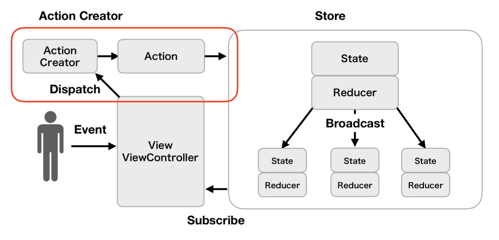

# アプリパターン設計(一言で説明してみる)

## 設計とは？

**設計とは関心の分離によって複雑な問題を単純な問題の群として切り分けること**

そもそものソフトウェア設計の考え方
  - すべてのコンピュータシステムは何らかの問題への関心を持ち、その問題に対する解決策を提供する
    - 複雑な問題は、より単純な問題の群として切り分けるためにシステムが部品(モジュール)の集合として構成される必要がある。それぞれの部品は狭い関心を持ち、一つの問題にだけ対処する(関心の分離)
    - 複雑な問題は、より単純な問題の群として切り分ける、つまり設計パターン(再現性のある問題に対する共通の解決策)が強い味方となる

※ 設計パターン(再現性のある問題に対する共通の解決策)を知るメリット
  - 問題を定型化して捉えられる
  - 解決策を客観的に比較できる
  - メンバーの共通言語となる

※ アーキテクチャも「設計パターン」
  - 「アプリを動かす」という複雑な問題領域を、大まかに複数の層(レイヤー)へと切り分ける考え方の一つ

## 設計の原則

**設計の原則とは責務(解決すべき問題の領域)の分割単位が適切かどうかを検証するための物差し**

原則はコードから**臭い**を取り除くもの
  - 硬さ(変更しにくいシステム、1つの変更によってシステムの他の部分に影響が及び、多くの変更を余儀なくさせるようなソフトウェア)
  - もろさ(1つの変更によって、その変更とは概念的に関連のない箇所まで壊れてしまうようなソフトウェア)
  - 移植性のなさ(他のシステムでも再利用できる部品をモジュールとして切り離すことが困難なソフトウェア)
  - 扱いにくさ(正しいことをするよりも、誤ったことをするほうが容易なソフトウェア)
  - 不必要な繰り返し(同じような構造を繰り返し含み、抽象化してまとめられる部分がまとまっていないソフトウェア)
  - 不必要な複雑さ(本質的な意味を持たない構造を内包しているようなソフトウェア)
  - 不透明さ(読みにくく、分かりにくい、その意図が上手く伝わっていないソフトウェア)

## アーキテクチャ

アプリの大まかなレイヤー(層)分割の捉え方

* GUIアーキテクチャ
  * システム本来の関心領域(ドメイン)を、UI(プレゼンテーション)から引き離す
  * UIにもシステム本来の関心にも該当しない処理は考慮しない
    * 例) サーバーAPIからのデータを試み、そこで発生したネットワークエラーをハンドリングする
    * 例) データをストレージに永続化する

* システムアーキテクチャ
  * UIという単位にとらわれず、システム全体の構造で捉える

## MVC(GUIアーキテクチャ)

* プログラムを「入力」「出力」「データの処理」の3つの要素に分け、それぞれ**Controller**、**View**、**Model**と定義したアーキテクチャ(**Model-View-Controller**)
  * アプリケーションの処理から入力と出力とを分離・独立させたことで、プログラムの本質である**「データ処理」**そのものに専念しやすくなる


### 基本構造

* **Model** → 各種ビジネスロジックのかたまり
* **View** → 画面の描画を担当
* **Controller** → 何かしらの入力に対する適切な処理を行うだけでなく、ModelオブジェクトとViewオブジェクトを保持する。Modelオブジェクトに処理を依頼し、受け取った結果を使ってViewオブジェクトへ描画を指示する。

## MVP(GUIアーキテクチャ)

* コンポーネント間を疎結合にすることでテスト容易性と作業分担のしやすさを目的とし、それぞれを**Presenter**、**View**、**Model**と定義したアーキテクチャ(**Model-View-Presenter**)

### コンポーネント間の同期方法

* **フロー同期** → 上位レイヤーのデータを下位レイヤーに都度セットしてデータを同期する(手続的同期方法)
* **オブザーバー同期** → 監視元である下位レイヤーが監視先である上位例やからObserverパターンを使って送られるイベント通知を送ってデータを同期させる(宣言的同期方法)

### 基本構造

* **Model** → UIに関係しない純粋なドメインロジックやそのデータを持つ
* **View** → ユーザー操作の受け付けと、画面表示を担当する
* **Presenter** → ViewとModelの仲介役となり、プレゼンテーションロジックを担う

### Passive View(フロー同期)


* **Model** → Presenterからのみアクセスされ、Viewとは直接の関わりを持たない
* **View** → Presenterからの描画指示に従うだけで、完全に受け身な立ち位置
* **Presenter** → すべてのプレゼンテーションロジックを受け持つ

### Supervising Controller(フロー同期 + オブザーバー同期)


* **Model** → Presenterからのみアクセスされ、必要に応じてViewに対してイベントを通知する
* **View** → PresenterとModelの双方から描画処理を受け、簡単なプレゼンテーションロジックを受け持つ
* **Presenter** → 複雑なプレゼンテーションロジックを担う

## MVVM(GUIアーキテクチャ)

* 関数型リアクティブプログラミングと相性が良く(Combine, RxSwift, RactiveSwift)、それぞれを**ViewModel**、**View**、**Model**と定義し、画面の描写処理をViewに、画面描写のロジックをViewModelコンポーネントに閉じ込めるアーキテクチャ(**Model-View-ViewModel**)

* View-ViewModel間はデータバインディングで関連付けられ、ViewModelの状態変更に同期してViewの状態も更新され、画面に反映される。宣言的なバインディングにより、ViewModelの自身の状態を更新するだけで、Viewの描画処理が発火され、手続的な描画指示の必要がなくなる

※ データバインディング → 2つのデータの状態を監視し同期する仕組みで、片方のデータ変更をもう一方が検知して、データを自動的に更新する


### 基本構造

* **Model** → UIに関係しない純粋なドメインロジックやそのデータを持つ
* **View** → ユーザー操作の受け付けと、画面表示を担当する
* **ViewModel** → ViewとViewModelの仲介役となり、3つの責務を持つ
  1. Viewに表示するためのデータを保持する
  2. Viewからイベントを受け取り、Modelの処理を呼び出す
  3. Viewからイベントを受け取り、加工して値を更新する

## Flux(GUIアーキテクチャ)

* データフローが単一方向であるアーキテクチャ


### 基本構造

* **Action** → 実行する処理を特定するためのtypeと、実行する処理に紐づくdataを保持したオブジェクト
* **Dispatcher** → Actionを受け取り、自身に登録されているStoreに伝える
* **Store** → 状態を保持し、Dispatcherから伝わったActionのtypeとdataに応じて、状態を変更する
* **View** → Storeの状態を購読し、その変更に応じて画面を更新する


※ ユーザーの入力を受けたViewは、その入力をもとにActionを生成し、Dispatcherに渡される。Storeの状態はAction経由でのみ変更される

### Viewの構成とデータフロー(UIViewController, UIView)
  * 構成
    * ユーザーの何らかの入力によるイベント、Viewが状態を持つことはない
  * データフロー → Storeの状態をViewに反映する
    * NotificationCenterの通知機能やObserverパターンのライブラリを使用する


### Action(ActionCreator)の構成とデータフロー
  * 構成
    * 何らかの処理を行い、その結果からActionの生成
    * 生成したActionをDispatcherへ送信
  * データフロー → ユーザーの入力をもとにActionCreatorの処理を実行する


### Dispatcherの構成とデータフロー
  * 構成
    * ActionCreatorからActionを受け取りStoreへ伝達
  * データフロー
    * Dispatcherのregister(callback:)をStore側で呼び出し、Callbackを登録してActionを受け取る
    * ActionCreatorがDispatcherのdispatch(_:)を使ってActionを送信し、Dispatcherのregister(callback:)で登録されているすべてのStoreに対して、Callbackを通じてActionを伝える
      * NotificationCenterの通知機能やRxSwiftのPublishSubjectやRxCocoaのPublishRelayなどを使用する


### Storeの構成とデータフロー
  * 構成
    * DispatcherからActionを受け取り、Actionのtypeとdataをもとに自身の状態を更新し、最終的にその状態がViewに反映される
  * データフロー
    * Dispatcherのregister(callback:)を使ってCallbackを登録し、そのCallbackからActionを受け取る
    * Storeの状態に変更があった場合に変更通知を送信し、Viewがその変更通知を受け取る
      * NotificationCenterの通知機能やRxSwiftのPublishSubjectやRxCocoaのPublishRelayなどを使用する


### 全体データフロー


* メリット
  * データフローが単一方向になっていることで、アプリの処理の流れの推測がしやすい
  * View・Action・Dispatcher・Storeと役割が分かれることで、どこに実装すべきかが分かりやすい
  * Storeが状態が管理する役割であるため、View ControllerやViewから状態管理のコードを削除できる
  * Dispatcherがハブとなっているため、テストでの結果取得やテストデータの挿入がしやすい
  * アプリの規模が大きくなったとしても、耐えうるスケーラビリティがある

* デメリット
  * Actionをディスパッチする際にStoreがまだ生成されているない状態があるため、Storeのライフサイクルを気にする必要がある
  * アプリの規模が大きくなるにつれて、Actionが肥大化していく
  * Storeを変更するために、Actionを生成しDispatcherを通すというフローに対して、アプリの規模次第では煩わしさを感じる場合がある

## Redux(GUIアーキテクチャ)

* Fluxアーキテクチャのアイデアと、関数型言語のElmによる複雑性に対するアプローチの影響を受けて誕生したアーキテクチャ
  * Fluxアーキテクチャの情報の伝播を1方向に制限する特徴と踏襲し、いつどのように更新が起きるかを明瞭にする
  * Elmアーキテクチャの純粋関数による副作用の排除や、イミュータブルな状態表現の制約を踏襲し、厳格で整合性のとれた状態管理を実現する

* Reduxは**状態変化を予測可能にしよう**と試みる
  * **リーダビリティ(読みやすさ)** → 予測可能な形でコードを構造化することで読むコストを下げる


### 基本構造

* **Action** → Reduxレイヤーに対して人氏のビジネスロジックの実行や状態の変更を依頼するためのメッセージ(値オブジェクトで表現)
* **State** → アプリケーションの状態を表現するデータの集合
* **Reducer** → Actionと現在のStateを入力にとり、新しいStateを出力する関数
* **Store** → StateとReducerを保持するアプリケーションで単一のインスタンスで、ActionのディスパッチとReducerの実行、ViewレイヤーからのStateの購読機能を有する

### 3つの原則

1.  信頼できる一意となる状態を唯一とする(Single source of truth)

各状態のインスタンスをあちこちに分散することなく、アプリケーション全体の状態を単一のオブジェクトツリー(State)で管理する。Stateは関数を所有しないデータのみで表現されるシンプルなオブジェクトで構成される。


状態を単一のオブジェクトツリーで構成することで、アプリケーションの開発時のデバッグが容易になる恩恵もある。複雑な状態変化や振る舞いが伴うアプリケーションでは、実行時の状態が観察しやすくなる。

2. 状態はイミュータブルで表現する(State is read-only)

作成されたStateが値を変えることのできない不変なインスタンスであることを意味する。Reducerにより新たなStateが生成されるまでの間、Viewレイヤーで参照している現在のStateはまったく変更されないことが保証される。そのため、イミュータブルな現在のStateを参照している間は、アプリケーション全体で一意で整合性のとれた状態のもとでViewレイヤーの処理を行うことができる。


Stateの変更はActionがディスパッチを介してReducerのみ実施できるように制約される。Reducerは現在のStateとディスパッチされたActionの2つを入力に受け、新しい出力をする関数で、現在のStateはイミュータブルであるため値の変更を行わず、現在のStateのコピーを作成する。Reducerに記述されたビジネスロジックの実行結果をコピーしたStateに適用し、新たなStateとして出力する。このようにして、ReducerではStateの変更を実施する。

3. 状態の変更は純粋関数で記述する(Changes are made with pure functions)

新たなStateの作成を担うReducerは関数として表現する。ここでいう関数とは、オブジェクト指向なクラスやメソッドによる記述ではなく、Reducer自身が関数(Reducer関数)として記述され、さらに純粋関数であることが求められる。


純粋関数は関数の評価において副作用を発生させない点が最大の特性であり、関数に入力されていない要素が出力とは関係ない箇所で変化することがないことを意味する。

※ 純粋関数の特性

1. 与えられた要素や関数外の要素を変化させず、戻り値以外の出力を行わない(副作用の排除)
2. 取り扱うすべての要素が引数として宣言されている(引数以外の要素を参照しない)
3. 入力に対して出力が常に一意である(同じ入力には常に同じ出力を返す)

### 単一方向のデータフロー


単一方向のデータフローを厳守するように設計され、ユーザーの操作やシステムが起因となるすべての状態変化は、Actionのディスパッチによる形式化された手続きにもとづいてのみ開始される。この手続きは、いつ、どこから、どのような状態を変化しようとしたのかを明確にし、開発者に対して変更の要因を把握できるように促す。

StoreはActionがディスパッチされるとReducerによって新たなStateを作成し、Viewレイヤーで購読している箇所に新たなStateを一斉にに通知する。Viewレイヤーは通知された新しいStateをもとに画面の描画や任意の処理を行う。

以上のActionを起点とする手続きを1回のフローとして、このフローを幾度も重ねることでアプリケーション全体の振る舞いをユーザーに提供する。(規律と規制のとれた状態管理はロジックがより予測しやすく開発者の理解の手助けとなる)

Viewレイヤーの関心はActionの種類とActionに付与するデータおよびStateのデータ構造のみとなる。ViewレイヤーはReducerを直接実行することはできず、どんなReducerが存在するか知るすべもなく、Reducerがどのように記述されているかについてもまったく関知しない。また、ViewレイヤーはStoreにより通知されるStateがイミュータブルであるため、状態の値を直接変更することはできない。

状態の変化を伴うロジックは、Viewレイヤーから完全に隔離されReduxレイヤーの管轄下に配置される。Reduxレイヤーでビジネスロジックの中心的な役割を担うReducerは、Actionのディスパッチ元がViewレイヤーのどこで、結果のStateがViewレイヤーでどのように利用されるのかについて関知しない。Reducerの関心事はアプリケーション全体のStateを新しくすべて作り直すことだけである。

Actionをディスパッチした呼び出し元が、ディスパッチ呼び出しの戻り値として新しいStateを即時に取得することはできない。伝達と結果の受け取りが、いわゆるメソッドの呼び出しのように実行時の対にはなっていないためである。結果である新たなStateは、ViewレイヤーでStoreを購読している箇所(画面など)へ通知される。

作用の伝達と結果の通知が分離されることで、ViewレイヤーとReduxレイヤー間の依存性を弱めている。これら2つの独立性の観点により、双方のレイヤーが関知し合わず、影響範囲が局所的に閉じた構造を実現している。

### ReSwiftでのReduxアーキテクチャ適用

* State → アプリケーションの全体の状態を表すデータ


``` swift
// private(set)アクセス修飾子を付与することで、Viewレイヤーから変更できないことを明示化する
struct AppState: ReSwift.StateType {
    private(set) var timelineState: TimelineState
    private(set) var userProfileState: UserProfileState?
}

struct TimelineState: ReSwift.StateType {
    private(set) var tweets: [Tweet]
    private(set) var response: [Tweet]
}

struct UserProfileState: ReSwift.StateType {
    private(set) var userProfile: UserProfile
}
```

* Action → Stateに対して、何かイベントが発生したことを伝えるためのメッセージ


``` swift
extension TimelineState {
    enum Action: ReSwift.Action {
        case requestStart()
        case requestSucess(response: [Tweet])
        case requestError(error: Error)
    }
}

struct ForceLogoutAction: ReSwift.Action {}
```

* ActionCreator → ディスパッチが可能な関数でActionを出力する



``` swift
typealias ActionCreator = (
    state: ReSwift.State,
    store: ReSwift.StoreType
)

// ActionCreatorは副作用が許容されている
func fetchGitHubRepositories(state: State, store: Store<State>) -> Action? {
    guard case let .loggedIn(conf) = state.authState.loggedInState else {
        return nil
    }

    Ocktokit(conf).repositories { response in
        DispatchQueue.main.async {
            store.dispatch(SetRepositories(repositories: response))
        }
    }
    return nil
}

store.dispatch(fetchGitHubRepositories)
```

* Reducer → 現在のStateとディスパッチされたActionを入力として、新しいStateを出力する純粋関数


``` swift
typealias Reducer<ReducerStateType> = (
    action: Action,
    state: ReducerStateType?
) -> ReducerStateType

func appReduce(action: ReSwift.Action, state: AppState?) -> AppState {
    var state = state ?? AppState()
    state.timelineState = TimelineState.reducer(
        action: action,
        state: state.timelineState
    )
    state.userProfile = UserProfileState.reducer(
        action: action,
        state: state.userProfile
    )
    return state
}

// 純粋関数でreducerを作成する
extension TimelineState {
    public static func reducer(
        action: ReSwift.Action,
        state: TimelineState?
    ) -> TimelineState {
        guard let action = action as? TimelineState.Action else {
            return state
        }

        var state = state ?? TimelineState()

        switch action {
        case let .requestStart:
            state.fetching = true
            state.error = nil
        case let .requestSuccess(response):
            state.fetching = false
            state.response = response
        case let .requestError(error):
            state.fetching = false
            state.error = error
        }

        return state
    }
}
```

* Store → StateとReducerを保持し、Actionをディスパッチする。新たなStateが生成されたことをViewレイヤーで検知する購読機能を有する


``` swift
open class Store<State: ReSwift.StateType>: ReSwift.StoreType {
    var state: State! { get }

    private var reducer: Reducer<State>

    open func dispatch(_ action: Action) {
        // ...
    }

    open func subscribe<S: StoreSubscriber>(_ subscriber: S) {
        // ...
    }

    open func unsubscribe(_ subscriber: AnyStoreSubscriber) {
        // ...
    }

    // ...
}

let store = ReSwift.Store<AppState>(
    reducer: appReduce,
    state: nil,
    middeleware: []
)
appDelegate.store = store

let someViewController = SomeViewController(store)
```

* ディスパッチ → ActionやActionCreatorをReducerに伝達するStoreの機能を担う。ディスパッチの対象がActionCreatorの場合は、ActionCreator関数を評価して結果のActionをReducerに伝達する。またMiddleware関数の実行を行う


``` swift
final class TimelineViewController: UIViewController {
    let store: Store<AppState>

    init(store: Store<AppState>) {
        self.store = store
    }

    override func viewDidLoad() {
        super.viewDidLoad()

        store.dispatch(TimelineState.Action.requestStart)
        store.dispatch(TimelineState.Action.requestActionCreator)
    }
}
```

* 購読 → Reducerによって新しいStateが生成されたことを、Viewレイヤーが検知できるようにする


``` swift
final class TimelineViewController: UIViewController, StoreSubscriber {
    let store: Store<AppState>

    init(store: Store<AppState>) {
        self.store = store
    }

    override func viewWillAppear(animated: Bool) {
        super.viewWillAppear(animated)

        store.subscribe(self) { subscription in
            subscription.select { state in
                state.response
            }
        }
    }

    override func viewWillDisappear(animated: Bool) {
        super.viewWillDisappear(animated)

        store.unsubscribe(self)
    }

    func newState(state: Response<[Repository]>?) {
        if case let .Success(response) = state {
            dataSource = response
            tableView.reloadData()
        }
    }
}
```

* Middleware → ディスパッチされたActionがReducerに実行されるまでの間に、任意の関数を逐次的に実行するための機構


``` swift
public typealias DispatchFunction = (Action) -> Void
public typealias Middleware<State> = (
    @escaping DispatchFunction,
    @escaping () -> State?
) -> (@escaping DispatchFunction) -> DispatchFunction

let loggingMiddleware: ReSwift.Middleware<AppState> = { dispatch, getState in
    return { next in
        return { action in
            print("[Action] \(action)")
            print("[Before State] \(getState())")
            next(action)
            print("[After State] \(getState())")
        }
    }
}

let appStore = Store<AppState>(
    reducer: appReduce,
    state: nil,
    middleware: [loggingMiddleware]
)
```

## Clean Architecture(システムアーキテクチャ)

* UIだけでなくアプリケーション全体、Modelの内部表現まで踏み込んだアーキテクチャパターン

* あるシステムの1機能を実現するアプリケーションを考える時、その実現する機能の領域(ドメイン)と技術の詳細に注目し、4つのコンポーネントに切り分ける
  * **Entity** → アプリケーションに依存しない、ドメインに関するデータ構造やビジネスロジック
  * **Use Case** → アプリケーションで固有なロジック
  * **インターフェイスアダプター** → Use Case・フレームワークとドライバで使われるデータ構造を互いに変換する
  * **フレームワークとドライバ** → データベース(DB)、Webなどのフレームワークやツールの「詳細」


* この4つが同心円状になるよう、もっとも純粋で他に依存のないEntityを中心に据え、その外にUse Caseを置く。逆にデータベース / Web / フレームワーク / OSのような、移植や技術遷移で変わりやすいものは最外周に配置する。残るインターフェイスアダプターは内外の変換層として、Use Caseと最外層との間に挟み込んだ階層構造を作成する。依存の方向を外から内への一方向に厳密に定める
  * 変わりやすい部分を変えやすく、維持しておきたい部分をそのままにしやすくなる
  * 内側にあるEntityやUse Caseは外側のWeb APIサーバーやデバイスドライバなどに依存していないので、それらの完成を待つことなくロジックをテストできる

### 依存関係のルール

* Entity → 処理の方法に依存しないビジネスロジックで、データ構造やメソッドの集合体
  * 外側の層には依存しないため、Use Caseや他の層にによってどのように使われるかを気にしない

* Use Case → Entityを使ってアプリケーション固有のビジネスロジック(構築対象のアプリケーションに対してのみ有効な処理)を実現
  * UIに関する処理を持たない

* インターフェイスアダプター → 円の内外に合わせてデータやイベントを変換するためのレイヤー
  * Use CaseやEntityで扱っているデータ表現をSQLやUI用のデータに変換したり、逆にデータベースやWebからのデータをUse CaseやEntityで使われる表現に変換するなど、両縁のためにつなぎの役割をこなす(PresenterやController)
  * Use Caseと最外層とを接続する役割を担うことから、Use Caseの入出力ポートを外側の何かに接続するかを決定する責務を持つ

* フレームワークとドライバ → UI、データベース、デバイスドライバ、Web APIクライアントなどの最外層
  * UIの実装先OSの種類、フレームワークといった環境も扱う(UIKitやAlamofireなど)

### レイヤー間の通信

* **内側の円は外側の円からのみ参照される**
  * 内側のクラスが外側のクラスや関数を直接参照することはできない
  * そのため依存関係逆転の原則を使用する


``` swift
// Use Case層
protocol UseCaseOutputPort: AnyObject {
    func useCaseDidUpdate(value: Int)
}

protocol UseCaseInputPort {
    func update(something: Int)
}

final class UseCase: UseCaseInputPort {
    private weak var output: UseCaseOutputPort? // 通常はPresenterを保持しないと処理できなくなる

    init(output: UseCaseOutputPort) {
        self.output = output
    }

    func update(something value: Int) {
        // 値を使ったアプリケーション固有の処理
        // Entity層の処理・データも使える

        // 依存関係逆転の法則
        // UseCase内の処理はProtocolとしてPresenter側の依存処理として通知される
        // Output経由でPresenterへ通知(逆方向)
        output?.useCaseDidUpdate(value: value)
    }
}

// インターフェイスアダプター層
final class Presenter: UseCaseOutputPort {
    func useCaseDidUpdate(value: Int) {
        print("UI更新 (\(value))")
    }
}

final class Controller {
    private let useCaseInput: UseCaseInputPort

    init(input: UseCaseInputPort) {
        self.useCaseInput = input
    }

    func received(something value: Int) {
        // インターフェイスアダプターはUse Caseを呼び出せる
        // Input経由でUse Caseを呼び出し(順方向)
        useCaseInput.udpate(something: value)
    }
}

// 円の構築
let useCase: UseCase = .init(output: Presenter())
let controller: Controller = .init(input: useCase)

// 処理開始
controller.received(something: 10)
```

* **非同期を前提としたメソッド**
  * 外の層に対して問い合わせるメソッドを用意する時の、その結果をどのように受け取るのか
  * 完了ハンドラで結果を渡すようにする

``` swift
// Use Case層
protocol SomeDataRepositoryProtocol: AnyObject {
    func get(
        ofIndex: Int,
        completionHandler: @escaping (_ values: Result<[Int]>) -> Void
    )
}

// インターフェイスアダプター層
final class SomeDataRepositoryGateway: SomeDataRepositoryProtocol {
    func get(
        ofIndex: Int,
        completionHandler: @escaping (_: Result<[Int]>) -> Void
    ) {
        // ... External Interfaceでの処理 ...
        completionHandler(.success(result)) // 結果を渡す
    }
}
```

## The Composable Architecture

* SwiftUIが状態管理にアプローチする方法に対しての、5つの大きな問題を定型化し、これを解決するためのアーキテクチャ(SwiftUI版のRedux)

1. アプリケーション全体の状態を管理する方法
2. 値の型のような単純な単位でアーキテクチャをモデル化する方法
3. アプリケーションの各機能をモジュール化する
4. アプリケーションの副作用をモデル化する
5. 各機能の包括的なテストを簡単に記述する方法

* 「副作用のない純粋関数」を用いて「人間が理解しやすい単方向の予測可能な状態変化のフロー」**でしか**コードを書けなくなる
  * 「複雑怪奇で難解なコード」を生み出すリスクが大幅に下がる

* 「状態管理、Composable、テスト」に重点を置いた、複数の要素や部品などを結合して、構成や組み立てが可能なアーキテクチャとなる

### 背景

* 宣言的UIの登場で、UIのコンポーネント化(部品化)が進む
  * → SwiftUIでUIのコンポーネント化(部品化)が容易になるため
  * → 部品を組み合わせて画面を構成する(Compose)作業が必要になる

* 部品化されたUIを、組み立てやすいアーキテクチャが求められている
  * 宣言的UIの環境ではComposable(部品を組み立て可能)なアーキテクチャが求められている
  * 「UIの部品化がしやすい」「その部品を組み合わせやすい」アーキテクチャであれば、宣言的UIのメリットを最大限享受できる

※ MVVMはComposableではない

MVVMの状態管理には`@Environment`, `@EnvironmentObject`, `@StateObject`, `@ObservedObject`などのProperty Wrapperの使い分けと共に、データフローがかなり複雑になっていく。

特に、コンポーネント階層の下流にコンポーネントをどんどん埋め込んでいくと、より複雑になる。コンポーネントが増えれば増えるほど、状態変化トリガーや状態監視の管理も難しくなり、どのコンポーネントが状態を保持し、その状態変更トリガーがどこから行われるかということが、コードを一見しただけでは分からなくなる。

コンポーネント化が進めば進むほど、ViewModelの状態管理は複雑になるため、宣言的UIにはMVVMは合わない

→ 解決策がThe Composable Architecture(TCA)

### 導入メリット

* 宣言的UIに適したComposableなアーキテクチャを導入できる
* 処理やデータの流れがシンプルになる
  * 異なるコンポーネントを通過するデータの流れが明確に定義され、一方向である
  * コードや処理の理解を容易にする
* 大規模アプリになっても、コードがスケールする(容易に分割できる)
* ビジネスロジックの切り出しが容易
* ロジック(reducer)やstateを合成できる。状態管理とロジックを組み合わせることが容易
* テストが書きやすい

### 導入デメリット

* 学習コストが高い
  * コンポーネント階層が深くなると、Storeの設計や、Store情報の受け渡し方法に頭を悩ませる
    * Storeの情報(環境情報なども)をProps渡しするのが煩雑になる
    * Storeの分割をどうするかを悩む
* TCAのライブラリ自体の信頼性がまだ低い
* 作成されてから日がまだ浅い

### SwiftUIにMVVMは、なぜ合わないのか

* Composableではない
  * 宣言的UIでUIの部品化が進むと、コンポーネント間の接続の問題(状態管理とその状態をどうやって運ぶか)が発生するが、MVVMはコンポーネント間の接続の問題を解決するアーキテクチャではない
* 異なるコンポーネントを通過するデータフローが明確に定義されず、フローの方向がぐちゃぐちゃになる(コードの理解を難しくする)
  * Property Wrapperの種類の多さから、ViewModelをどこに管理して、どうやって運ぶかという問題に、いちいち頭を悩ませる必要がある
  * ViewModelの無秩序化によって、コードが複雑になりスケールしない
  * ViewModelとModelのやりとりが煩雑になる