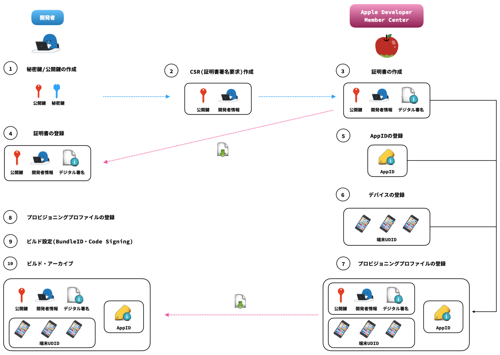
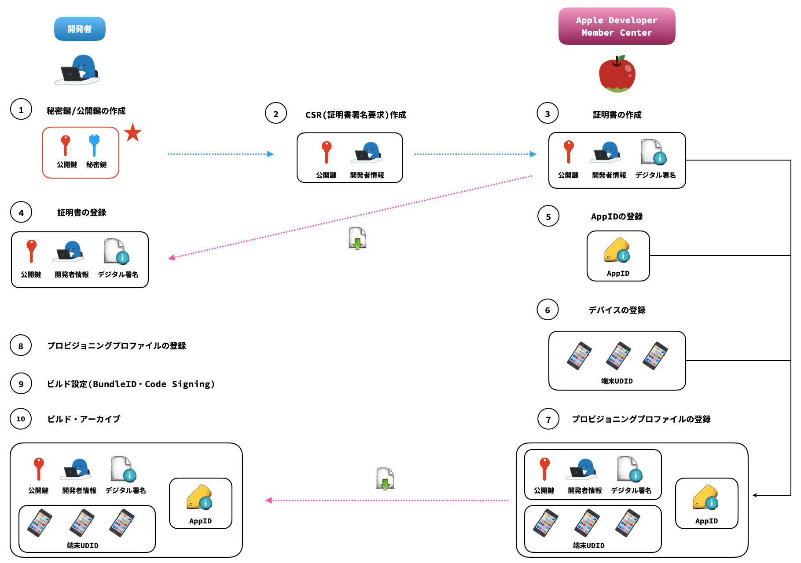
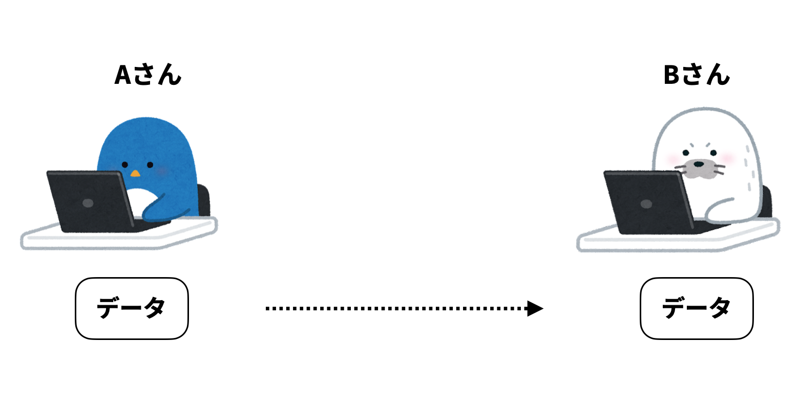
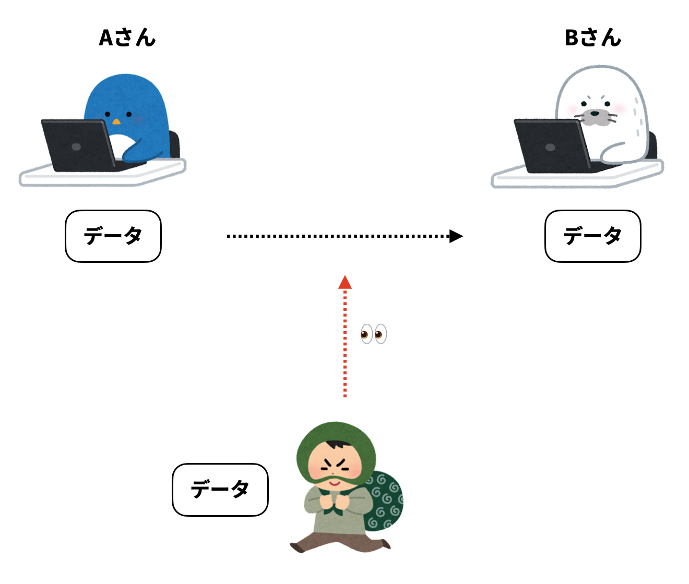
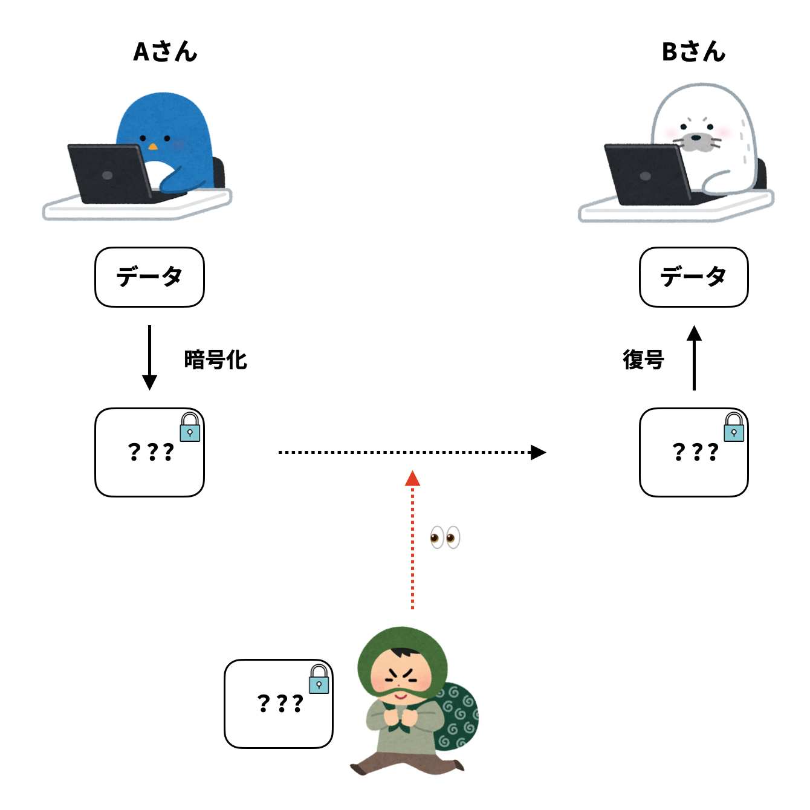
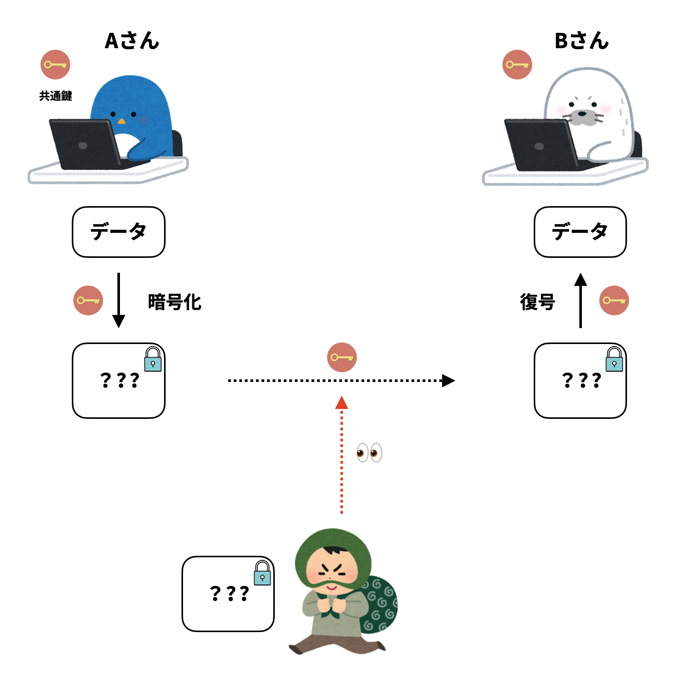
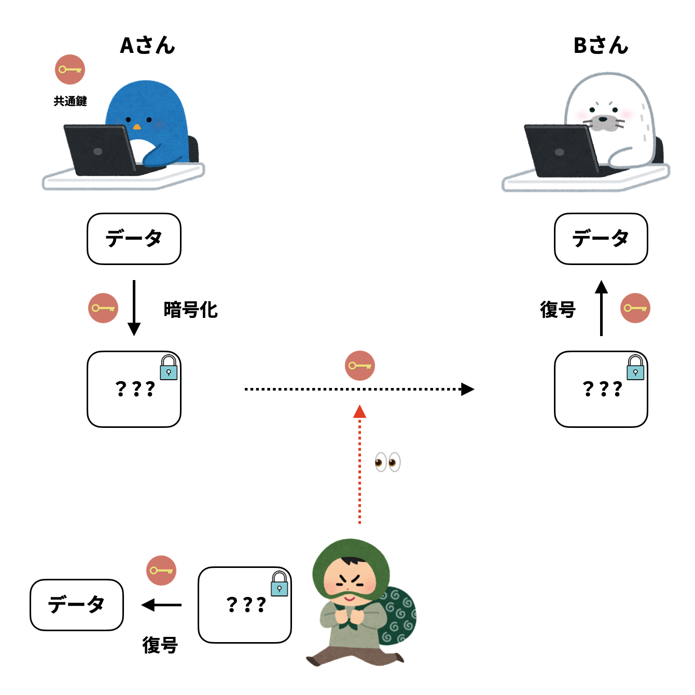
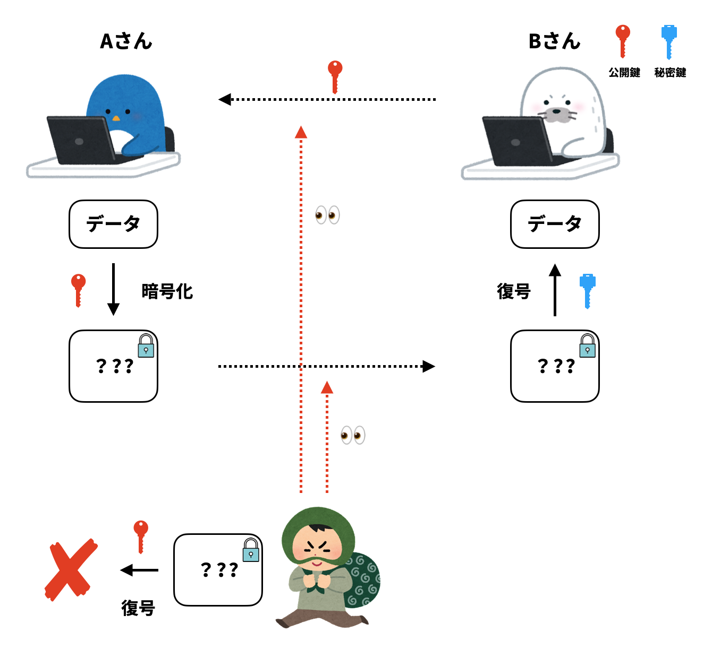
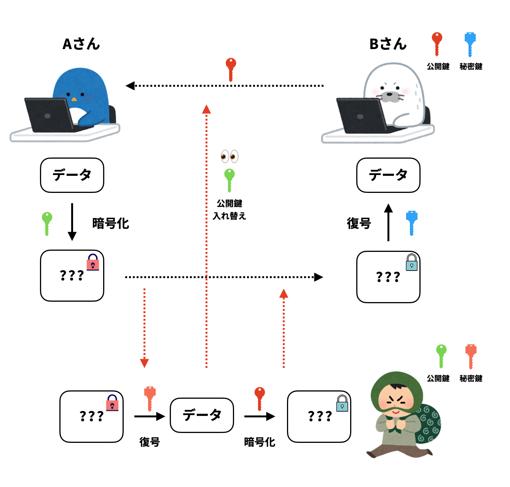

# iOSの証明書周りをイラストで読み解く 事前準備編(データの暗号化)

iOSのアプリを公開する際には証明書が必要になりますが、複雑で理解しにくい部分が多くありました。

そのため、今回は証明書周りをなるべくイラストを使って読み解いていきたいと思います。

こちらは証明書周りの概要図になります。

※ 概要図を説明する上で、こちらの[記事](https://qiita.com/fujisan3/items/d037e3c40a0acc46f618)が大変分かりやすいため、こちらを参考に作成いたしました

## 概要

今回はiOSの証明書周りを理解するための事前準備編として、データのやり取りの際に用いられるデータの暗号化、ならびに鍵について読み解いていきます。

まずはシンプルなAさんとBさんのデータのやり取りをイラストで表してみます。

このままですと、悪意を持った第三者からデータを盗み見される可能性があります。

データの暗号化は、こうしたデータの内容を第三者から見られるのを防ぐためにデータを加工することです。

データを暗号化することで、受け取った側は暗号化されたデータを元のデータに戻す復号をしない限りは確認することができません。そのため、第三者から盗み見されたとしてもデータの内容を知ることができません。

そして、データを暗号化・復号するためには「鍵」というものが必要になります。

データを暗号化する方法として、暗号化と復号に同じ鍵を使う「共通鍵暗号方式」と別々の鍵を用いる「公開鍵暗号方式」に分けられます。

### 共通鍵暗号方式

暗号化と複合に同じ鍵を用いる暗号方式です。

前述したように、第三者から盗み見されたとしても、暗号化されたデータであるためデータの内容を知ることができません。

しかし、共通鍵暗号方式には問題点があります。それが、データを受け取る側が共通鍵を持っておらず、送る側が共通鍵も一緒に渡す場合に、第三者が盗み見した時にその共通鍵を使ってデータを復号できてしまうことです。

このように、公開鍵をそのまま送信すると第三者に盗まれてしまうため、安全に鍵を配送する手段を取る必要があります。(鍵配送問題)

### 公開鍵暗号方式

暗号化と複合に異なるペアとなる鍵を用いる暗号方式です。

暗号化に使う鍵を「公開鍵」、復号に使う鍵を「秘密鍵」として、それぞれが別々の機能を持ちます。

受け取る側(Bさん)が送る側(Aさん)に対して事前に公開鍵を送っておき、その公開鍵を使ってデータを暗号化します。

暗号化されたデータは公開鍵のペアとなる秘密鍵でしか復号できません。そのため、公開鍵と暗号化されたデータを第三者に盗み見された場合でも暗号化されたデータを復号できるのは秘密鍵であるため、元のデータに復号することはできません。

公開鍵暗号方式では共通鍵暗号方式の問題としてあった鍵配送問題を解決することができますが、一方で公開鍵の信頼性に関する問題があります。

公開鍵には作成者などに関する情報を持たないため、データを受け取る側(Bさん)が送る側(Aさん)に公開鍵を渡す際に、第三者が自身で作成した公開鍵とすり替えても、送る側(Aさん)が受け取る側(Bさん)からの公開鍵なのか、第三者にすり替えられた公開鍵なのかを判断することができません。

iOSの証明書では公開鍵暗号方式が使われており、公開鍵の信頼性の問題に対してはデジタル署名、デジタル証明書の仕組みを組み合わせることで開発者情報の特定、情報の改変がないことの検証をしています。

デジタル署名、デジタル証明書については次回詳しく読み解いていきます。

## まとめ

iOSの証明書ではデータの暗号化に公開鍵暗号方式が使われています。また、公開鍵の信頼性の問題に対してはデジタル署名、デジタル証明書の仕組みを組み合わせることで、証明書の目的である開発者情報の特定、アプリが改変されていないことの証明を実現しています。

## 参考文献

[iOSアプリのプロビジョニング周りを図にしてみる](https://qiita.com/fujisan3/items/d037e3c40a0acc46f618)

石田保輝・宮崎修一 (2017) アルゴリズム図鑑 照英社