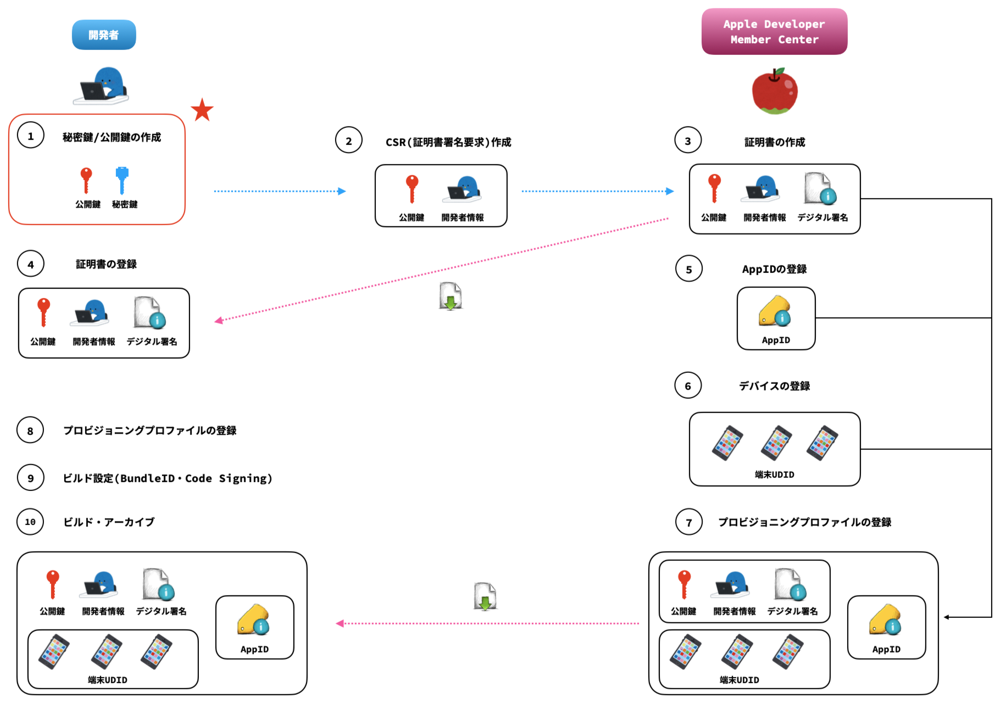
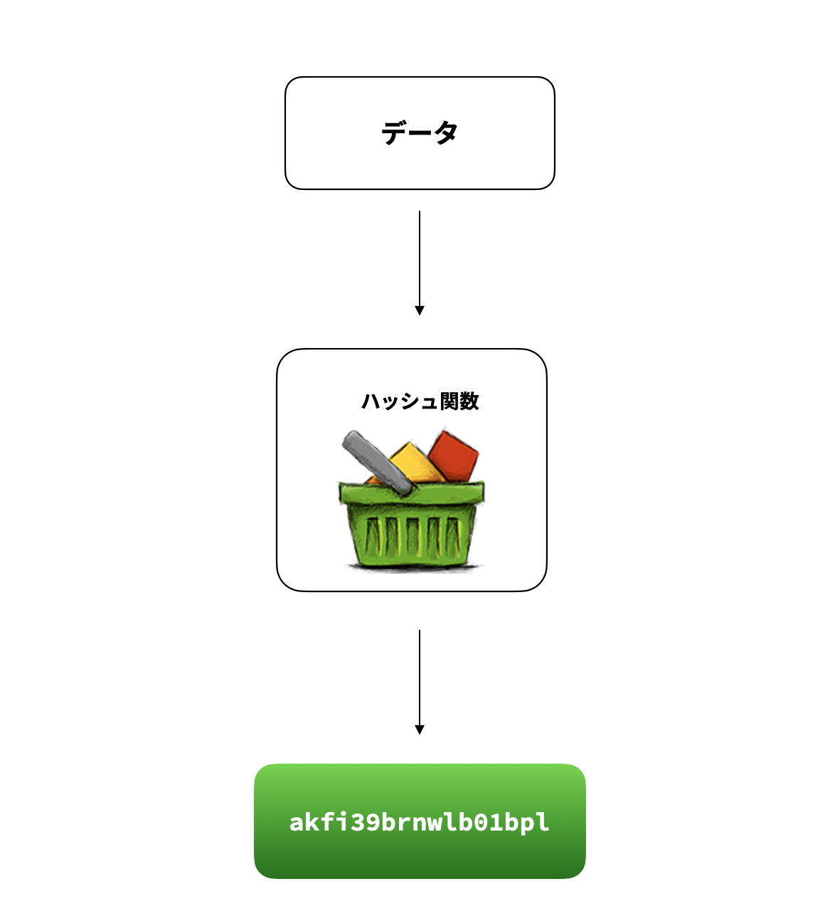
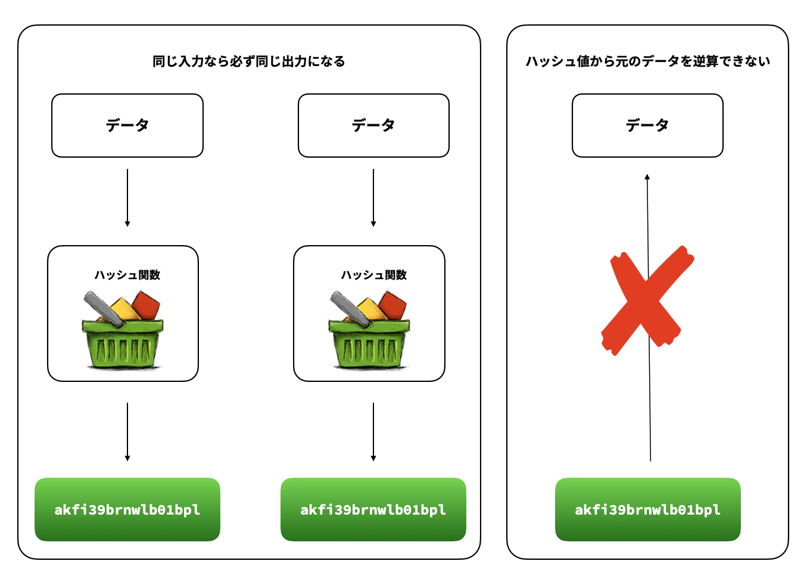
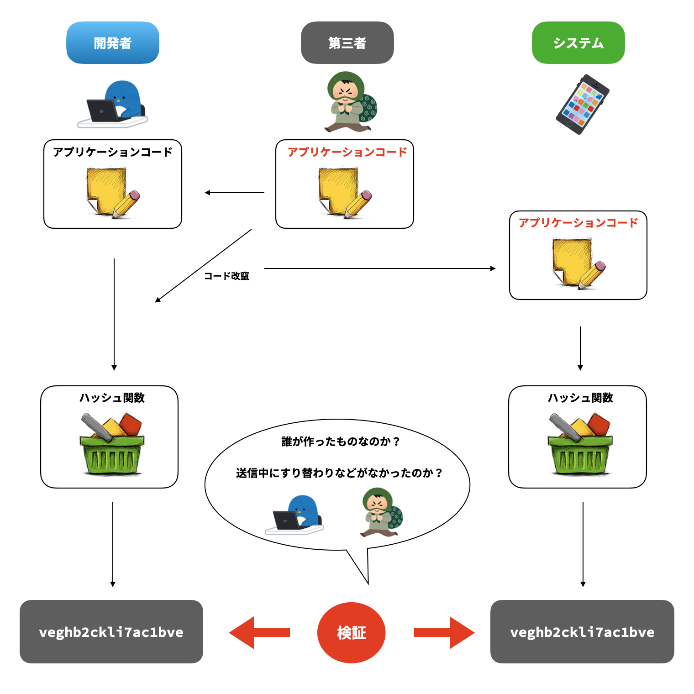
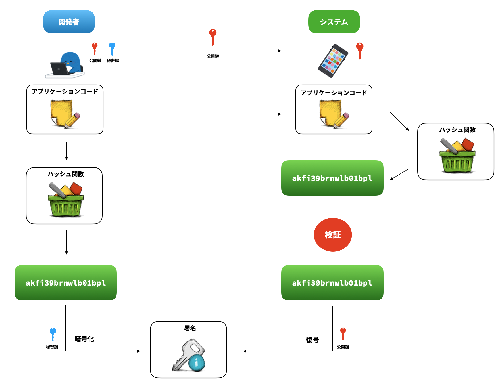
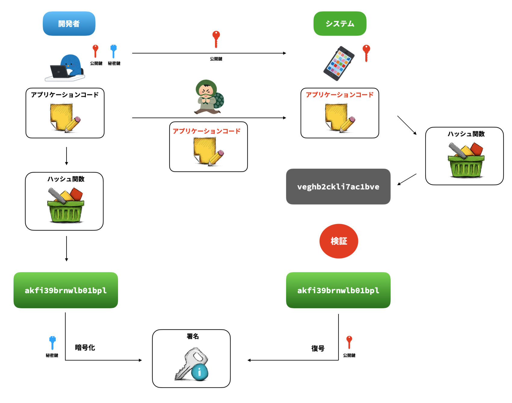
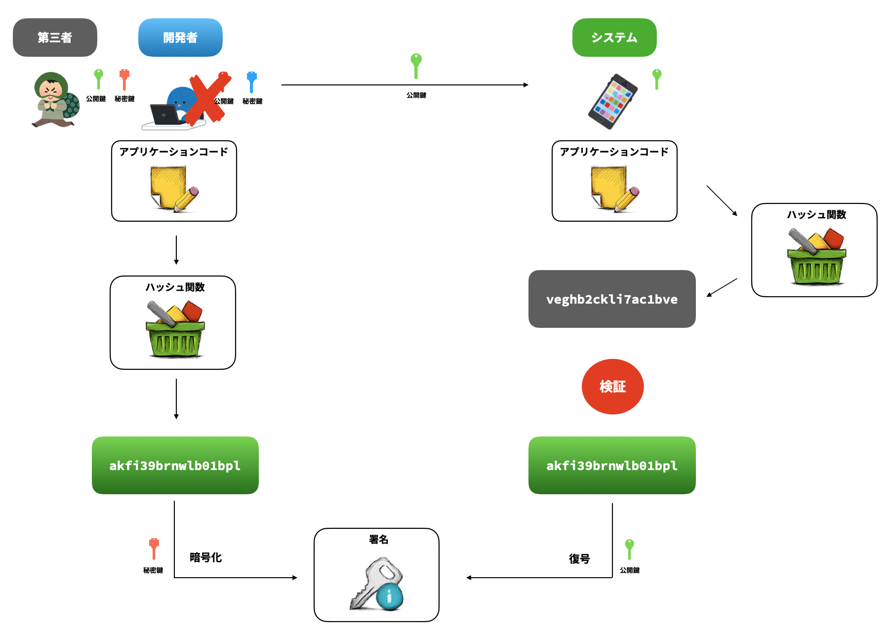
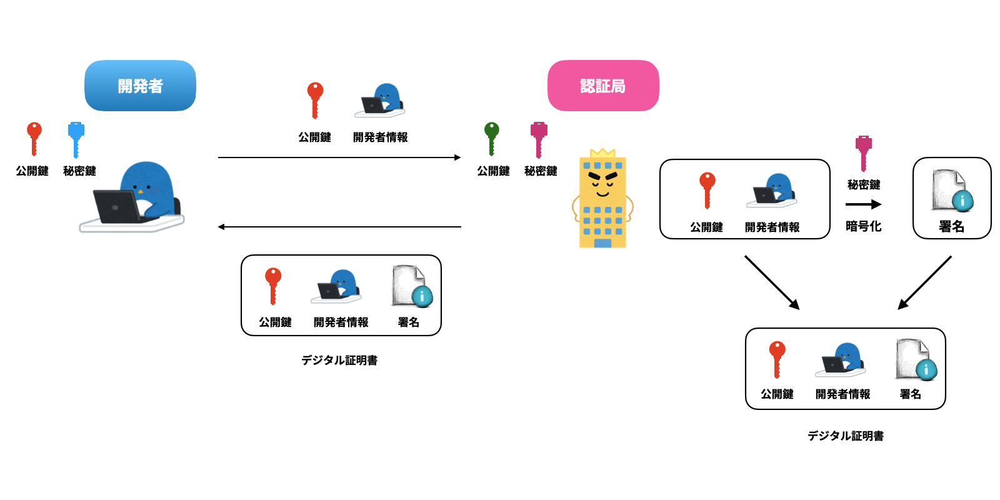
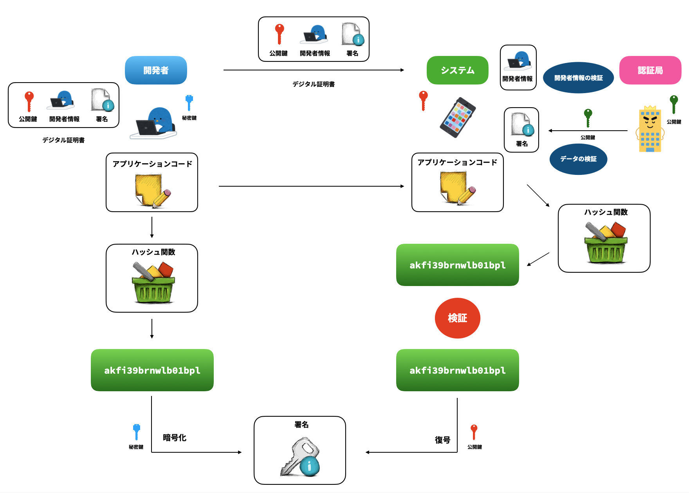
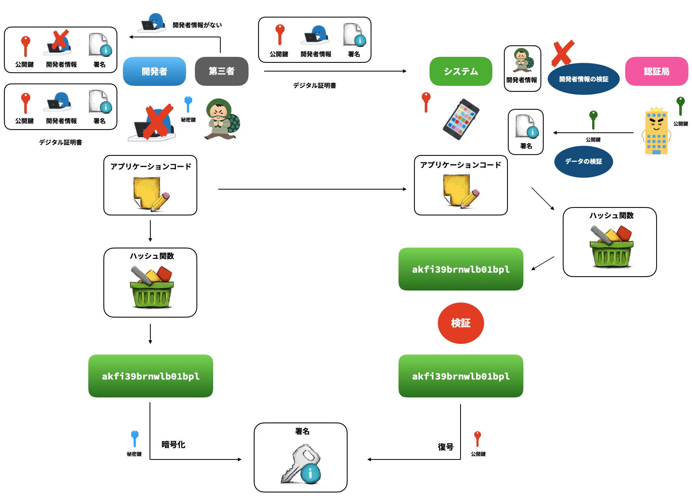

# iOSの証明書周りをイラストで読み解く 秘密鍵・公開鍵/コード署名編(秘密鍵と公開鍵の作成)

[前回](記事URL)はiOSの証明書周りを理解するための事前準備編として、データのやり取りの際に用いられるデータの暗号化、ならびに鍵について読み解いていきました。

今回は証明書の中で作成されることになる秘密鍵・公開鍵について、デジタル署名・デジタル証明書とともに読み解いていきます。

## 概要

証明書の中で使用される秘密鍵・公開鍵は概要図である`② CSR(証明書署名要求)作成`の際に自動的に作成されるため、実際の作成方法は次回ご紹介したいと思います。

ここでは、秘密鍵・公開鍵が使用されているコード署名について確認してみます。

### コード署名

コード署名とは、iOSにおいては以下のようなことを可能にするための仕組みです。

* アプリケーションの正当性の検証
* アプリケーションの完全性の保証
* 開発者IDの確認
* 安全なアプリケーションの配布

具体的に実現していることは以下の2点であり、これらをそれぞれ確認してみます。

1. アプリケーションの正当性の検証(改竄などがないかどうかの検証)
2. 開発者または企業の真正性の保証(特定の開発者・企業のアプリケーションかどうかの証明)

#### アプリケーションの正当性の検証(改竄などがないかどうかの検証)

アプリケーションのコードが改竄されていないことを確認するにはハッシュ関数が用いられます。

ハッシュ関数とは、与えられたデータを固定長の不規則な値に変換する関数のことを指します。

ハッシュ関数には、同じ入力なら出力は必ず同じになる、ハッシュ値から元のデータを逆算することはできないといった特徴を持っています。

アプリケーションのコードにおいても、アプリケーションのコードをハッシュ関数でハッシュ化し、そのハッシュ値を使って改竄されていないかどうかの検証が行われます。

しかし、そのままアプリケーションのコードをハッシュ関数を使ってハッシュ化し、ハッシュ値で検証するだけでは不十分です。その情報が開発者によって実際に作成され、送信中に改竄されていないことを証明できないからです。

そこで、開発者を特定し改竄の検証もするためにデジタル署名が利用されます。

#### 開発者または企業の真正性の保証(特定の開発者・企業のアプリケーションかどうかの証明)

デジタル署名では、ハッシュ値と公開鍵・秘密鍵を使用してデータの真正性、完全性、送信者の認証を保証するものです。コード署名では、アプリケーションのコードのハッシュ値を秘密鍵を使って署名を行い、公開鍵を使って検証します。

公開鍵を使って送られてきた署名を復号できるのは、それのペアとなる秘密鍵を使って暗号化した署名者の署名のみです。つまり、データを復号できた場合には、秘密鍵を持っている所有者によって署名されたデータであることが保証され、署名された後にデータの改竄があってもハッシュ値が異なるため不正を検出することができます。

デジタル署名によって、署名後の改竄の検出、特定の開発者(企業)に署名されていることを検証することができるようになりました。

しかし、デジタル署名にも問題点があります。それが公開鍵暗号方式と同じく、公開鍵の信頼性の問題です。公開鍵には作成者などに関する情報を持たないため、第三者がなりすますことができてしまいます。

そこで、公開鍵が信頼でき、真正性を保証するための仕組みとしてデジタル証明書が使用されます。

### デジタル証明書

デジタル証明書は、認証局(CA: Certification Authority)を通して、公開鍵に自身の情報を含めたものです。認証局は開発者の公開鍵と開発者情報、その他関連情報を自身の秘密鍵で署名を行い、公開鍵・開発者情報・署名情報をまとめてデジタル証明書として発行します。

先ほどのコード署名のデジタル署名の流れの中では、開発者が公開鍵を渡して検証を行なっていましたが、これをデジタル証明書を使って検証するようにします。

デジタル証明書では公開鍵に含めて署名情報と開発者情報を持っているため、第三者が開発者になりすますことができなくなります。

これで、コード署名の中でアプリケーションの正当性の検証(改竄などがないかどうかの検証)、開発者または企業の真正性の保証(特定の開発者・企業のアプリケーションかどうかの証明)を確認することができました。

## まとめ

公開鍵と秘密鍵が使用されているコード署名の中では、アプリケーションの正当性の検証(改竄などがないかどうかの検証)、開発者または企業の真正性の保証(特定の開発者・企業のアプリケーションかどうかの証明)のためにデジタル署名やデジタル証明書の仕組みを利用していることを確認することができました。

次回は、今回登場したデジタル証明書を実際に作成しながら、必要な手順を読み解いていきます。

## 参考文献

[Xcode と署名](https://scrapbox.io/tasuwo-ios/Xcode_%E3%81%A8%E7%BD%B2%E5%90%8D)

[iOSのコード署名がなんのためにどうやって行われているかを理解する](https://qiita.com/maiyama18/items/88567365dde2a3b3cc92#%E3%82%B3%E3%83%BC%E3%83%89%E7%BD%B2%E5%90%8D%E3%81%AE%E7%99%BB%E5%A0%B4%E4%BA%BA%E7%89%A9)

石田保輝・宮崎修一 (2017) アルゴリズム図鑑 照英社