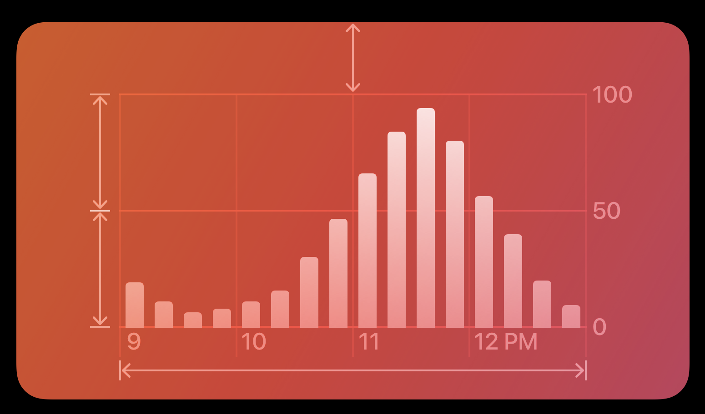
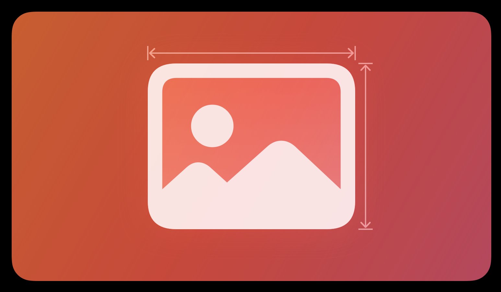
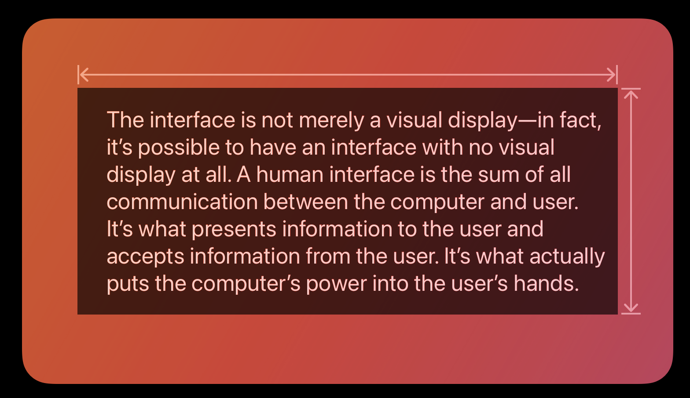
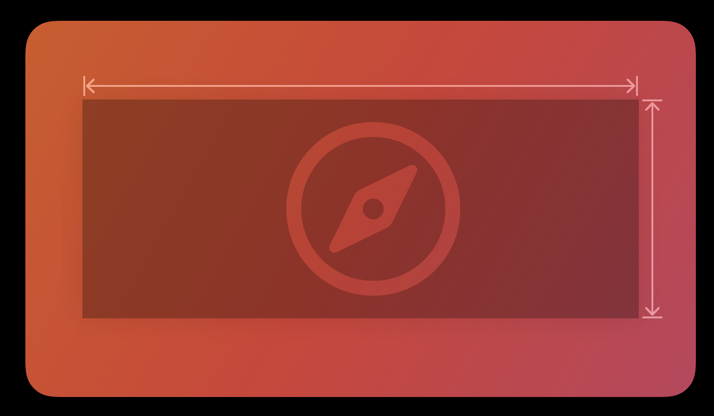

# コンテンツ

## グラフ

データをグラフで表現すると、分かりやすくて視覚に訴える形で情報を伝達できる。

* マーク
  * データについて伝えたい情報に合ったマークのタイプを選択する

バー | ライン | ポイント
:--: | :--: | :--:
 |  | 
異なるカテゴリの値を比較するグラフ、時間の経過にともなってデータがどのように変化するかを示すグラフ | 時間の経過に伴う値の変化を表すグラフ、全体のトレンドを視覚化 | ここのデータの値を視覚的に強調する。ここのデータを精査したり、外れ値やクラスタを識別したりする

* 軸
  * グラフの持つ意味に合わせて、軸の範囲を固定または動的にする
    * 最小値、最大値の関係に意味がある場合は、範囲を固定推奨(バッテリー残量グラフなど)
    * 発生し得るデータ値が大きく変化し、プロット領域を活用してマークを細かくプロットしたい場合は、範囲を動的推奨(ヘルスケアの歩数グラフなど)
  * 軸のメモリとグリッド線のラベルにはきりのいい値を使用する(0, 5, 10など)
  * グリッド線とラベルの見た目をグラフの用途に合わせて調整する

* 説明コンテンツ
  * ユーザーがグラフをみる前にグラフの目的を理解できるような説明を記述する(VoiceOverユーザや特定の種類の認識障がいのあるユーザーにとって特に重要)
  * グラフの主要なメッセージを要約し、誰にとっても利用しやすく役に立つグラフにする(鍵となる情報を要約してユーザーが一目で把握できるようにすることが重要)

### ベストプラクティス

1. 視覚的に整理された階層を維持し、さまざまなグラフ要素の相対的重要性がすぐ分かるようにする
2. 表示領域が狭い環境では、プロット領域の幅を最大にして十分な場所を確保し、ユーザーがグラフを快適に活用できるようにする
3. アプリ内のすべてのグラフのグラフでアクセシビリティに対応する
4. 必要に応じてユーザーがテータを操作できるようにするが、重要な情報は操作を行わなくても分かるようにする
5. 誰でも簡単にグラフを操作できるようにする
6. キーボードコマンドやスイッチコントロールで、操作可能なグラフ内を簡単に移動できるようにする
7. ユーザがグラフの重要な変化に気付けるようにする
8. グラフを周囲のインターフェイス要素と揃える

## イメージビュー

透明または不透明の背景の上に1つのイメージが表示される、場合によっては、イメージのアニメーションシーケンスが表示されることもある。

### ベストプラクティス

1. イメージビューはビューの主な目的が単にイメージを表示することである場合に使用する
2. インターフェイスにアイコンを表示したい場合は、イメージビューの代わりにシンボルまたはインターフェイスアイコンを使用することを検討する
3. イメージ上にテキストをオーバーレイする時は注意する。テキストオブジェクトを目立たせる方法を検討する
4. アニメーションシーケンスでは全てのイメージに一貫したサイズを使用するよう努める

## テキストビュー

複数行のスタイル付きテキストコンテンツを表示する、任意で編集可能にする。

### ベストプラクティス

1. 長いテキストや編集可能なテキスト、特殊なフォーマットのテキストを表示する場合に使用する
2. テキストを読みやすくする、コンテンツの可読性を維持する(Dynamic Typeの採用)
3. 有用なテキストは選択可能にする

## Webビュー

埋め込まれたHTMLやWebサイトなどのリッチなWebコンテンツをアプリ内に直接読み込んで表示する。

### ベストプラクティス

1. 進む/戻るナビゲーションに適宜対応する
2. Webビューを使ってWebブラウザを構築することはしない