# レイアウトと編成

## ボックス

理論的に関連のある情報やコンポーネントを視覚的にまとめるためのコンポーネント。

そのコンテンツをインターフェイスの残りの部分と区別するためのボーダーやバックグラウンドカラーがデフォルトで設定されており、タイトルも含めることができる。

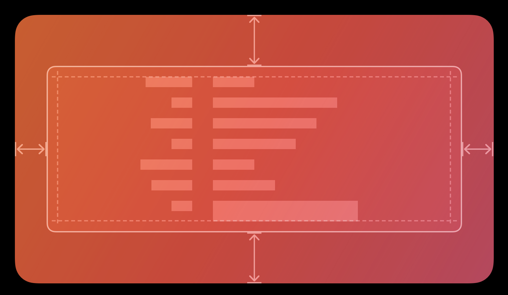

### ベストプラクティス

1. ボックスを含むビューに対してなるべく小さくする(他のコンテンツを圧迫しないようにする)
2. ボックス内でさらにグループ化を行う場合は余白や配置を工夫する(圧迫感を防ぐようにする)

### コンテンツ

* タイトルによってボックスのコンテンツを容易に識別できる場合は、簡潔なタイトルを含める
* タイトルが必要な場合は、簡潔な表現にする、英語の場合は大文字化し句読点は使用しない(設定パネルでボックスを使用する場合は、タイトルにコロンを付加する)

## コレクション

順序の付いたコンテンツのセットを管理して、カスタマイズ可能な視覚に訴えるレイアウトで表示する。

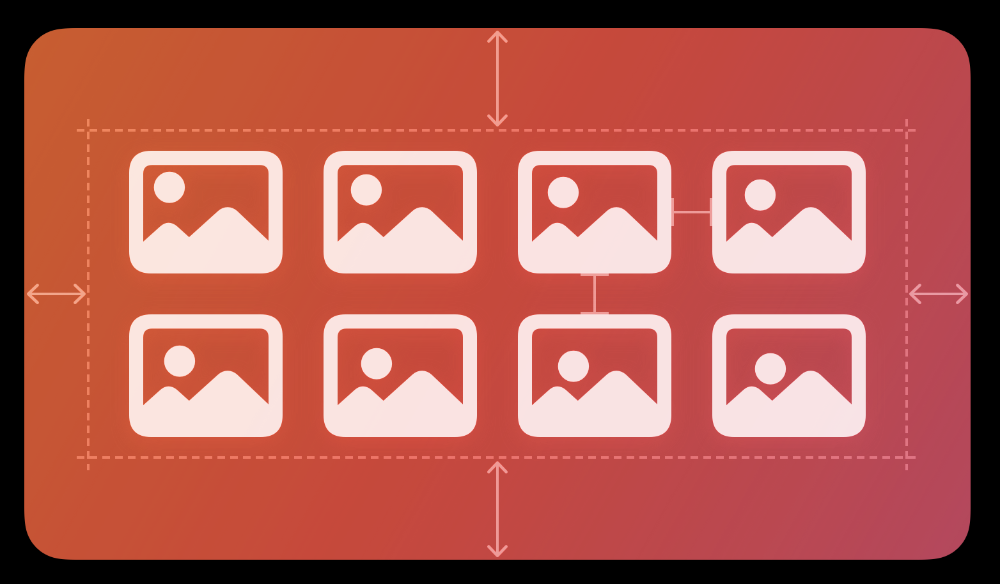

### ベストプラクティス

1. 可能な場合は常に、標準の行レイアウトやグリッドレイアウトを使用する(ユーザーを戸惑わせたり、不必要に注目を引いたりするカスタムレイアウトを避ける)
2. テキストを表示する場合はコレクションではなくテーブルを使用する
3. 項目を選択しやすくする
4. 必要に応じてカスタムの操作を追加する
5. ユーザーが項目を挿入、削除、並び替えた場合は、なるべくアニメーションを使用してフィードバックを返す

## カラム表示(macOS)

縦方向のカラムを使用して、データ階層の参照や移動を行う。

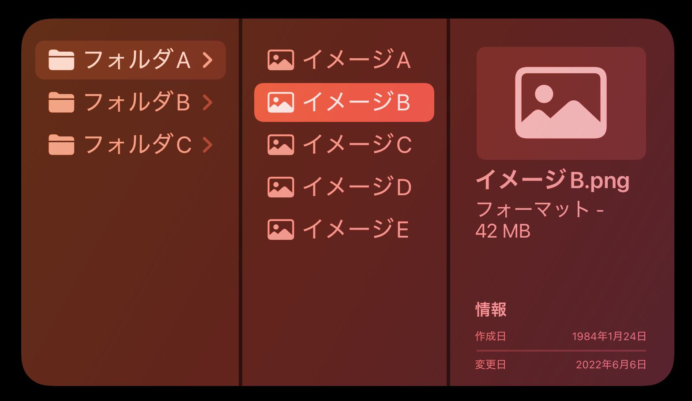

### ベストプラクティス

1. 深いデータ階層内でユーザーが頻繁に移動を繰り返すタイプのアプリで、リストまたはテーブルで提供されるような並び替えの機能が必要ない場合は、カラム表示の使用を検討する
2. データ階層のルートレベルを最初のカラムに表示する
3. 子項目がない項目が選択されたら、その項目自体の表示を表示する
4. ユーザーがカラムの幅を変更できるようにする

## 開閉コントロール

特定のコントロールやビューに関する情報や機能を表示したり非表示にしたりする

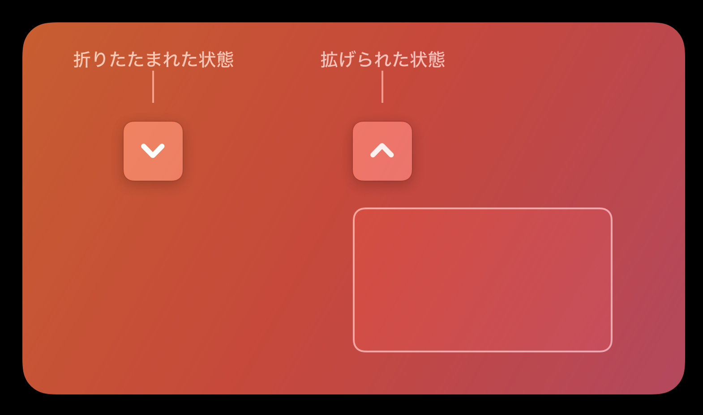

### ベストプラクティス

1. 詳細な情報は、それが必要になるまで開閉コントロールを使って非表示にする

## ラベル

ユーザーが読むことができるコピーはできるが、編集はできない静的なテキスト。

* ボタン内では、「編集」、「キャンセル」、「送信」などのボタンの機能を伝える
* リスト内では、各項目を説明する
* ビュー内では、コントロールの紹介やビュー内で実行できる一般的な操作やタスクの説明を表示する

### ベストプラクティス

1. ユーザーが編集する必要がない少量のテキストを表示するために使用する(少量のテキストをユーザーが表示できるようにする場合はテキストフィールド、対象のテキストを表示し、適宜ユーザーが編集できるようにする必要がある場合はテキストビューを使用する)
2. システムフォントを優先する(カスタムを使用する場合は、必ずテキストを読めるようにする)
3. システムで提供されるラベルカラーを使って相対的な重要度を伝える
4. 有用なラベルテキストは選択可能にする(エラーメッセージ、場所、IPアドレスなどの有用な情報がラベルに含まれる場合は、その情報を選択して他の場所にコピー&ペーストできるようにする)

## リストとテーブル

行に対して1つ以上の列にデータを表示する。

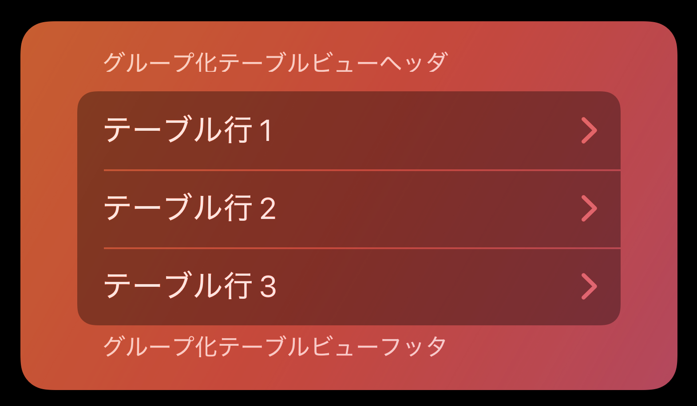

### ベストプラクティス

1. リストまたはテーブルではテキストの表示を優先する(サイズのばらつきの大きい項目がある、多数のイメージを表示する必要がある場合は、代わりにコレクションを使用することを検討する)
2. 適切な場合に限りユーザーがテーブルを編集できるようにする
3. ユーザーがリストの項目を選択した時に適切なフィードバックを提供する

### コンテンツ

* 常に項目のテキストを簡潔にして行の内容を読みやすくする
* 他の方法では収まりきらなかったりキレたりする可能性があるテキストの読みやすさを保つ方法を検討する(テキストの中央に省略記号を表示する)
* 複数列のテーブルでは説明的な列見出しを使用する

## ロックアップ(tvOS)

複数の別個のビューを組み合わせて1つのインタラクティブな単位にしたもの。

### ベストプラクティス

1. ロックアップ間に十分なスペースを取る
2. 1つの列またはグループ内で一貫したロックアップのサイズを使用する(ボタンのグループや1列に並んだコンテンツイメージは、全ての要素の幅と高さを一致させる)

* カード(ヘッダ、フッタ、およびコンテンツビューを組み合わせてメディア項目の制限していやレビューが表示される)

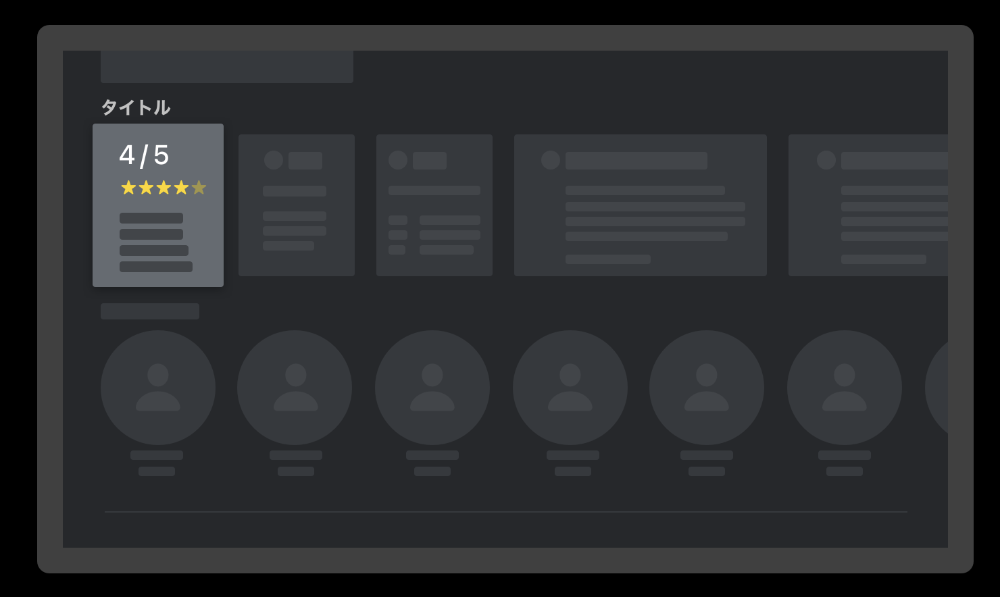

* キャプションボタン(ボタンの下にタイトルとサブタイトルを含める)

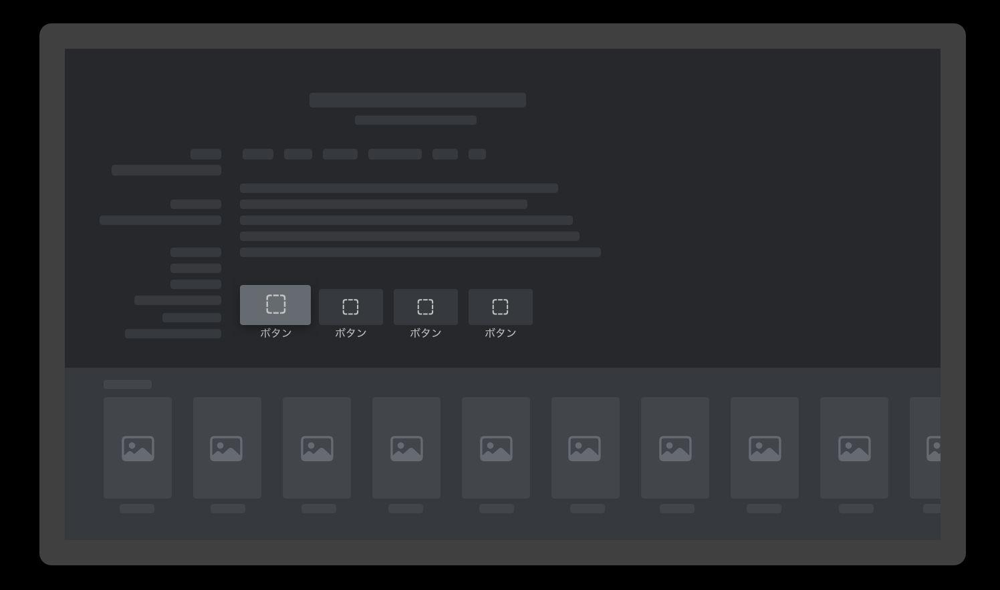

* モノグラム(人物を明確にする、イニシャルではなくイメージを使用する)

* ポスター(イメージとオプションのタイトルおよびサブタイトルを含める)

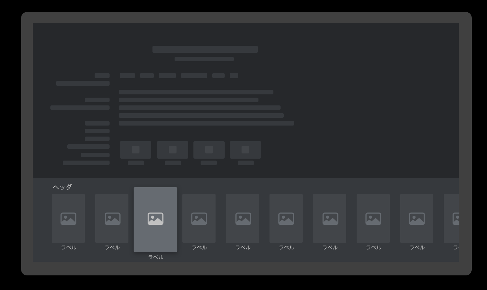

## アウトラインビュー(macOS)

列と行を整理されているセルのスクロールするリストで、階層型のデータの表示に適している。

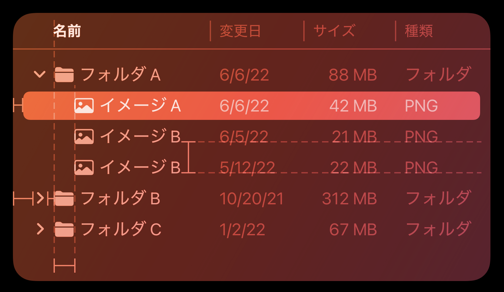

### ベストプラクティス

1. 階層型でないデータを表示する場合はアウトラインビューではなくテーブルを使用する
2. データ階層は最初の列のみに表示する
3. コンテキストが分かるような列見出しを使用する
4. ユーザーが列見出しをクリックしてアウトラインビューを並び替えられるようにする
5. ユーザーが列の幅を変更できるようにする
6. 入れ子のコンテナをユーザーが簡単に展開したり折りたたんだりできるようにする
7. ユーザーが項目を展開した状態を維持する
8. 複数列のアウトラインビューでは行の列を交互にする
9. アプリ内で理にかなう場合にユーザーがデータを編集できるようにする
10. セルのテキストを切り捨てるのではなく、中央に省略記号を挿入して切り詰める
11. 内容が多いアウトラインビューでは、検索フィールドから値を素早く検索できるようにする

## Split View

複数の隣接するコンテンツパネルの表示を管理する。

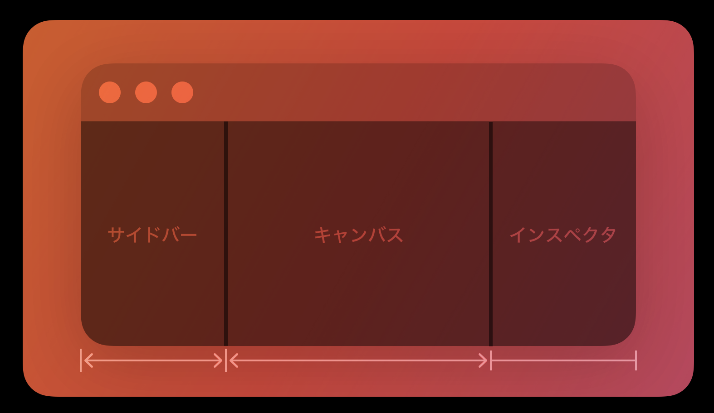

### ベストプラクティス

1. 表示領域がコンパクトの環境ではなくレギュラーの環境で使用することを心がける
2. ナビゲーションの操作感を高めるため、詳細ビューに到達するための各パネルでの選択箇所を常に強調表示する
3. パネル間でコンテンツのドラッグ&ドロップに対応する

## タブビュー(macOS, watchOS)

相互排他的な複数のコンテンツパネルを同じ領域に表示する。

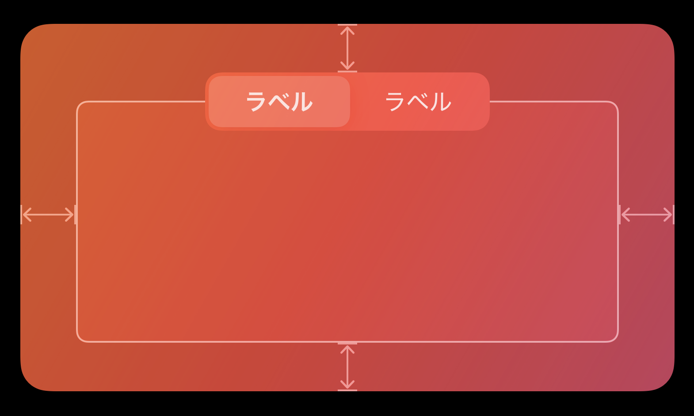

### ベストプラクティス

1. 互いに関連の深いコンテンツ領域を表示する時に使用する
2. パネル内のコントロールは同じパネル内にのみ影響するようにする
3. それぞれのタブにはパネルの内容を表すラベルを指定する
4. タブの切り替えようにポップアップボタンを使うのは避ける
5. タブビューに配置するタブは5個までにする