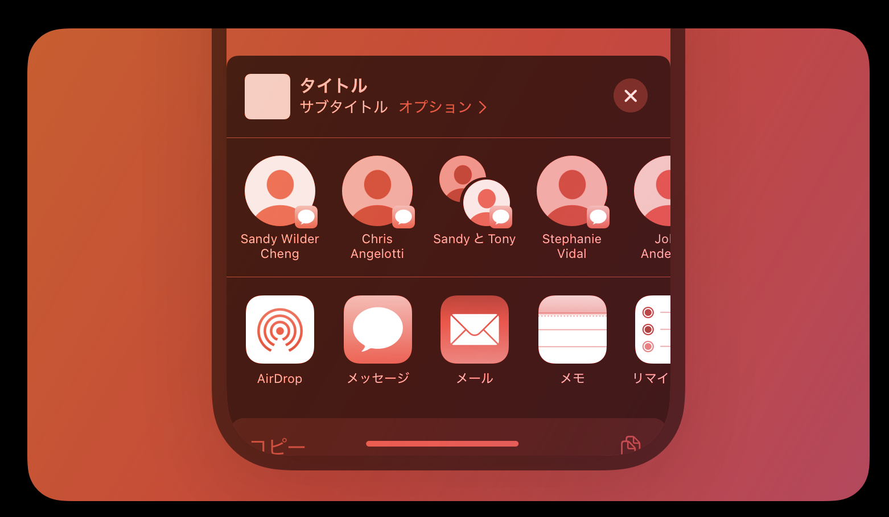
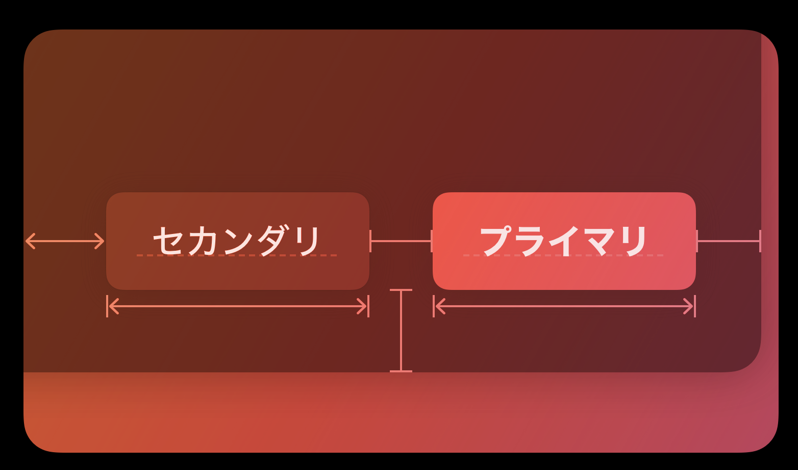

# メニューとアクション

## アクティビティメニュー

共有シートとも呼ばれ、現在のコンテキストで実行できる様々なタスクを表示する。

### ベストプラクティス

1. すでに利用できる一般的なアクションと重複するアクションを作らない
2. カスタムのアクティビティをシンボルで表現することを検討する(SF Symbols 70✖︎70)
3. カスタムアクションごとに簡潔でわかりやすいタイトルを付ける
4. 現在のコンテキストに適したアクティビティであることを確認する
5. アクティビティビューは「共有」ボタンからのみ表示する

### 共有機能拡張とアクション機能拡張

1. 必要に応じて、ユーザーが使いやすいと感じるカスタムインターフェイスを作成する
2. 操作を合理化して手順を減らす
3. 拡張機能にモーダルビューを重ねて配置しない
4. 必要に応じて、機能拡張の目的を伝える画像を用意する
5. 時間がかかる捜査の進捗はメインアプリで伝える(ただし、タスクが完了したことを伝えるためだけに通知は使うべきでない)

## ボタン

即座にアクションを開始する。

### ベストプラクティス

1. ユーザーが使いやすいボタンにする(ボタンの周りに十分な余白を取る、ヒット領域を44✖︎44以上にする)
2. 目的が明確に伝わるボタンにする

### スタイル

1. 基本的に、ビューの中で最もよく使われるであろうアクションのボタンには、視認できるバックグラウンドを使う
2. 視覚的に目立たせるボタンの数は1つのビューにつき2つまでにする
3. 複数の選択肢の中で推奨するものを視覚的に差別化する場合は、サイズではなくスタイルを使用する

### コンテンツ

1. ボタンが実行する処理がすぐに分かるようなコンテンツにする
2. ユーザーがボタンのアクションを確実に連想できるアイコンがあるなら、そのアイコンを使う
3. アイコンより短いラベルの方がもっと明確に意図を伝達できる場面は、テキストを使う

### 役割

* 通常: 特別な意味を持たないボタン
* プライマリ: ユーザーが選択する可能性が最も高いデフォルトのボタン
* キャンセル: 現在のアクションをキャンセルするボタン
* 破壊的: データの破壊に繋がるアクションを実行するボタン

1. ユーザーが選択する可能性が最も高いボタンにはプライマリの役割を割り当てる
2. 最も選択される可能性が高くても破壊的なアクションを実行する母tガンにはプライマリの役割を割り当てない

## コンテキストメニュー

## Dockメニュー

## 編集メニュー

## メニュー

## オーナメント

## ポップアップボタン

## プルダウンボタン

## ツールバー