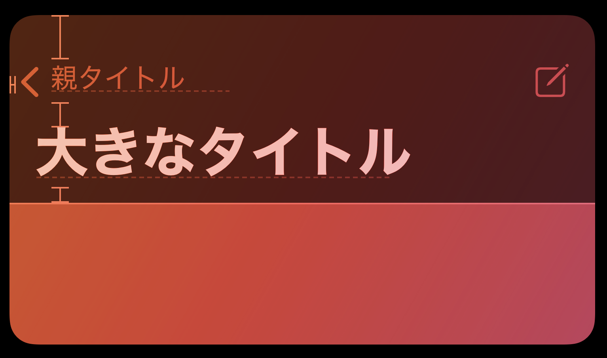
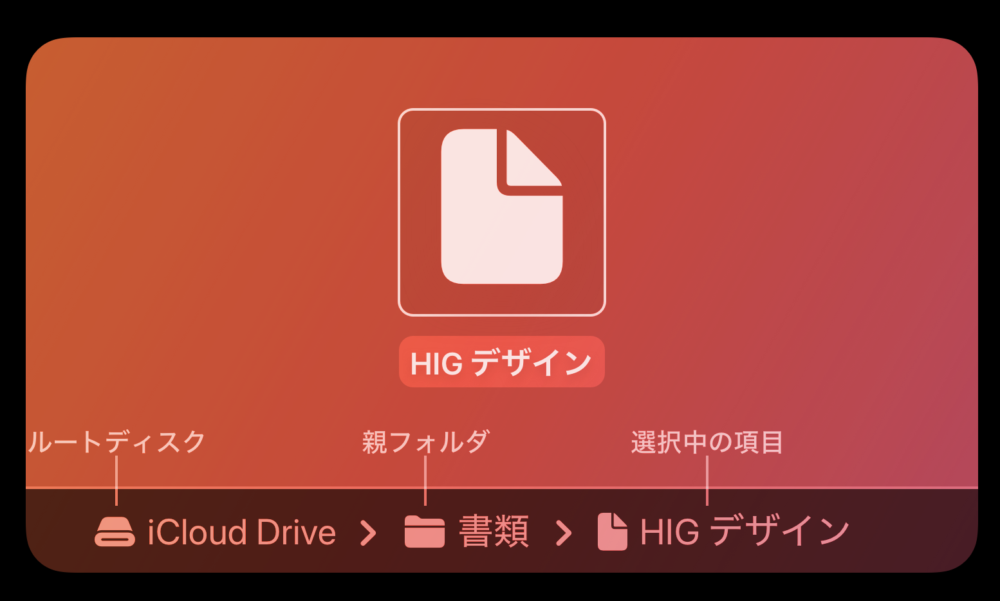
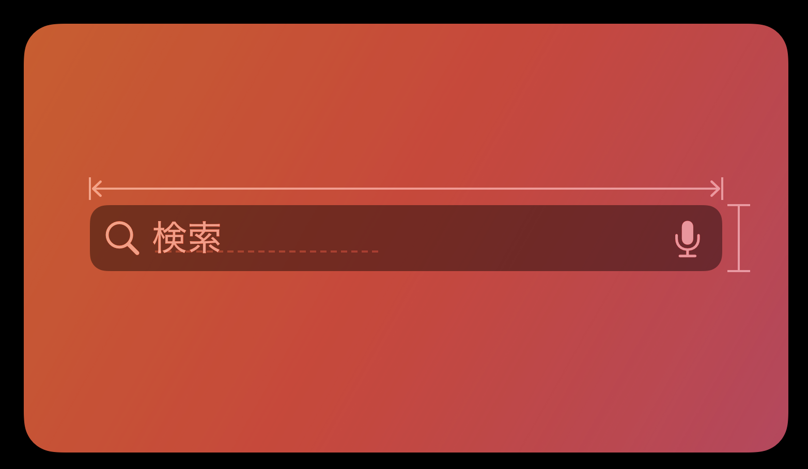
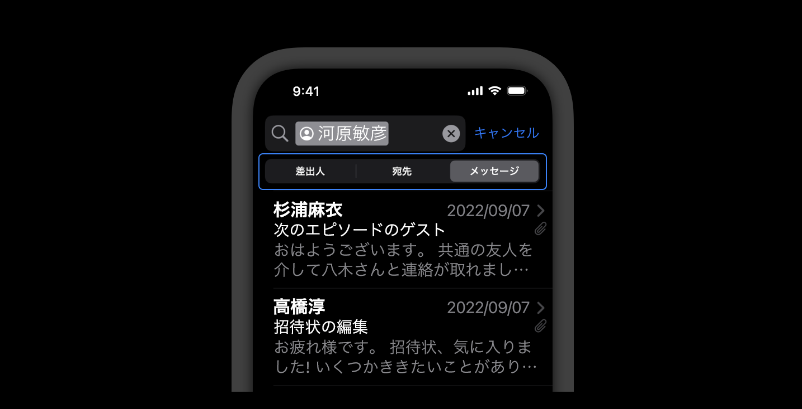
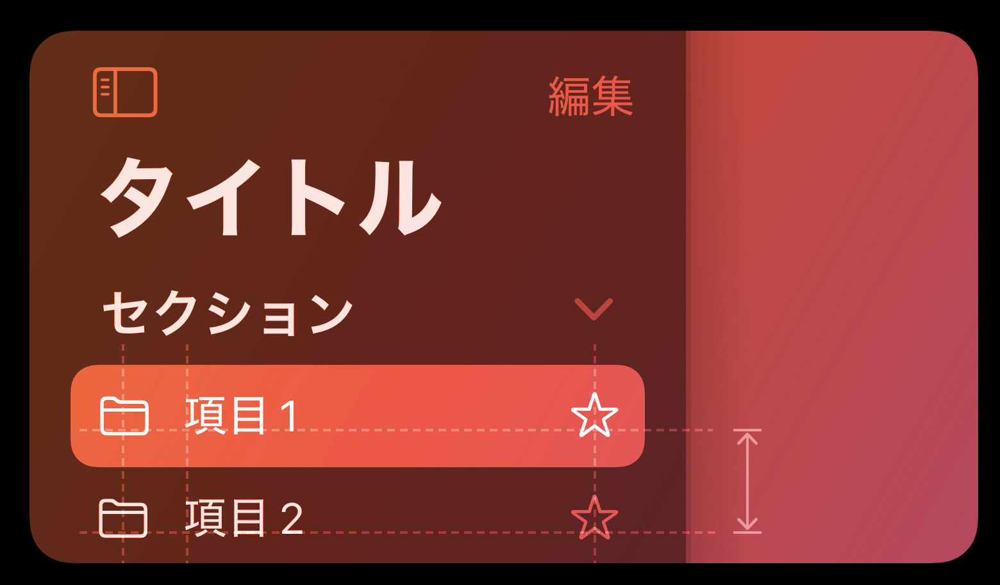
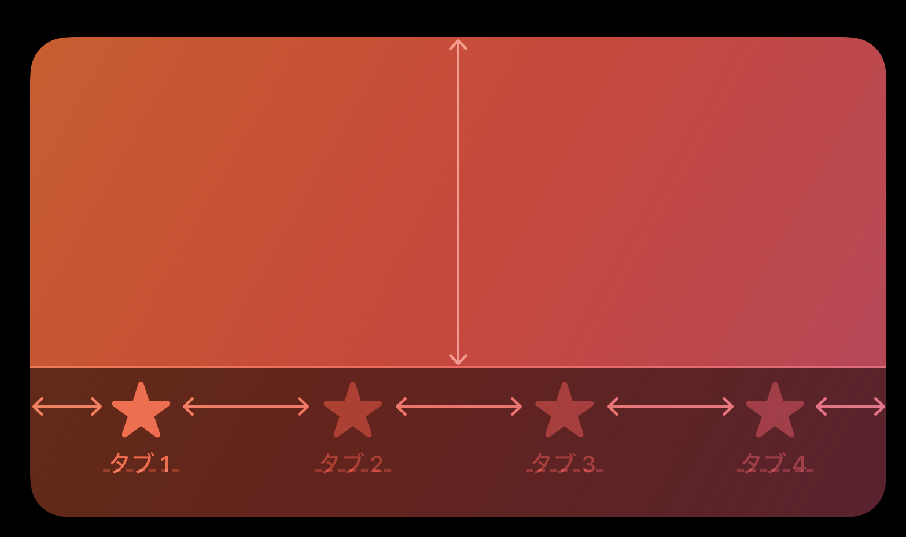
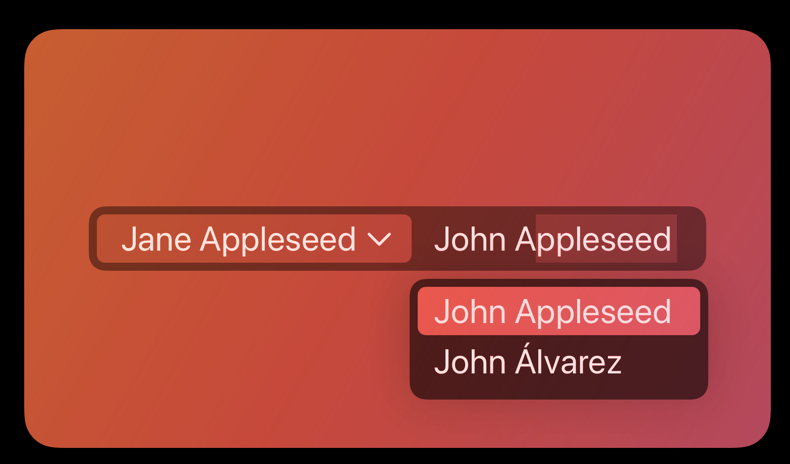

# ナビゲーションと検索

## ナビゲーションバー

ウィンドウまたは画面の上部に表示される、コンテンツの階層のナビゲーションを補助するコンポーネント。

### ベストプラクティス

1. タイトル領域によって有用なコンテキストを提供できる場合は、タイトル領域を使って現在のウィンドウを説明する
2. タイトルは簡潔にする(半角15文字以内目安)
3. 操作に集中できるように、ナビゲーションバーを一時的に非表示にすることを検討する
4. 標準の戻るボタンを使用する(戻るボタンのような見た目を維持する)
5. テキストラベルを使うボタンには十分なスペースを取る

### iOS/iPadOS

1. ナビゲーションバーでセグメントコントロールを使って情報階層をフラット化することを検討する
2. ユーザーが移動したりスクロールしたりしても常に自分の位置が分かるように、ラージタイトルを使用する
3. タイトルとコンテンツの繋がり感を強めるため、ラージタイトルのナビゲーションバーの枠線を非表示にすることを検討する

## パスコントロール(macOS)

選択されているファイルまたはフォルダのファイルシステムパスの表示。

### ベストプラクティス

1. パスコントロールはウィンドウフレームではなくウィンドウ本体で使用する

## 検索フィールド

ユーザーが入力した語句でコンテンツのコレクションを検索する。

### ベストプラクティス

1. 検索に役立つガイドを提供する
2. 検索フィールドの近くに便利なショートカットなどのコンテンツを表示する
3. 適切なタイミングで検索を開始する
4. 消去ボタンを含める
5. 検索履歴を表示するためにプライバシーに配慮する(スコープパーの検討)

## サイドバー

ユーザーがアプリやゲーム内を移動したり、コンテンツのトップレベルのコレクションに素早くアクセスする。

### ベストプラクティス

1. アプリの主要な領域またはフォルダやプレイリストなど、コンテンツのトップレベルのコレクションにユーザーが素早く移動できるようにする目的で使う
2. 可能な場合は、ユーザーによるサイドバーのコンテンツのカスタマイズに対応する
3. ユーザーが非表示できるようにする
4. 基本的に、サイドバーで表示する階層は2つまでとする
5. サイドバーに2つの階層を含める必要がある場合は、各グループに簡潔で分かりやすいラベルを付ける

### iOS/iPadOS

1. iOSアプリでは、サイドバーの代わりにタブバーを使用する
2. iPadOSアプリでは、タブバーの代わりにサイドバーを使用する
3. 必要に応じて、サイドバーの見た目を調整する

## タブバー

バーの項目によって、同じビューの中で相互排他的なコンテンツパネル間を移動する。

### ベストプラクティス

1. アクションの実行ではなく、ナビゲーションのために使用する
2. アプリの別の領域に移動してもタブバーが表示されたままになるようにする(モーダルビューは例外)
3. アプリのナビゲーションに必要なタブの数は最小限にする(iOSは5個、visionOS、iPadOS、tvOSは6個まで)
4. タブのコンテンツが利用できない時でもタブを消さない
5. 各タブタイトルに簡潔な用語を使用する
6. バッジを使用してさりげなく情報を伝える

### iOS/iPadOS

1. 可能な限りタブがあふれないようにする
2. iPadOSアプリではタブバーの代わりにサイドバーを使用することを検討する
3. タブバーの影響をそれに関連付けられているビュー内にとどめ、別のビューに影響が及ぼないようにする
4. タブバー項目の見た目に広く一貫性を持たせるためにSF Symbolを使用することを検討する

## トークンフィールド

テキストをトークンに変換できるテキストフィールドの1つ。テキストを容易に選択したり操作することができる。

### ベストプラクティス

1. コンテキストメニューで利便性を高める
2. テキストをトークンに変換できる方法を増やす
3. トークンの候補が表示されるまでのシステムの遅延時間をカスタマイズする