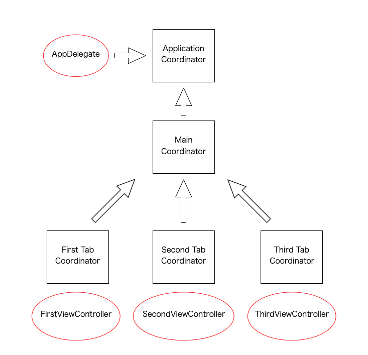

# Coordinatorパターン

## 概要
画面遷移の処理は一般的にViewControllerが受け持ちます。  
画面遷移したい場合にはViewController内で次のViewControllerをインスタンス化し、NavigationControllerへのpushやModalのpresentを行うのが一般的です。  
例えば、以下のような方法で画面遷移を行う場合があります。

```swift
final class MainViewController: UIViewController {

    private let modalButton: UIButton = {
        let button = UIButton()
        button.setTitle("MODAL", for: .normal)
        button.backgroundColor = .blue
        return button
    }()
    
    private let pushButton: UIButton = {
        let button = UIButton()
        button.setTitle("PUSH", for: .normal)
        button.backgroundColor = .green
        return button
    }()

    override func viewDidLoad() {
        super.viewDidLoad()
        setupView()
        setEvent()
    }

    private func setupView() {
        view.backgroundColor = .systemBackground

        title = "MAIN"

        view.addSubview(modalButton)
        view.addSubview(pushButton)

        modalButton.translatesAutoresizingMaskIntoConstraints = false
        pushButton.translatesAutoresizingMaskIntoConstraints = false

        NSLayoutConstraint.activate([
            modalButton.centerXAnchor.constraint(equalTo: view.centerXAnchor),
            modalButton.centerYAnchor.constraint(equalTo: view.centerYAnchor),
            pushButton.centerXAnchor.constraint(equalTo: view.centerXAnchor),
            pushButton.topAnchor.constraint(equalTo: modalButton.bottomAnchor, constant: 20)
        ])
    }

    private func setEvent() {
        modalButton.addTarget(
            self,
            action: #selector(tappedModalButton),
            for: .touchUpInside
        )

        pushButton.addTarget(
            self,
            action: #selector(tappedPushButton),
            for: .touchUpInside
        )
    }

    @objc private func tappedModalButton() {
        /* 次のViewControllerのインスタンス作成 */
        let nextVC = NextViewController()
        /* present(_:animated:)を使用してモーダル表示の処理を実行 */
        present(nextVC, animated: true)
    }

    @objc private func tappedPushButton() {
        /* 次のViewControllerのインスタンス作成 */
        let nextVC = NextViewController()
        /* UINavigationControllerのpushViewController(_:animated:)を使用してpush処理を実行 */
        navigationController?.pushViewController(nextVC, animated: true)
    }
}
```

しかし裏を返すと、ViewControllerは次のViewControllerのことを知っていることになります。  
上記でいうところの`MainViewController`が`NextViewController`を知る必要があるということです。  
遷移元のViewControllerと遷移先のViewControllerの関係が1対1である場合には大した問題にはなりません。  
ですがそのViewControllerを使い回したり、遷移先が複数存在するような場合、遷移先が特定のViewControllerに依存していることで、遷移ロジックが肥大化します。  
これを解決するためにViewControllerの上位レイヤーとして、画面遷移を管理するCoordinatorというものが生まれました。

## Application Coordinator
Coordinatorを導入する場合、アプリ全体を管轄する責務を持ったCoordinatorが1つ必要です。  
これを`Application Coordinator`と呼びます。  
`Application Coordinator`はAppDelegateが所有し、ルートビューに対するCoordinatorとなります。  
`Application Coordinator`をルートとして、1つのViewControllerにつき1つのCoordinatorが存在します。そして画面遷移の経路に沿った親子関係を構築します。  

例えばTabBarをルートとするアプリでは、それぞれのTabBarItemで、対応するNavigationController毎に1つのCoordinatorが存在し、それをタブ全体のCoordinatorが親として持つことになります。  
`Application Coordinator`は`Application Controller`とも呼ばれており設計パターンの1つでもあります。



### Application Coordinatorの実装
```swift
/** Coordinator.swift
 * Coordinatorが準拠すべきプロトコルの定義
 */
protocol Coordinator {
    func start()
}

/** AppDelegate.swift
 * AppCoordinatorの初期化
 */
@main
class AppDelegate: UIResponder, UIApplicationDelegate {
    var window: UIWindow?

    private var appCoordinator: AppCooridnator?

    func application(
        _ application: UIApplication,
        didFinishLaunchingWithOptions launchOptions: [UIApplication.LaunchOptionsKey: Any]?
    ) -> Bool {
        let window = UIWindow(frame: UIScreen.main.bounds)
        self.window = window

        let appCoordinator = AppCooridnator(window: window)
        appCoordinator.start()
        self.appCoordinator = appCoordinator

        return true
    }
}

/** AppCoordinator.swift
 * AppCoordinatorの作成
 */
final class AppCooridnator: Coordinator {
    private let window: UIWindow
    private let rootViewController: UITabBarController = .init()
    private var mainCoordinator: MainCoordinator?

    init(window: UIWindow) {
        self.window = window)
        self.mainCoordinator = MainCoordinator(tabController: self.rootViewController)
    }

    func start() {
        window.rootViewController = rootViewController
        mainCoordinator?.start()
        window.makeKeyAndVisible()
    }
}

/** MainCoordinator.swift
 * タブ全体を管理するCoordinatorの作成
 */
final class MainCoordinator: Coordinator {
    private let tabController: UITabBarController
    private var firstCoordinator: FirstCoordinator?
    private var secondCoordinator: SecondCoordinator?
    private var thirdCoordinator: ThirdCoordinator?

    init(tabController: UITabBarController) {
        self.tabController = tabController

        let firstNav = UINavigationController()
        self.firstCoordinator = FirstCoordinator(navigationController: firstNav)

        let secondNav = UINavigationController()
        self.secondCoordinator = SecondCoordinator(navigationController: secondNav)

        let thirdNav = UINavigationController()
        self.thirdCoordinator = ThirdCoordinator(navigationController: thirdNav)

        tabController.setViewControllers(
            [firstNav, secondNav, thirdNav],
            animated: false
        )
    }

    func start() {
        firstCoordinator?.start()
        secondCoordinator?.start()
        thirdCoordinator?.start()
    }
}
```

### Coordinatorによる画面遷移
```swift
/** FirstCoordinator.swift
 * Coordinatorの作成
 */
final class FirstCoordinator: Coordinator {
    private let navigationController: UINavigationController
    private var firstViewController: FirstViewController?
    private var firstDetailCoordinator: FirstDetailCoordinator?

    init(navigationController: UINavigationController) {
        self.navigationController = navigationController
    }

    func start() {
        let firstVC = FirstViewController()
        firstVC.delegate = self
        firstVC.title = "FIRST"
        navigationController.pushViewController(firstVC, animated: true)
        firstViewController = firstVC
    }
}

extension FirstCoordinator: FirstViewControllerDelegate {
    
    func FirstViewControllerDidSelectName(_ name: String) {
        let firstDetailCoordinator = FirstDetailCoordinator(
            navigationController: navigationController,
            name: name
        )
        firstDetailCoordinator.start()
        self.firstDetailCoordinator = firstDetailCoordinator
    }
}

/** FirstViewController.swift
 * ViewControllerの作成
 */
protocol FirstViewControllerDelegate: AnyObject {
    func FirstViewControllerDidSelectName(_ name: String)
}

final class FirstViewController: UIViewController {
    var names: [String] = ["name1", "name2", "name3", "name4", "name5"]

    weak var delegate: FirstViewControllerDelegate?

    private lazy var tableView: UITableView = {
        let tableView = UITableView()
        tableView.register(UITableViewCell.self, forCellReuseIdentifier: "Cell")
        tableView.delegate = self
        tableView.dataSource = self
        tableView.translatesAutoresizingMaskIntoConstraints = false
        return tableView
    }()

    override func viewDidLoad() {
        super.viewDidLoad()
        setupView()
    }

    private func setupView() {
        view.backgroundColor = .systemBackground
        view.addSubview(tableView)

        NSLayoutConstraint.activate([
            tableView.topAnchor.constraint(equalTo: view.topAnchor),
            tableView.bottomAnchor.constraint(equalTo: view.bottomAnchor),
            tableView.leadingAnchor.constraint(equalTo: view.leadingAnchor),
            tableView.trailingAnchor.constraint(equalTo: view.trailingAnchor)
        ])
    }
}

extension FirstViewController: UITableViewDelegate {
    
    func tableView(_ tableView: UITableView, didSelectRowAt indexPath: IndexPath) {
        tableView.deselectRow(at: indexPath, animated: true)

        let name = names[indexPath.row]
        delegate?.FirstViewControllerDidSelectName(name)
    }
}

extension FirstViewController: UITableViewDataSource {
    func tableView(
        _ tableView: UITableView,
        numberOfRowsInSection section: Int
    ) -> Int {
        names.count
    }

    func tableView(
        _ tableView: UITableView,
        cellForRowAt indexPath: IndexPath
    ) -> UITableViewCell {
        let cell = tableView.dequeueReusableCell(withIdentifier: "Cell", for: indexPath)
        cell.textLabel?.text = names[indexPath.row]
        return cell
    }
}

/** FirstDetailCoordinator.swift
 * Coordinatorの作成
 */
final class FirstDetailCoordinator: Coordinator {
    private let navigationController: UINavigationController
    private let name: String
    private var firstDetailViewController: FirstDetailViewController?

    init(navigationController: UINavigationController, name: String) {
        self.navigationController = navigationController
        self.name = name
    }

    func start() {
        let firstDetailVC = FirstDetailViewController()
        firstDetailVC.name = name
        firstDetailVC.title = "FIRST DETAIL"
        navigationController.pushViewController(firstDetailVC, animated: true)
        self.firstDetailViewController = firstDetailVC
    }
}

/** FirstDetailViewController.swift
 * ViewControllerの作成
 */
final class FirstDetailViewController: UIViewController {
    var name: String?

    private lazy var label: UILabel = {
        let label = UILabel()
        label.textColor = .red
        label.font = .boldSystemFont(ofSize: 20)
        label.text = name
        label.translatesAutoresizingMaskIntoConstraints = false
        return label
    }()

    override func viewDidLoad() {
        super.viewDidLoad()
        setupView()
    }

    private func setupView() {
        view.backgroundColor = .systemBackground
        view.addSubview(label)

        NSLayoutConstraint.activate([
            label.centerXAnchor.constraint(equalTo: view.centerXAnchor),
            label.centerYAnchor.constraint(equalTo: view.centerYAnchor),
            label.heightAnchor.constraint(equalToConstant: 40)
        ])
    }
}
```

### アプリの起動経路の整理
ここまで説明したように、CoordinatorパターンはもともとView Controllerから画面遷移を切り離すテクニックとして提案されたパターンです。切り離されるということは、View Controllerが遷移元や遷移先を知ることがなくなるということです。  
このメリットが有効活用できる場所は通常の画面遷移だけではありません。  
画面遷移のロジックが切り離されることで、アプリ起動時の遷移処理も同様に活用できます。  

**アプリの主な起動パターン**
- ホーム画面のアイコンタップによる通常起動
- プッシュ通知による起動
- Universal Linksによる起動
- Spotlightによる起動
- Widgetによる起動
- アイコンの3D Touchによる起動

1. プッシュ通知による起動はUserNotificationのデリゲートメソッドが管理
2. その他の起動については、以下の4つのメソッドによって集約される
  - application:didFinishLaunchingWithOptions
  - application:openURL
  - application:continueUserActivity
  - application:performActionForShortcutItem

それぞれのパターンをAppDelegateだけで対処しようとすると、それぞれのメソッドでView Controllerを初期化することになり、AppDelegateがあっという間に肥大化してしまいます。  
そこでCoordinatorパターンを用いることで、起動時に何がパラメータとして渡されるか、パラメータに応じてどこに遷移するかをCoordinatorに閉じ込めることができます。またそれぞれの動作をユニットテストで担保できます。

#### 通常起動
ホーム画面でアプリをタップして起動する、いわゆる普通の起動。  
AppDelegateの`didFinishLaunchingWithOptions`内で、UIApplication.LaunchOptionsKeyによって流入元を区別できます。

#### ローカル / リモートプッシュ通知による起動
ローカル / リモートプッシュ通知はUNUserNotificationCenterDelegateの`userNotificationCenter(_:didReceive:withCompltionHandler:)`に委ねます。

```swift
extension AppDelegate: UNUserNotificationCenterDelegate {

    func userNotificationCenter(
        _ center: UNUserNotificationCenter,
        didReceive response: UNNotificationRespose,
        withCompletionHandler completionHandler: @escaping () -> Void
    )
}

/** AppCoordinator.swift
 * Local NotificationとRemote Notificationはトリガによって区別する
 * そこでAppCoordinatorのイニシャライザの引数を増やす
 */
final class AppCoordinator: Coordinator {
    let window: UIWindow
    let rootViewController: UITabBarController
    let launchType: LaunchType

    enum LaunchType {
        case normal
        case notification(_ notification: UNNotificationRequest)
        case userActivity(_ userActivity: NSUserActivity)
    }

    init(window: UIWindow, launchType: LaunchType? = nil) {
        self.window = window
        self.rootViewController = .init()
        self.launchType = launchType

        let repoNavigationController = UINavigationController()
        self.repoListCoordinator = RepoListCoordinator(navigator; repoNavigationController)

        rootViewController.viewControllers = [repoNavigationController]
    }

    func start {
        window.rootViewController = rootViewController

        defer {
            window.makeKeyAndVisible()
        }

        guard let launchType = launchType else {
            repoListCoordinator.start()
            return
        }

        switch launchType {
            case .normal:
                break

            case let .notification(request):
                if request.trigger is UNPushNotificationTrigger {
                    /* remote notification */
                } else if trigger is UNTimeIntervalNotificationTrigger {
                    /* local notification */
                }

            case let .userActivity(userActivity):
                switch userActivity.activityType {
                case NSUserActivityTypeBrowsingWeb:
                    /* universal links */

                case CSSearchableItemActionType:
                    /* Core spotlight */

                case CSQueryContinuationActionType:
                    /* Core spotlight (incremental search) */

                default:
                    fatalError("Unreachable userActivity: `\(userActivity.activityType)`")
                }
        }
    }
}

/**
 * ローカルプッシュを起動する場合
 */
extension AppDelegate: UNUserNotificationCenterDelegate {

    func userNotificationCenter(
        _ center:UNUserNotificationCenter,
        didReceive response: UNNotificationResponse,
        withCompletionHandler completionHandler: @escaping () -> Void
    ) {
        let window = UIWindow(frame: UIScreen.main.bounds)
        self.window = window

        let request = response.notification.request
        let launchType: AppCoordinator.LaunchType = .notification(request)
        let appCoordinator = AppCoordinator(window: window, launchType: launchType)

        appCoordinator.start()
        self.appCoordinator = appCoordinator
        completionHandler()
    }
}
```

#### Universal Links / Core Spotlightによる起動
Universal LinksはWebページからのアプリ起動後に特定画面へ強制遷移できます。  
このとき、AppDelegateの`application(_:continue:restorationHandler:)`が呼ばれます。  
同様に、Spotlightからの検索結果やインクリメンタルサーチの表示結果からの起動でも、このデリゲートメソッドが呼ばれます。

```swift
/* AppDelegate.swift */
func application(
    _ application: UIapplication,
    continue userActivity: NSUserActivity,
    restorationHandler: @escaping ([UIUserActivityRestoring]?) -> Void
) -> Bool {
    let window = UIWindow(frame: UIScreen.main.bounds)
    self.window = window

    let type: AppCoordinator.LaunchType = .userActivity(userActivity)
    let appCoordinator = AppCoordinator(window: window, launchType: type)

    appCoordinator.start()
    self.appCoordinator = appCoordinator

    return true
}
```

#### URLによる起動(Widget, Deferred Deep Link)
Widgetからアプリを起動する場合は、Widget側でopenAppURLをコールします。  
AdjustやFirebase Dynamic LinksなどのSDKを用いて実装する場合、通称「Deferred Deep Link」と呼ばれる仕組みのように、アプリのインストール成果とWeb広告の流入とを紐づけるため、SDKは特定のURLを自身オンactive直後に開くことがあります。

```swift
/* AppDelegate.swift */
func application(
    _ app: UIApplication,
    open url: URL,
    options: [UIApplication.OpenURLOptionKey: Any] = [:]
) -> Bool {
    let window = UIWindow(frame: UIScreen.main.bounds)
    self.window = window

    let type: AppCoordinator.LaunchType = .openURL(url)
    let appCoordinator = AppCoordinator(window: window, launchType: type)

    appCoordinator.start()
    self.appCoordinator = appCoordinator

    return true
}

/* AppCoordinator.swift */
func start() {
    ...
    switch launchType {
    ...
        case let .openURL(url):
            if url.scheme == "coordinator-example-widget" {
                let identifier = url.lastPathComponent
            } else if url.scheme == "adjustSchemeExample" {
                /* TODO: replace your adjust url scheme */
            } else if url.scheme == "FirebaseDynamicLinksExample" {
                /* TODO: handle your FDL */
            }
    }
}
```

### 起動経路の計測と遷移先の決定
これまでにAppCoordinatorを使って各起動経路を制御する方法を説明しましたが、AppCoordinatorの`start()`が各経路からの処理で肥大化し、かなり複雑になってしまっています。  
そこで次の2つの責務を分離していきます

1. 起動経路の計測
2. 遷移先の決定

計測とはアプリがどのように起動されたかをサーバーに送るなどしてユーザー動向を調べることです。  
これは今の分岐で満たさせているように見えますが、計測ロジックに依存するため、可能なら切り離すべきです。  
遷移先についても、流入元と合わせてn×mの組み合わせがある状態なので、組み合わせの数を抑えるべきです。

```swift
struct LaunchTracker {

    enum Event: Equatable {
        case normal
        case localNotification(identifier: String)
        case remoteNotification(identifier: String)
        case deepLin(url: URL)
        case spotlight(resultIdentifier: String)
        case spotlight(query: String)
        case widget(identifier: String)
        case homeScreen(type: String)

        init?(launchType: AppCoordinator.LaunchType) {
            switch launchType {
                case .normal:
                    self = .normal

                case let .notification(request):
                    if request.trigger is UNPushNotificationTrigger {
                        self = .remoteNotification(identifier: request.identifier)
                    } else if request.trigger is UNTimeIntervalNotificationTrigger {
                        self = .localNotification(identifier: request.identifier)
                    }

                case let .userActivity(activity):
                    switch activity.activityType {
                        case NSUserActivityTypeBrowsingWeb:
                            let url = activity.webpageURL!
                            self = .deelLink(url: url)

                        case CSSearchableItemActionType:
                            let identifier = activity.userInfo![
                                CSSearchableItemActivityIdentifier
                            ] as! String
                            self = .spotlight(resultIdentifier: identifier)

                        case CSQueryContinuationActionType:
                            let query = activity.userInfo![
                                CSSearchQueryString
                            ] as! String
                            self = .spotlight(query: query)

                        default:
                            return nil /* untracked in this app */
                    }

                case let .openURL(url):
                    if url.scheme == "coordinator-example-widget" {
                        let identifier = url.lastPathComponent
                        self = .widget(identifier: identifier)
                    } else if url.scheme == "adjustSchemeExample" {
                        /* TODO: replace your adjust url scheme */
                        self = .deepLink(url: url)
                    } else if url.scheme == "FirebaseDynamicLinksExample" {
                        /* TODO: handle your FDL */
                        self = .deepLink(url: url)
                    } else {
                        return nil /* untracked any other urls */
                    }

                case let .shortcutItem(item):
                    self = .homeScreen(type: item.type)
            }

            return nil
        }

        static func track(launchType: AppCoordinator.LaunchType) {
            guard let event = Event(launchType: launchType) else {
                return
            }
            send(event: event)
        }

        private static func send(event: Event) {
            /* TODO: send event to your analytics */
        }
    }
}
```

### ユニットテストの導入
Coordinatorパターンの導入によって、遷移先決定処理とユーザー操作を切り離すことにより、ユニットテストだけでそれぞれの入口となるメソッドや、その遷移先の組み合わせを確認することができるようになります。

```swift
func test_launch_deeplink() {
    let userActivity = NSUserActivity(activityType: NSUserActivityTypeBrowsingWeb)
    let url = URL(string: "https://example.coordinator.com/123456")!
    userActivity.webpageURL = url

    guard let event = LaunchTracker.Event(launchType: .userActivity(userActivity)) else {
        XCTFail()
        return
    }

    XCTAssertEqual(event, .deepLink(url: url))
}
```

## まとめ
Coordinatorパターンと呼ばれる手法を導入することで、起動経路のさまざまなロジックをApplication Coordinatorにまとめることにより、AppDelegate自体はスリムになり、起動経路のロジックのユニットテストも可能になりました。  
Coordinatorパターンはこのように便利な方法ですが、プロジェクトの途中からCoordinatorを導入することは、一般的には変更不可が大きいのも事実です。  
アプリの規模やフェーズによっては、Routerパターンを用いる方が現実的なケースもあるので、どちらが自分のアプリに適しているかを考える必要があります。
