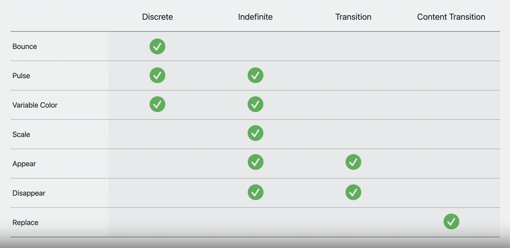

# Animate symbols in your app

## Symbol effects

* **4つの行動パターン**
  * Discrete(離散)
  * Indefinite(不定)
  * Transition(遷移)
  * Content Transition(コンテンツ遷移)



## UI framework APIs

``` swift
// SwiftUI
Image(systemName: "wifi.router")
    .symbolEffect(.variableColor) // アニメーション設定

Image(systemName: "wifi.router")
    .symbolEffect(.variableColor.iterative.reversing) // 細かい設定

Image(systemName: "wifi.router")
    .symbolEffect(.variableColor)
    .symbolEffect(.scale.up) // 複数のアニメーション設定

Image(systemName: "wifi.router")
    .symbolEffect(
        .variableColor.iterative.reversing,
        isActive: isConnectingToInternet // いつアニメーションを有効にするか
    )

// UIKit & AppKit
let imageView: UIImageView = ...

// アニメーション設定
imageView.addSymbolEffect(.variableColor)
// アニメーション削除
imageView.removeSymbolEffect(ofType: .variableColor)
```

``` swift
// 値を設定したアニメーション

// SwiftUI
VStack {
    Image(systemName: ""antenna.radiowaves.left.and.right)
        .symbolEffect(.bounce, value: bounceValue)

    Button("Animate") {
        bounceValue += 1
    }
}

// UIKit & AppKit
let imageView: UIImageView = ...

imageView.addSymbolEffect(.bounce)

// 複数回のbounce
VStack {
    Image(systemName: ""antenna.radiowaves.left.and.right)
        .symbolEffect(
            .bounce,
            options: .repeat(2),
            value: bounceValue
        )

    Button("Animate") {
        bounceValue += 1
    }
}

let imageView: UIImageView = ...

imageView.addSymbolEffect(.bounce, options: .repeat(2))
```

``` swift
// コンテンツ置き換えアニメーション

// SwiftUI
Button {
    isPaused.toggle()
} label: {
    Image(systemName: isPaused ? "pause.fill" : "play.fill")
        .contentTransition(.sysmbolEffect(.replace.offUp))
}

// UIKit & AppKit
let imageView: UIImageView = ...

let pauseImage = UIImage(systemName: "pause.fill")!
imageView.setSymbolImage(pauseImage, contentTransition: .replace.offUp)
```

``` swift
// 表示・非表示アニメーション
// 画像自体のヒエラルキーを残すことも消すこともできる

// SwiftUI
HStack {
    RoundedRectangle(...)

    Image(systemName: "moon.stars")
        // レイアウトは変更されない
        .symbolEffect(.disappar, isAvtive: isMoonHidden)

    Circle(...)
}

// UIKit & AppKit
let imageView: UIImageView = ...

imageView.addSymbolEffect(.disappear)
imageView.addSymbolEffect(.appear)

// SwiftUI
HStack {
    RoundedRectangle(...)

    if !isMoonHidden {
        Image(systemName: "moon.stars")
            // レイアウトは変更される
            .transition(.symbolEffect(.disappear.down))
    }

    Circle(...)
}

// UIKit & AppKit
let imageView: UIImageView = ...

imageView.addSymbolEffect(.disappear) { context in
    if let imageView = context.sender as? UIImageView, context.isFinished {
        imageView.removeFromSuperview()
    }
}
```

## Adoption tips

* **UIBarButtonItemにも使用可能**
* **UISliderで両端に到達すると画像がバウンドする(iOS17)**
  * isSymbolAnimationEnabledで制御
* **SwiftUIのmodifierでのアニメーション伝搬**

``` swift
// 一部のアニメーション無効化
VStack {
    Image(systemName: "...")
        .symbolEffectsRemoved() // アニメーションをさせない設定
    Image(systemName: "...")
    Image(systemName: "...")
}
.symbolEffect(.pulse) // 子要素全てにアニメーションの設定

// アニメーションなしでエフェクト表示
Image(systemName: "iphone.radiowaves.left.and.right")
    .symbolEffect(.scale.up, isActive: isScaledUp)
    .onAppear {
        var transaction = Transaction()
        transaction.disablesAnimation = true
        withTransaction(transaction) {
            isScaledUp = true
        }
    }

let imageView: UIImageView = ...

imageView.addSymbolEffect(.disappear, animated: false)

// 変数値に比例したエフェクト処理

Image(systemName: "wifi", variableColor: signalLevel)

let imageView: UIImageView = ...

let currentSignalImage = UIImage(
    systemName: "wifi",
    variableValue: signalLevel
)!
imageView.setSymbolImage(currentSignalImage, contentTransition: .automatic)
```