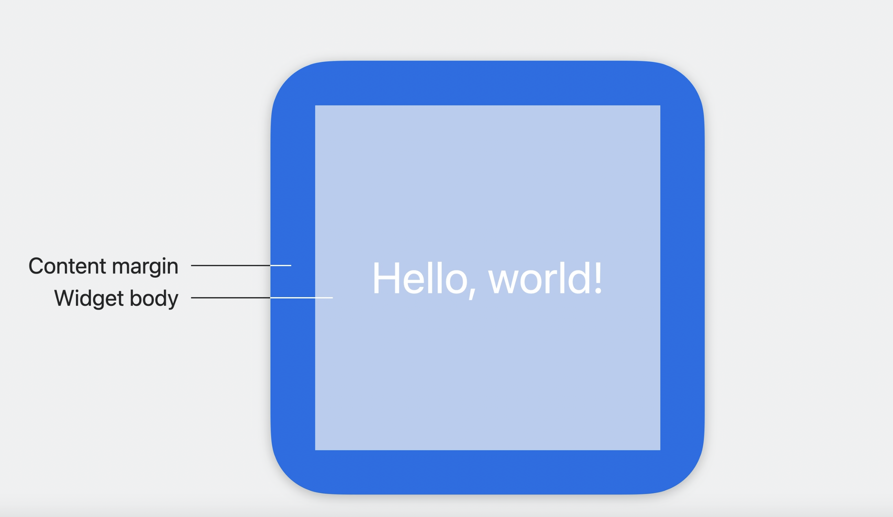

# Bring widgets to new places

## Transition to content margins

* **ウィジェットの外側に余白の追加**

``` swift
struct SafeAreasWidgetView: View {
    @Environment(\.widgetContentMargins) var margins

    var body: some View {
        ZStack {
            Color.blue

            Group {
                Color.lightBlue
                Text("Hello world!")
            }
            .padding(margins)
        }
    }
}
```



## Add a removable background

* **既存背景の削除**

``` swift
// 既存背景の削除
struct EmojiRenderWidgetEntryView: View {
    var entry: Provider.Entry

    @Environment(\.widgetFamily) var family

    var body: some View {
        switch family {
        case .systemSmall:
            // 旧式
            ZStack {
                Color.gameBackground

                AvatarView(entry.hero)
                    .wigetURL(entry.hero.url)
                    .foregroundColor(.white)
            }

            // 新式
            ZStack {
                AvatarView(entry.hero)
                    .wigetURL(entry.hero.url)
                    .foregroundColor(.white)
            }
            .contianerBackground(for: .widget) {
                Color.gameBackground
            }
        }
        // ...
    }
}

// 既存背景の削除無効化
struct PhotoWidget: Widget {
    public var body: some WidgetConfiguration {
        StaticConfiguration(...) { entry in
            PhotoWidgetView(entry: entry)
        }
        .containerBackgroundRemovable(false)
    }
}
```

## Dynamically adjust layout

* **レイアウトの最適化**
 * スタンバイモードやiPadでの表示(プレビューを使って確認)

## Prepare for vibrant rendering

* **レンダリング時の彩度による背景色**
  * widgetRenderingModeで検出