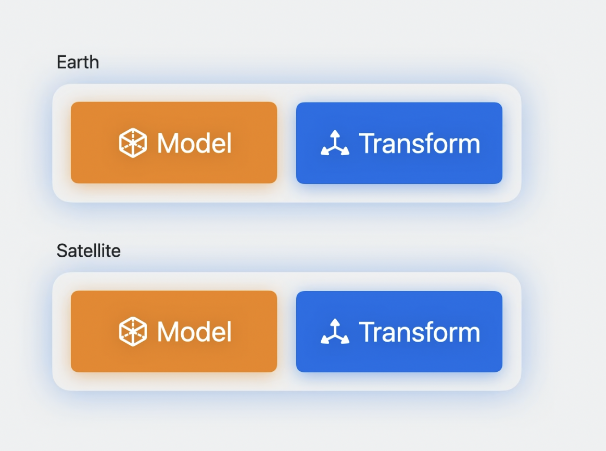
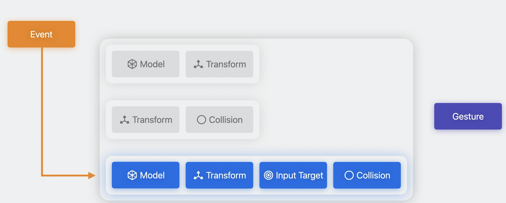

# Build spatial experiences with RealityKit

## RealityKit and SwiftUI

``` swift
import SwiftUI

// 2D表示
struct GlobalModule: View {
    var body: some View {
        Image("GlobeHero")
            .resizable()
            .aspectRatio(contentMode: .fit)
    }
}

import RealityKit

// 3D表示
struct GlobalModule: View {
    var body: some View {
        Model3D(named: "Globe") { model in
            model
                .resizable()
                .scaledToFit()
        } placeholder: {
            ProgressView()
        }
    }
}

// 3D最適化されたウィンドウ定義(volumetric)
struct WorldApp: App {
    var body: some Scene {
        // ...

        WindowGroup(id: "planet-earth") {
            Model3D(named: "Globe")
        }
        .windowStyle(.volumetric)
        .defaultSize(width: 0.8, height: 0.8, depth: 0.8, in: .meters)
    }
}

@Environment(\.openWindow) private var openWindow

Button("View Globe") {
    openWindow(id: "planet-earth")
}

// 3D最適化されたウィンドウ定義(immersive space)
struct WorldApp: App {
    var body: some Scene {
        // ...

        ImmersiveSpace(id: "objects-in-orbit") {
            RealityView { content in
                // ...
            }
        }
    }
}

@Environment(\.openImmersiveSpace) private var opneImmersiveSpace

Button("View Orbits") {
    Task {
        await openImmersiveSpace(id: "objects-in-orbit")
    }
}
```

## Entities and components



## RealityView

``` swift
import SwiftUI
import RealityKit

struct Orbit: View {
    let earth: Entity

    var body: some View {
        RealityView { content in
            async let earth = ModelEntity(named: "Earth")
            async let moon = ModelEntity(named: "Moon")

            if let earth = try? await earth, let moon = try? await moon {
                content.add(earth)
                content.add(moon)
                moon.position = [0.5, 0, 0]
            }
        }
    }
}

// アプリの状態をRealityKitのコンポーネントに保存されているプロパティに接続させる
struct RotatedModel: View {
    var entity: Entity
    var ratation: Rotation3D

    var body: some View {
        RealityView { content in
            content.add(entity)
        } update: { content in
            entity.orientation = .init(rotation)
        }
    }
}

// 座標の変換
struct ResizableModel: View {
    var body: some View {
        GeometryReader3D { geometry in
            RealityView { content in
                if let earth = try? await ModelEntity(named: "Earth") {
                    let bounds = content.convert(
                        geometry.frame(in: .local),
                        from: .local,
                        to: content
                    )
                    // ビューの最小の長さ取得
                    let minExtent = bounds.extents.min()
                    earth.scale = [minExtent, minExtent, minExtent]
                }
            }
        }
    }
}

// イベントの取得
struct AnimatedModel: View {
    @State var subscription: EventSubscription?

    var body: some View {
        RealityView { content in
            if let moon = try? await Entity(named: "Moon"),
               let animation = moon.availableAnimations.first {
                moon.playAnimation(animation)
                content.add(moon)
            }

            subscription = content.subscribe(to: AnimationEvents.PlaybackCompleted.self) {
                // ...
            }
        }
    }
}
```

## Input, animation, and audio



``` swift
// Input
struct DraggableModel: View {
    var earth: Entity

    var body: some View {
        RealityView { content in
            content.add(earth)
        }
        .gesture(DragGesture()
            .targetedToEntity(earth)
            .onChanged { value in
                // swiftUIの座標からRealityKitの座標に変換
                earth.position = value.convert(
                    value.location3D,
                    from: .local,
                    to: earth.parent!
                )
            })
    }
}

// Animation
let orbit = OrbitAnimation(
    name: "Orbit",
    axis: [0, 1, 0],
    startTransform: moon.transform,
    bindTarget: .transform,
    repeatMode: .repeat
)

if let animation = try? AnimationResource.generate(with: orbit) {
    moon.playAnimation(animation)
}

// Audio
let audioSource = Entity()
audioSource.spatialAudio = SpatialAudioComponent(directivity: beam(focus: 0.75))
audioSource.orientation = .init(angle: .pi, axis: [0, 1, 0])

if let audio = try? await AudioFileResource(
    named: "SatelliteLoop",
    configuration: .init(shouldLoop: true)
) {
    satellite.addChild(audioSource)
    audioSource.playAudio(audio)
}
```

## Custom systems

``` swift
struct TraceComponent: Component {
    var mesh = TraceMesh()
}

func updateTrace(for entity: Entity) {
    var component = entity.components[TraceComponent.self] ?? TraceComponent()
    component.update()
    entity.components[TraceComponent.self] = component
}

struct PointOfInterestComponent: Component, Codable {
    var name = ""
}
```