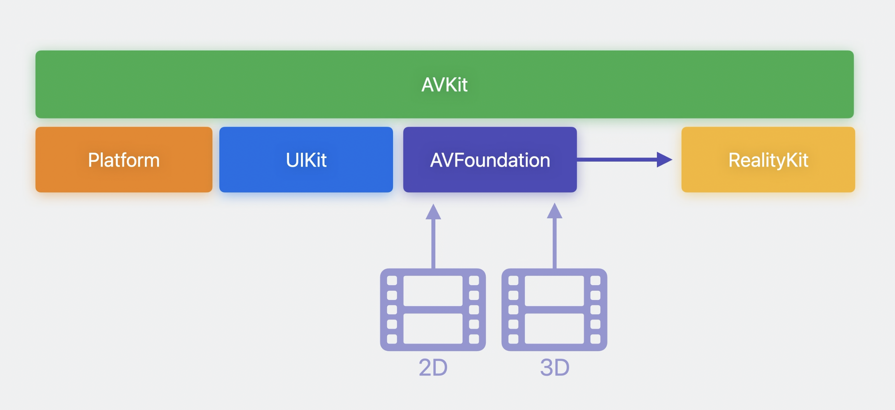
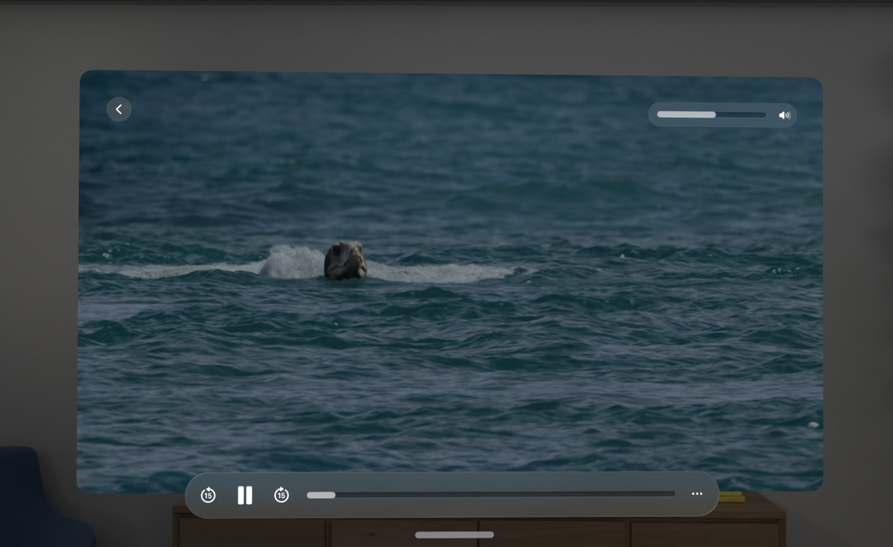
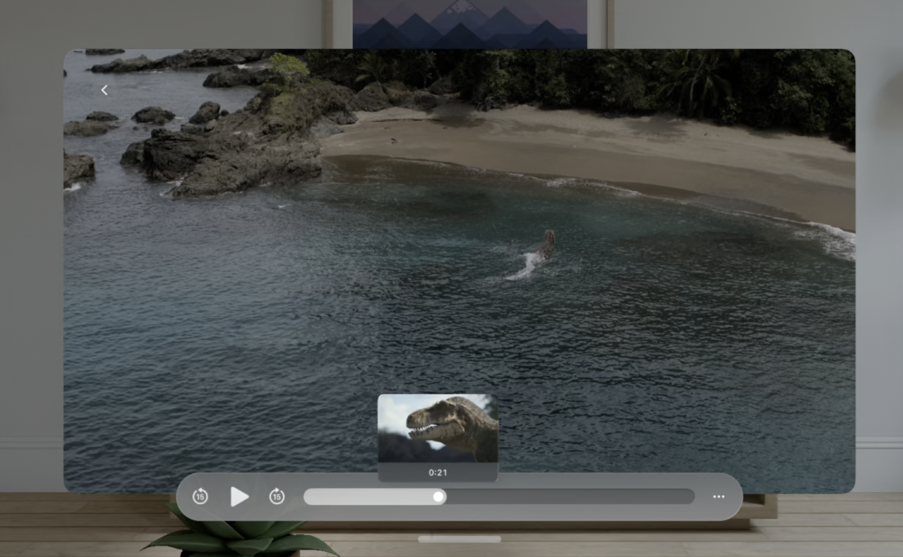
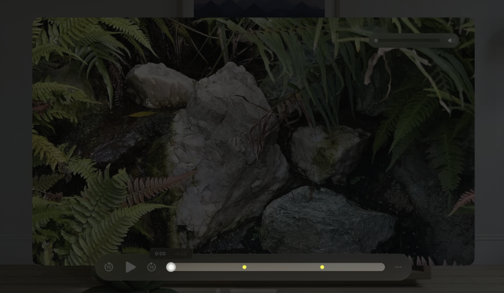
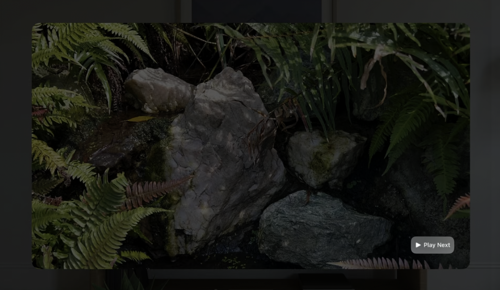
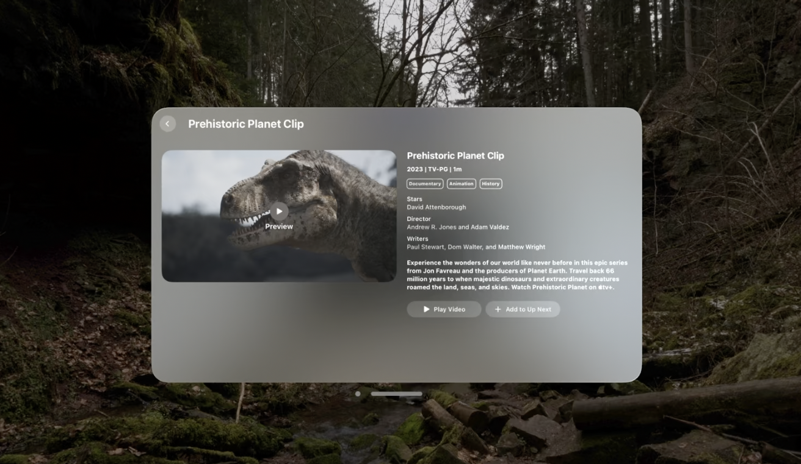
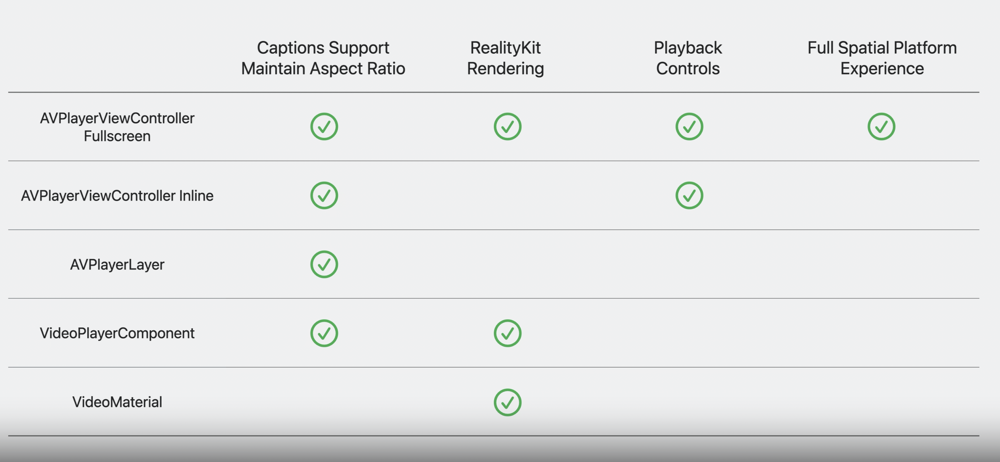

# Create a great spatial playback experience

## Media experience



``` swift
import AVFoundation
import AVKit

let controller = AVPlayerViewController()
controller.player = AVPlayer()
controller.player?.replaceCurrentItem(with: AVPlayerItem(url: contentURL))

// SwiftUIで使用する
struct PlayerView: UIViewControllerRepresentable {
    func makeUIViewController(context: Context) -> AVPlayerViewController {
        let controller = AVPlayerViewController()
        controller.player = AVPlayer()
        controller.player?.replaceCurrentItem(with: AVPlayerItem(url: contentURL))
        return controller
    }

    func updateUIViewController(_ : AVPlayerViewController, context: Context) {}
}

import SwiftUI

@main
struct MoviePlayingApp: App {
    var body: some SwiftUI.Scene {
        WindowGroup {
            PlayerView()
        }
    }
}
```



## Advanced features

* サムネイルの表示(145ピクセル推奨)



* ロゴ、総集編、広告を挿入するためのタイムラインサポート



* カスタムアクションボタンの追加
  * コンテンツに関するメタデータの表示
  * 関連するコンテンツの提案



* Immersive Spaceの作成
  * 空間のカスタム定義

``` swift
import SwiftUI

@main struct MoviePlayingApp: App {
    var body: some SwiftUI.Scene {
        WindowGroup {
            PlayerView()
                .onAppear() {
                    Task {
                        await openImmersiveSpace(id: "PlayerImmersiveSpace")
                    }
                }
        }

        ImmersiveSpace(id: "PlayerImmersiveSpace") {
            RealityView { content in
                let entity = // Create entities.
                content.add(entity)
            }
        }
    }
}

// カスタムコントロールの使用
showsPlaybackControls = false
```

## Other use cases

* インライン再生



## Conclusion

