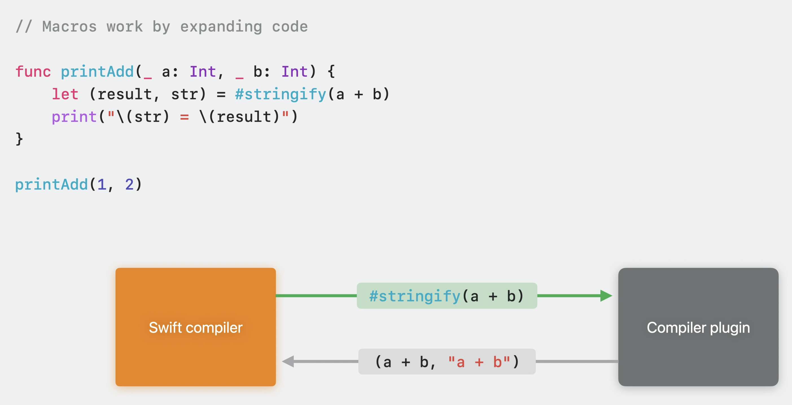
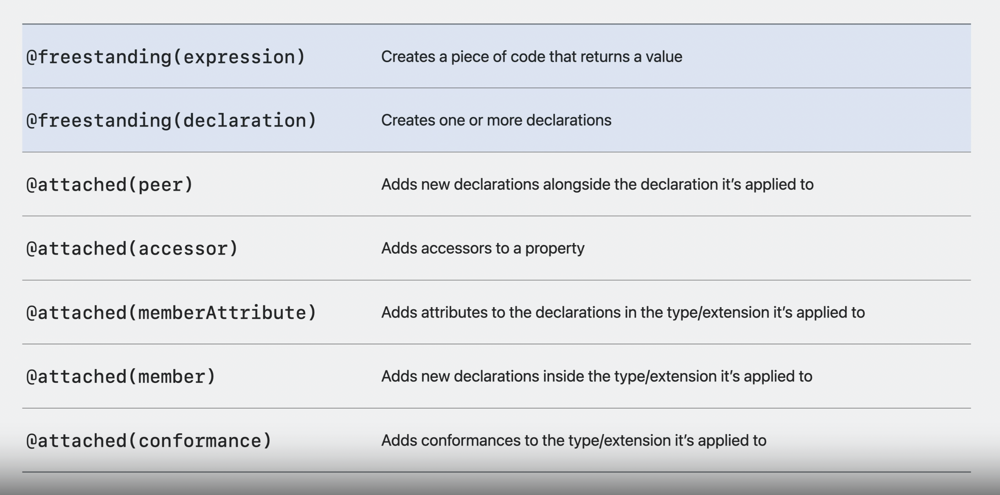
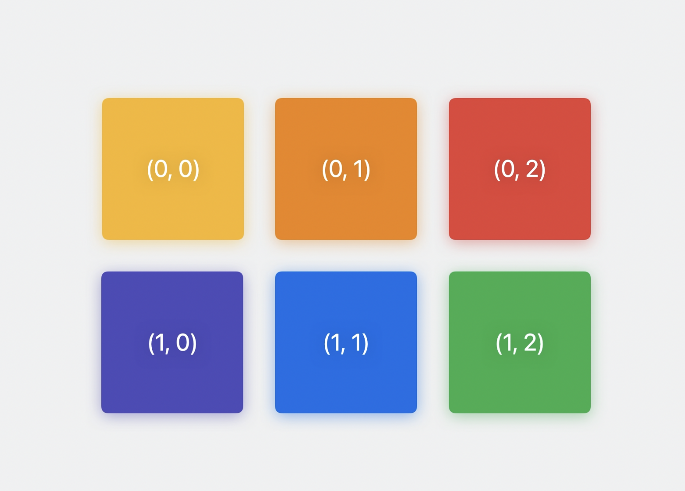
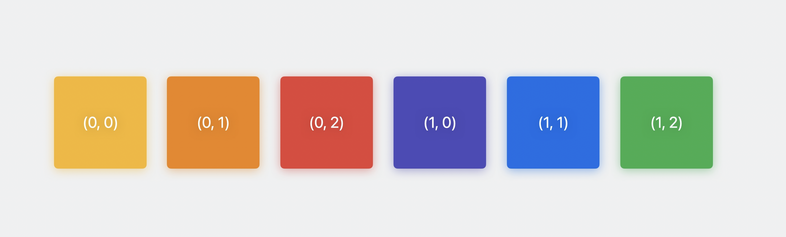
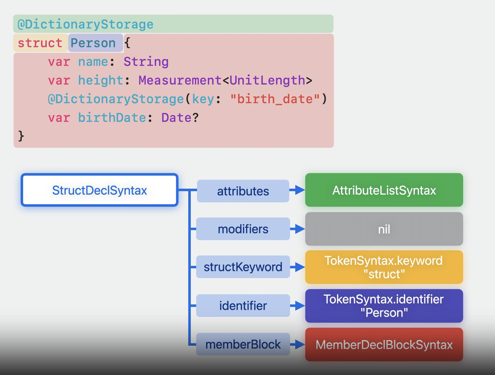

# Expand on Swift macros

## Why macros?

* **Macroをサポートする理由**
  * コンパイラを修正することなくパッケージで独自の言語機能を追加することができる

``` swift
struct Smoothie: Codable {
    var id, title, description: String
    var measuredIngredients: [MeasuredIngredient]

    // Codable準拠によって自動的にCodableサポートのためのコードを補完する
    //
    // private enum CodingKeys: String, CodingKey {
    //     case id, title, description, measuredIngredients
    // }
    //
    // init(from decoder: Decoder) throws { ... }
    //
    // func encode(to encoder: Encoder) throws { ... }

    static let berryBlue = Smoothie(id: "berry-blue", title: "Berry Blue") {
        // result builder
        """
        Filling and refreshing, this smoothie \
        will fill you with joy!
        """

        Ingredient.orange
            .measured(with: .cups).scaled(by: 1.5)
        Ingredient.blueberry
            .measured(with: .cups)
        Ingredient.avocado
            .measured(with: .cups).scaled(by: 0.2)
    }
}
```

## Design philosophy

* **4つの目標**
  * Macroを使用しているということが明白であること
  * Macroに送られるコードと送り返されるコードが完全で、間違いがないかチェックされること
  * Macroの拡張が予測可能で追加的な方法でプログラムに組み込まれること
  * Macroが理解できない魔法的なものにならないこと

``` swift
// Macroを使用しているということが明白であること

// Freestanding macros(「#」記号で始まる)
return #unwrap(icon, message: "should be in the app bundle")

// Attached macros(「@」記号で始まる)
@AddCompletionHandler func sendRequest() async throws -> Response
```

``` swift
// Macroに送られるコードと送り返されるコードが完全で、間違いがないかチェックされること

#unwrap(1 + ) // Expected expression after operator

@AddCompletionHandler(parameterName: 42) // Cannot convert value of type 'Int' to expected argument type 'String'
func sendRequest() async throws -> Response

@DictionaryStorage class Options { ... } // '@DictionaryStorage' can only be applied to a 'struct'
```

``` swift
// Macroの拡張が予測可能で追加的な方法でプログラムに組み込まれること

func doThingy() {
    startDoingThingy()

    // マクロの実行によって前後の処理に呼び出しの削除や別の関数に移動などの変更がされないこと
    #someUnknownMacro()

    finishDoingThingy()
}
```

## Translation model

* **Marcoの変換**

``` swift
// Macro宣言

@freestanding(expression)
macro stringify<T>(_ expr: T) -> (T, String)

func printAdd(_ a: Int, _ b: Int) {
    let (result, str) = #stringify(a + b) // (a + b, "a + b")
    print("\(str) = \(result)")
}

printAdd(1, 2) // "a + b = 3"
```



## Macro roles

* **Macroの役割**
  * Macroのルールセット(適用する場所と方法、どのようなコードに展開するか、その展開をコードのどこに挿入するかを管理する)



* **freestanding expression**

``` swift
// expression(式)とは？
// 実行されて結果を生成するコードの単位

// (x + width)も式であり、widthも式である
let numPixels = (x + width) * (y + height)
```

``` swift
// #unwrap expression macro

// 強制アンラップでも良い理由を示したい
let image = donwloadedImage!

// guard letでも良いけど説明が長くなる
guard let image = downloadedImage else {
    preconditionFailure("Unexpectedly found nil: downloadedImage was already checked")
}

// 式を返すmacroを作成する
@freestanding(expression)
macro unwrap<Wrapped>(_ expr: Wrapped?, message: String) -> Wrapped

let image = #unwrap(downloadedImage, message: "was already checked")
// 実際は式展開がされる
// let image = #unwrap(downloadedImage, message: "was already checked")
//     { [downloadedImage] in
//         guard let downloadedImage else {
//             preconditionFailure(
//                 "Unexpectedly found nil: 'downloadedImage' " + "was already checked",
//                 file: "main/ImageLoader.swift",
//                 line: 42
//             )
//         }
//         return downloadedImage
//     }()
```

* **freestanding declaration**




``` swift
// 2次元の配列型を必要とする統計分析
// 2次元Indexを受け取り1次元Indexを計算する

public struct Array2D<Element>: Collection {
    public struct Index: Hashable, Comparable {
        var storageIndex: Int
    }

    var storage: [Element]
    var width1: Int

    public func makeIndex(_ i0: Int, _ i1: Int) -> Index {
        Index(storageIndex: i0 + width1 + i1)
    }

    public subscript(_ i0: Int, _ i1: Int) -> Element {
        get { self[makeIndex(i0, i1)] }
        set { self[makeIndex(i0, i1)] = newValue }
    }

    public subscript(_ i: Index) -> Element {
        get { storage[i.storageIndex] }
        set { storage[i.storageIndex] = newValue }
    }
}

// 3次元も必要になった場合(4次元、5次元...とコードが冗長になっていく)

public struct Array3D<Element>: Collection {
    public struct Index: Hashable, Comparable {
        var storageIndex: Int
    }

    var storage: [Element]
    var width1, width2: Int

    public func makeIndex(_ i0: Int, _ i1: Int, _ i2: Int) -> Index {
        Index(storageIndex: (i0 * width1 + i1) * width2 + i2)
    }

    public subscript(_ i0: Int, _ i1: Int, _ i2: Int) -> Element {
        get { self[makeIndex(i0, i1, i2)] }
        set { self[makeIndex(i0, i1, i2)] = newValue }
    }

    public subscript(_ i: Index) -> Element {
        get { storage[i.storageIndex] }
        set { storage[i.storageIndex] = newValue }
    }
}

// N次元を組み込み宣言できるmacroを作成する
@freestanding(declaration, names: arbitrary)
macro makeArrayNS(n: Int)

#makeArrayND(n: 2)
#makeArrayND(n: 3)
#makeArrayND(n: 4)
#makeArrayND(n: 5)

// 展開すればこうなる
// public struct Array2D<Element>: Collection {
//     public struct Index: Hashable, Comparable {
//         var storageIndex: Int
//     }
//
//     var storage: [Element]
//     var width1: Int
//
//     public func makeIndex(_ i0: Int, _ i1: Int) -> Index {
//         Index(storageIndex: i0 + width1 + i1)
//     }
//
//     public subscript(_ i0: Int, _ i1: Int) -> Element {
//         get { self[makeIndex(i0, i1)] }
//         set { self[makeIndex(i0, i1)] = newValue }
//     }
//
//     public subscript(_ i: Index) -> Element {
//         get { storage[i.storageIndex] }
//         set { storage[i.storageIndex] = newValue }
//     }
// }
```

* **Attatched macro peer**

``` swift
// asyncで記述した並行処理をクロージャでも受け取れるようにしたい
func fetchAvater(_ userName: String) async -> Image? {
    // ...
}

func fetchAvater(_ userName: String, onCompletion: @escaping (Image?) -> Void) {
    Task.detached {
        onCompletion(await fetchAvater(username))
    }
}

// @AddCompletionHandler
// 自動的にクロージャで変換できるようにする(ドキュメント・コメントも記述できる)
@attached(peer, names: overloaded)
macro AddCompletionHandler(parameterName: String = "completionHandler")
```

* **Attached macro accessor**

``` swift
// 辞書型でプロパティを使用して中身にアクセスしたい
struct Person: DictionaryRepresentable {
    var dictionary: [String: Any]

    init(dictionary: [String: Any]) {
        self.dictionary = dictionary
    }

    var name: String {
        get { dictionary["name"] as! String }
        set { dictionary["name"] = newValue }
    }

    var height: Measurement<UnitLength> {
        get { dictionary["height"] as! Measurement<UnitLength> }
        set { dictionary["height"] = newValue }
    }

    var birthDate: Date? {
        get { dictionary["birth_date"] as! Date? }
        set { dictionary["birth_date"] = newValue as Any? }
    }
}

// @DictionaryStorage
@attached(accessor)
macro DictionaryStorage(key: String? = nil)

struct Person: DictionaryRepresentable {
    var dictionary: [String: Any]

    init(dictionary: [String: Any]) {
        self.dictionary = dictionary
    }

    // ボイラープレートになっている
    @DictionaryStorage var name: String
    @DictionaryStorage var height: Measurement<UnitLength>
    @DictionaryStorage(key: "birth_date") var birthDate: Date?
}
```

* **Attached macro memberAttribute**

``` swift
// 先ほどのaccessorの@DictionaryStorageを型全体のプロパティに適用させたい
@attached(memberAttributes)
@attached(accessor)
macro DictionaryStorage(key: String? = nil)

@DictionaryStorage struct Person: DictionaryRepresentable {
    // @DictionaryStorageで必ずDictionaryRepresentableを準拠する必要がある
    // つまり、DictionaryRepresentableの準拠部分がボイラープレートになっている
    var dictionary: [String: Any]

    init(dictionary: [String: Any]) {
        self.dictionary = dictionary
    }

    var name: String
    var height: Measurement<UnitLength>
    @DictionaryStorage(key: "birth_date") var birthDate: Date?
}
```

* **Attached macro member**

``` swift
// 先ほどのmemberAttributesの@DictionaryStorageにDictionaryRepresentable準拠に必要なコードを組み込みたい
@attached(member, names: named(dictionary), named(init(dictionary:)))
@attached(memberAttributes)
@attached(accessor)
macro DictionaryStorage(key: String? = nil)

// DictionaryRepresentableに準拠しているのは明白なのでボイラープレートとなっている
@DictionaryStorage struct Person: DictionaryRepresentable {
    var name: String
    var height: Measurement<UnitLength>
    @DictionaryStorage(key: "birth_date") var birthDate: Date?
}
```

* **Attached macro conformance**

``` swift
// 先ほどのmemberの@DictionaryStorageにDictionaryRepresentableを準拠させたい
@attached(conformance)
@attached(member, names: named(dictionary), named(init(dictionary:)))
@attached(memberAttributes)
@attached(accessor)
macro DictionaryStorage(key: String? = nil)

@DictionaryStorage struct Person {
    var name: String
    var height: Measurement<UnitLength>

    @DictionaryStorage(key: "birth_date")
    var birthDate: Date?
}
```

## Macro implementation

* **Macroの実装方法**

``` swift
// 「=」以降に実装箇所がある
@freestanding(expression)
macro stringify<T>(_ expr: T) -> (T, String) = #stringifyWithPrefix(expr, prefix: "")

@freestanding(expression)
macro stringify<T>(_ expr: T) -> (T, String) = #externalMacro(module: "MyLibMacros", type: "StringifyMacro")

// @DictionaryStorageのattached member roleの中身
import SwiftSyntax // ソースコードの解析、検査、操作、生成の手助けをする
import SwiftSyntaxMacros // マクロを書くために必要なプロトコルと型の提供
import SwiftSyntaxBuilder // Syntax Treeを構築するためのAPIの提供

struct DictionaryStorageMacro: MemberMacro {
    static func expansion(
        of attribute: AttributeSyntax,
        providingMembersOf declaration: some DeclGroupSyntax,
        in context: some MacroExpansionContext
    ) throws -> [DeclSyntax] {
        return [
            "init(dictionary: [String: Any]) { self.dictionary = dictionary }",
            "var dictionary: [String: Any]"
        ]
    }
}

extension DictionaryStorageMacro: ConformanceMacro, MemberAttributeMacro, AccessorMacro { ... }
```

* **SwiftSyntaxの木構造**



* **Macroのエラー表現**

``` swift
@DictionaryStorage // In expansion of macro 'DictionaryStorage'
enum Gender {
    case other(String)
    case female
    case male
}

struct DictionaryStorageMacro: MemberMacro {
    static func expansion(
        of attribute: AttributeSyntax, // 実際のDictionaryStorageの属性
        providingMembersOf declaration: some DeclGroupSyntax, // 宣言の属性
        in context: some MacroExpansionContext // マクロがコンパイラと通信するときに使用
    ) throws -> [DeclSyntax] {
        // 型のチェックを行う
        guard declaration.is(StructDeclSyntax.self) else {
            // Diagnosticでより複雑なエラー表現を生成
            let structError = Diagnostic(
                node: attribute, // エラーがどの行で発生したかの情報を渡す
                message: MyLibDiagnostic.notAStruct // 実際に表示するエラーメッセージ
            )
            context.diagnose(structError)
            return []
        }

        return [
            "init(dictionary: [String: Any]) { self.dictionary = dictionary }",
            "var dictionary: [String: Any]"
        ]
    }
}

enum MyLibDiagnostic: String, DiagnosticMessage {
    case notAStruct

    // エラーか警告かを指定する
    var severity: DiagnosticSeverity { return .error }

    var message: String {
        switch self {
        case .notAStruct:
            reutrn "'@DictionaryStorage' can only be applied to a 'struct'"
        }
    }

    var diagnosticID: MessageID {
        MessageID(domain: "MyLibMacros", id: rawValue)
    }
}
```

* **Syntax tree**

``` swift
static func makeGuardStmt() -> StmtSyntax {
    return """
        guard let downloadedImage else {
             preconditionFailure(
                 "Unexpectedly found nil: 'downloadedImage' " + "was already checked",
                 file: "main/ImageLoader.swift",
                 line: 42
             )
         }
    """
}

// メッセージの追加
static func makeGuardStmt(message: ExprSyntax) -> StmtSyntax {
    return """
        guard let downloadedImage else {
             preconditionFailure(
                 "Unexpectedly found nil: 'downloadedImage' " + \(message),
                 file: "main/ImageLoader.swift",
                 line: 42
             )
         }
    """
}

// 変数名(トークン)の定義
static func makeGuardStmt(wrapped: TokenSyntax, message: ExprSyntax) -> StmtSyntax {
    return """
        guard let \(wrapped) else {
             preconditionFailure(
                 "Unexpectedly found nil: 'downloadedImage' " + \(message),
                 file: "main/ImageLoader.swift",
                 line: 42
             )
         }
    """
}

// nilの出力を防ぐ(文字列として出力する)
static func makeGuardStmt(wrapped: TokenSyntax, message: ExprSyntax) -> StmtSyntax {
    let messagePrefix = "Unexpectedly found nil: 'downloadedImage' "

    return """
        guard let \(wrapped) else {
             preconditionFailure(
                 \(literal: messagePrefix) + \(message),
                 file: "main/ImageLoader.swift",
                 line: 42
             )
         }
    """
}

// 変数名に沿った文字の出力
static func makeGuardStmt(
    wrapped: TokenSyntax,
    originalWrapped: ExprSyntax,
    message: ExprSyntax,
    in context: some MacroExpansionContext
) -> StmtSyntax {
    let messagePrefix = "Unexpectedly found nil: '\(originalWrapped.description)' "
    let originalLoc = context.location(of: originalWrapped)!

    return """
        guard let \(wrapped) else {
             preconditionFailure(
                 \(literal: messagePrefix) + \(message),
                 file: "\(originalLoc.file)",
                 line: "\(originalLoc.line)"
             )
         }
    """
}

// ファイル、行数の出力
```

## Writing correct marcos

``` swift
// 名前衝突
let wrappedValue = "🎁"
let image = #unwrap(request.downloadedImage, message: "\(wrappedValue)")
    { [wrappedValue = request.downloadedImage] in // wrappedValueが自分で書いたコードと重複する可能性がある
        guard let wrappedValue else {
            preconditionFailure(
                "Unexpectedly found nil: 'request.downloadedImage' " + "was \(wrapepdValue)",
                file: "main/ImageLoader.swift",
                line: 42
            )
        }
        return wrappedValue
    }()

// makeUniqueName()で名前衝突を回避する
let captureVar = context.makeUnqiueName()

return """
       { [captureVar] = \(originalWrapped)] in
          \(makeGuardStmt(wrapped: captureVar, ...))
          \(makeReturnStmt(wrapped: captureVar))
       }
       """

// マクロが保有しないコードにアクセスする(name specifiers)
overloaded
prefixed
suffixed
named
arbitrary

// マクロに含めてはいけない情報
■ コンパイラが提供する情報のみ使う必要がある

// TDD(テスト駆動開発)を用いたマクロテストコード作成
import MyLibMacros
import XCTest
import SwiftSyntaxMacrosTestSupport

final class MyLibTests: XCTestCase {
    func testMacro() {
        assertMacroExpansion(
            """
            @DictionaryStorage var name: String
            """,
            expanededSource:
            """
            var name: String {
                get { dictionary["name"]! as! String }
                set { dictionary["name"] = newValue }
            }
            """,
            macros: ["DictionaryStorage": DictionaryStorageMacro.self]
        )
    }
}
```