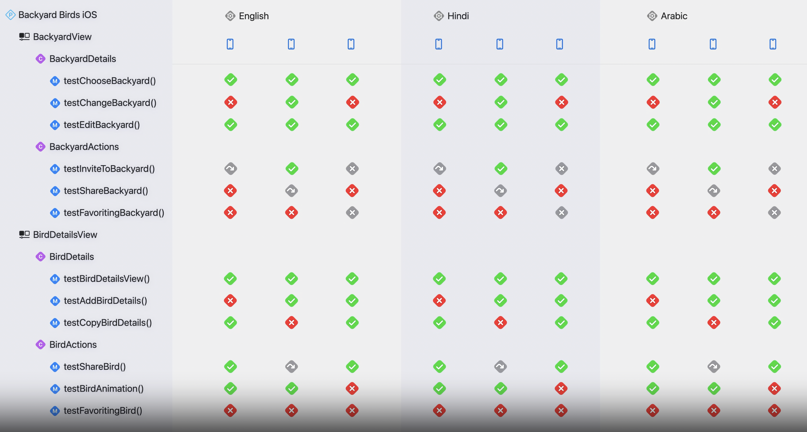

# Fix failures faster with Xcode test reports

## Structing tests

* **Test Method**
  * ソースコードを検証してテスト結果を生成するテストやメソッド

* **Test Class**
  * Test Methodのグループであり、テストされる領域に基づいてグループ化される

* **Test Bundle**
  * 1つ以上のTest Classで構成される(UI or Unit)

* **Test Plan**
  * 1つ以上のTest Bundleで構成される(Configurationの設定)
    * 言語・地域の設定
    * コードカバレッジの使用
    * 繰り返し実行

## Explore the test report

* **テストレポートの詳細化**
  * 共通して失敗したパターン
  * テストに一番長い時間がかかったパターン

* **UIテストレポートの詳細化**
  * 失敗時のビデオ再生
  * スクリーンショットの要素を押下してUI要素の詳細情報取得