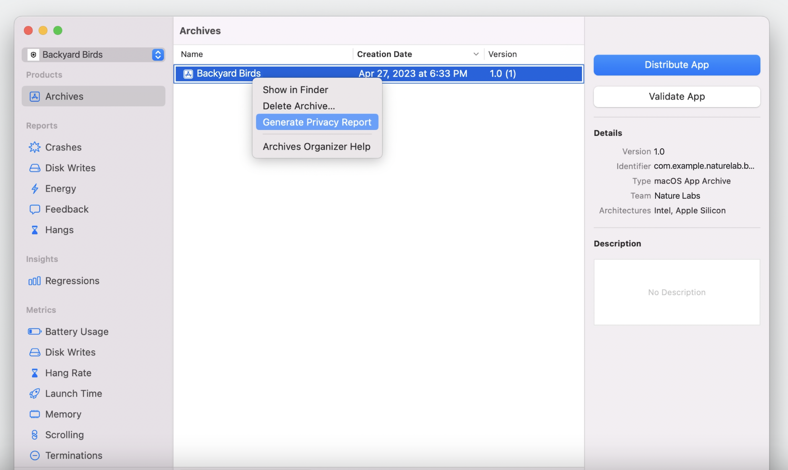

# Get started with privacy manifests

## Privacy manifest

* **Privacy manifestsの作成**
  * *xcprivavy*形式のファイル
    * SDKが収集するデータタイプ
    * 各データタイプの使用方法
    * ユーザーへのリンクの有無
    * App Tracking Transparencyポリシーによって定義されるトラッキングのために使用されるか

## Privacy report

* **Privacy reportの生成**
  * アプリと依存関係のプライバシーの確認、理解、説明に役立つ

## Tracking domains

* **データ追跡を許可するかどうかの宣言**
  * 一部のサードパーティーSDKはユーザーが許可を与えていない場合、トラッキングを手動で無効にする必要があるエッジケースが存在する
  * Privary Tracking Domainsを設定することで自動的に指定されたドメインへの接続をブロックする
  * Points of InterestのInstrumentでSDKがトラッキングドメインに接続しているかを確認できる

## Required reason APIs

* **アクセスに許可が必要なAPI**
  * 例) NSFileSystemFreeSize(ディスクの空き容量をチェックする)