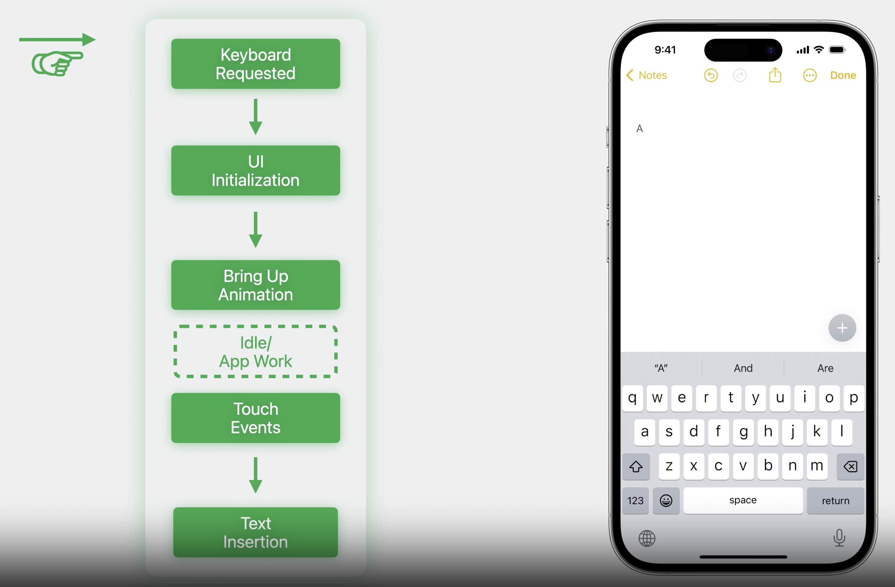
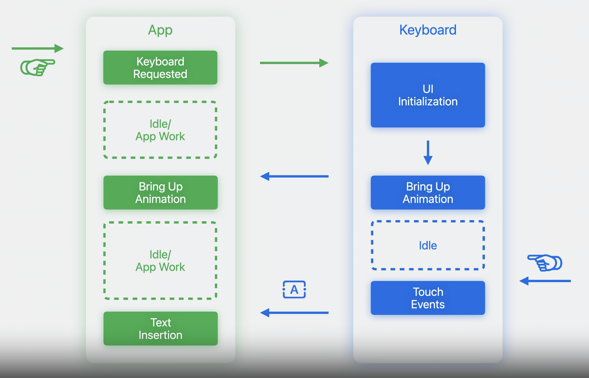

# Keep up with the keyboard

## Out of process keyboard

* **独自プロセスへの分離**

iOS17以前 | iOS17
:--: | :--:
 | 

## Design for the keyboard

* **Keyboard Layout Guide**

``` swift
// Keyboard Layout Guideの適用
view.keyboardLayoutGuide.topAnchor.constraint(equalTo: textView.bottomAnchor).isActive = true

// iOS17からのオプション機能
// followsUndockedKeyboard [default:false]
// ガイドがキーボードを追い続ける

// usesBottomSafeArea [default: true]
// キーボードが解除された時にセーフエリアの高さを追従する
view.keyboardLayoutGuide.usesBottomSafeArea = false

textField.topAnchor.constraint(
    equalToSystemSpacingBelow: backdrop.topAnchor,
    multiplier: 1.0
)
.isActive = true

view.keyboardLayoutGuide.topAnchor.constraint(
    greaterThanOrEqualToSystemSpacingBelow: textField.bottomAnchor,
    multiplier: 1.0
)
.isActive = true

view.keyboardLayoutGuide.topAnchor.constraint(
    equalTo: backdrop.bottomAnchor,
    multiplier: 1.0
)
.isActive = true

view.safeAreaLayoutGuide.bottomAnchor.constraint(
    greaterThanOrEqualTo: textField.bottomAnchor
)
.isActive = true

// keyboardDismissPadding
// スクロールして解除するジェスチャーのパラメータ調整(キーボードの上の余白指定)
var dismissPadding = aboveKeyboardView.bounds.size.height

view.keyboardLayoutGuide.keyboardDismissPadding = dismissPadding

// Notificationによるキーボード取得の廃止
// iPadのような高さが異なるView表示ができる場合に整合性が取れなくなる
func handleWillShowOrHideKeyboardNotification(notification: NSNotification) {
    guard let userInfo = notification.userInfo else {
        return
    }

    let endFrameKey = UIResponder.keyboardFrameEndUserInfoKey

    guard let keyboardFrameEnd = userInfo[endFrameKey] as? CGRect else {
        return
    }

    let offset = keyboardFrameEnd.size.height

    // ...
}

// 対処法
func handleWillShowOrHideKeyboardNotification(notification: NSNotification) {
    guard let userInfo = notification.object as? UIScreen else {
        return
    }

    // アプリと同じ画面に表示されているかどうかを確認する
    guard (screen.isEqual(view.window?.screen)) else {
        return
    }

    let endFrameKey = UIResponder.keyboardFrameEndUserInfoKey

    guard let keyboardFrameEnd = userInfo[endFrameKey] as? CGRect else {
        return
    }

    let fromCoordinateSpace: UICoordinateSpace = screen.coordinateSpace
    let toCoordinateSpace: UICoordinateSpace = view

    let convertedKeyboardFrameEnd = fromCoordinateSpace.convert(
        keyboardFrameEnd,
        to: toCoordinateSpace
    )

    var bottomOffset = view.safeAreaInsets.bottom

    let viewIntersection = view.bounds.intersection(convertedKeyboardFrameEnd)

    if !viewIntersection.isEmpty {
        bottomOffset = viewIntersection.size.height
    }

    movingBottomConstraint.constant = bottomOffset

    // ...
}
```

## New text entry APIs

* **Inline predictions**
  * 英語の自動予測

``` swift
@MainActor public protocol UITextInputTraits: NSOjbectProtocol {
    @avaialbe(iOS, introduced: 17.0)
    optional var inlinePredictionType: UITextInlinePredictionType { get set }
}

public enum UITextInlinePredictionType: Int, @unchecked Sendable {
    case 'default' = 0
    case no = 1
    case yes = 2
}

let textView = UITextView(frame: frame)
textView.inlinePredictionType = .yes
```