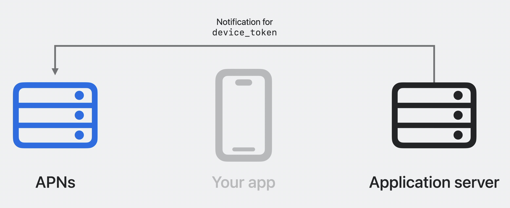

# Meet Push Notifications Console

## Send notifications

* **Push Notifications Console**
  * APNsとやりとりするための様々な機能を提供するツール
    * プッシュ通知の送信
      * プッシュ通知の名前設定
      * デバイストークンの設定
      * ペイロード情報の設定
    * 送信したプッシュ通知の履歴情報保存
    * プッシュ通知環境(Development, Production)の設定
    * プッシュ通知タイプの設定
    * プッシュ通知の有効期限の設定
    * プッシュ通知の優先順位の設定

※ プッシュ通知の仕組み(簡易版)

* **Apple Push Notification Service(APNs)**
  * プッシュ通知の配信を可能にしているバックエンド
    * アプリから通知の許可を受けると、そのアプリ固有のデバイストークンが生成され、デバイスに送信される
    * デバイストークンはアプリケーションサーバーに保存される
    * アプリケーションサーバーがプッシュ通知を送信したい場合に保存したデバイストークンを使用して、APNs経由で通知される

## Examine delivery logs

* **配信したプッシュ通知のログ出力**
  * 端末でプッシュ通知を受け取れなかった原因調査などができる
    * 例) 端末で省電力モードを有効にすることで通知を受け取れない状況を再現する
  * APNsがHTTPレスポンスで返す`apns-unique-id`を使って通知を特定する

## Debug with tools

* **認証トークン生成**
  * Apple Developer portalから取得した秘密鍵(p8)と関連キーを提供する
    * 有効期限は1時間

* **認証トークンバリデーター**
  * 生成した認証トークンが有効なものかどうかを検証できる

* **デバイストークンバリデーター**
  * デバイストークンを入力することで、対応しているプッシュタイプや環境などを検証できる

※ APNs認証に必要な証明書とトークン
  * 証明書
    * APNsとアプリケーションサーバーの間に信頼できる接続を確立させる
    * Apple Developer Programで証明書を作成し、管理する必要がある(有効期限あり)
  * トークン
    * APNsとプロバイダーサーバーの間に安全で効率的な認証(JSON Web Token)を使用する
    * Apple Developerアカウントに関連付けられた秘密鍵で署名されたトークンを生成する必要がある