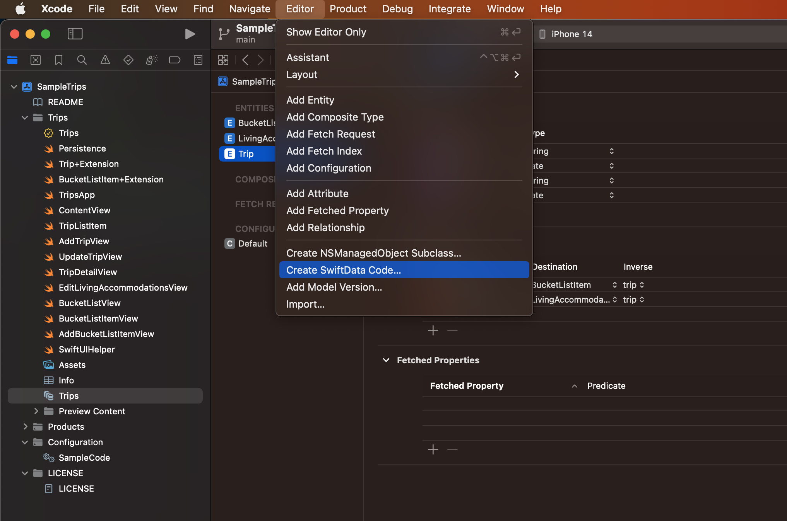
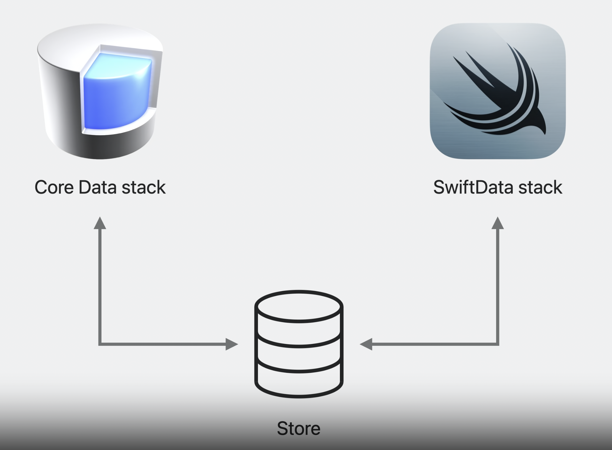

# Migrate to SwiftData

## Generate model classes

* **CoreDataからSwiftDataへの移行**



## Complete adoption

* **スタックの移行(CoreData stack → SwiftData stack)**
  * 既存のCoreData modelがどのように構造化されているかを考慮する必要がある(entity, properties, relationship...)
  * CoreDataで定義されたEntityとSwiftDataのEntity名とプロパティは完全一致である必要がある

``` swift
// ModelContainer

@main struct TripsApp: App {
    var body: some Scene {
        WindowGroup {
            ContentView()
        }
        // グループ内の全てのWindowが同じ永続コンテナにアクセスするように設定されることを保証する
        // 同時にコンテナとコンテキストの両方が設定され、デフォルトのModelContextも作成される
        .modelContainer(
            for: [Trip.self, BucketListItem.self, LivingAccommodation.self]
        )
    }
}

// ModelContext

// データの変更を追跡する
@Environment(\.modelContext) private var modelContext

// Object creation in Core Data

@Engironment(\.managedObjectContext) private var viewContext

let newTrip = Trip(context: viewContext)
newTrip.name = name
newTrip.destination = destination
newTrip.startDate = startDate
newTrip.endDate = endDate

// Object creation in SwiftData

@Environment(\.modelContext) private var modelContext

let trip = Trip(
    name: name,
    destination: destination,
    startDate: startDate,
    endDate: endDate
)

modelContext.insert(object: trip)

// FetchRequest in Core Data

@FetchRequest(sortDescriptors: [SortDescriptor(\.startDate)])
private var trips: FetchResults<Trip>

// Fetch with Query in SwiftData

@Query(sort: \.startDate, order: .forward)
var trips: [Trip]
```

## Coexists with Core Data

* **CoreDataとSwiftDataの共存**



``` swift
// Setting store path for Core Data store

let url = URL(firlURLWithPath: "/path/to/Trips.store")

if let description = container.persistentStoreDescriptions.first {
    // 両方のスタックが同じURLに書き込まれるように設定する
    description.url = url
    // 永続的な履歴の追跡を有効にする(SwfitDataのみ)
    // これを設定していない場合に永続的なstoreを開こうとすると、storeは読み込み専用モードとなるため
    description.setOption(true as NSNumber, forKey: NSPersistentHistoryTrackingKey)
}
```

* **注意事項**
  * 既存のNSManagedObjectベースのEntityのサブクラスとSwiftDataのクラスが衝突しないように名前空間を指定する必要がある(class名は変更してもEntity名は同じままにしておく)
  * CoreDataとSwiftDataのスキーマを同期させる
  * スキーマのバージョンを追跡する

``` swift
// Considerations: Namespace

class Trip: NSManagedObject { // クラス名をCDTripなどに変更する
    // ...
}

@Model final class Trip {
    // ...
}
```