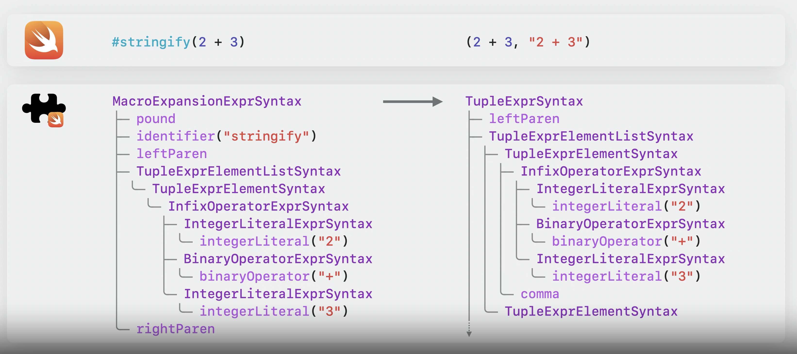

# Write Swift macros

## Overview

* **Macroとは**

``` swift
let calculations = [
    (1 + 1, "1 + 1"),
    (2 + 3, "2 + 3"),
    (7 - 3, "7 - 3"),
    (5 - 2, "5 - 2"),
    (3 * 2, "3 * 2"),
    (3 * 5, "3 * 5"),
]

// XcodeのTemplateに含まれているMacro(stringify)
// コンパイル時に上記のようなタプルに変換され、計算結果が一致するかどうかが保証される
let calculations = [
    #stringify(1 + 1),
    #stringify(2 + 3),
    #stringify(7 - 3),
    #stringify(5 - 2),
    #stringify(3 * 2),
    #stringify(3 * 5),
]

@freestanding(expression)
macro stringify(_ value: Int) -> (Int, String)

#stringify("Hello World") // Cannot convert value of type 'String' to expected argument type 'Int'

// Macroは式を使用できる場所であればどこでも使用することができる(#で表現される)
// 全ての引数がマクロのパラメータと一致することをチェックした後、コンパイラーは実際にMacroを展開し実行する
// 展開を実行するために、各Macroはコンパイラ・プラグインで定義される
```



## Create a macro

* **Package作成(Project/WWDC参照)**

``` swift
// ExpressionMacroの準拠(expansion関数の作成)
public struct StringifyMacro: ExpressionMacro {
    public static func expansion(
        of node: some FreestandingMacroExpansionSyntax,
        in context: some MacroExpansionContext
    ) -> ExprSyntax {
        // Macro式の引数を1つ取得する(stringifyは必ず1つの引数があり、型チェックをおこなう必要があるため)
        guard let argument = node.argumentList.first?.expression else {
            fatalError("compiler bug: the macro does not have any arguments")
        }

        return "(\(argument), \(literal: argument.description))"
    }
}

final class WWDCTests: XCTestCase {
    func testMacro() {
        assertMacroExpansion(
            """
            #stringify(a + b)
            """,
            expandedSource: """
            (a + b, "a + b")
            """,
            macros: testMacros
        )
    }

    // テストケースにMacroの展開方法を伝える
    let testMacros: [String: Macro.Type] = [
        "stringify": StringifyMacro.self
    ]
}
```

## Macro rules

* **Macroの役割**

``` swift
@freestanding(expression) // 値を返却するコードを作成
@freestanding(declaration) // 1つまたは複数の宣言を作成
@attatched(peer)
@attatched(accessor)
@attatched(memberAttribute)
@attatched(member)
@attatched(conformance)
```

``` swift
// @attached(member) 実装例
// SlopeとEasySlopeに分けたい
// しかし、このままだとEasySlopeに追加するたびにSlopeに追加し、イニシャライザ、Computed Propertyにもそれぞれ追加する必要が出てくる
enum Slope {
    case beginnersParadise
    case practiceRun
    case livingRoom
    case olympicRun
    case blackBeauty
}

enum EasySlope {
    case beginnersParadise
    case practiceRun

    init?(_ slope: Slope) {
        switch slope {
        case .beginnersParadise: self = .beginnersParadise
        case .practiceRun: self = .practiceRun
        default: return nil
        }
    }

    var slope: Slope {
        switch self {
        case .beginnersParadise: return .beginnersParadise
        case .practiceRun: return .practiceRun
        }
    }
}
```

``` swift
// 導入したいmemberの名前を定義
@attached(member, names: named(init))
public macro SlopeSubset() = #externalMacro(
    module: "WWDCMacros",
    type: "SlopeSubsetMacro"
)

// 実際のMacroの中身実装(テスト駆動開発で行うべきなのでテストを先ず作成)
public struct SlopeSubsetMacro: MemberMacro {
    public static func expansion(
        of node: AttributeSyntax,
        providingMembersOf declaration: some DeclGroupSyntax,
        in context: some MacroExpansionContext
    ) throws -> [DeclSyntax] {
        return []
    }
}

// Macroをコンパイラに公開するようにする
@main
struct WWDCPlugin: CompilerPlugin {
    let providingMacros: [Macro.Type] = [
        SlopeSubsetMacro.self
    ]
}
```

``` swift
// テストケース作成(実装はまだしていないので@SlopeSubsetが削除されて、何も変化してないことだけをテストする)
func testSlopeSubset() {
    assertMacroExpansion(
        """
        @SlopeSubset
        enum EasySlope {
            case beginnerParadise
            case practiceRun
        }
        """,
        expandedSource:
        """
        enum EasySlope {
            case beginnerParadise
            case practiceRun
        }
        """,
        macros: testMacros
    )
}

// Macroを展開することをテストケースに知らせる
let testMacros: [String: Macro.Type] = [
    "SlopeSubset": SlopeSubsetMacro.self
]
```

``` swift
// 実際に実装するMacroに沿ったテストケース作成(失敗)
func testSlopeSubset() {
    assertMacroExpansion(
        """
        @SlopeSubset
        enum EasySlope {
            case beginnerParadise
            case practiceRun
        }
        """,
        expandedSource:
        """
        enum EasySlope {
            case beginnerParadise
            case practiceRun
            init?(_ slope: Slope) {
                switch slope {
                    case .beginnerParadise:
                        self = .beginnerParadise
                    case .practiceRun:
                        self = .practiceRun
                    default:
                        return nil
                }
            }
        }
        """,
        macros: testMacros
    )
}
```

``` swift
// Macroの実装
public struct SlopeSubsetMacro: MemberMacro {
    public static func expansion(
        of node: AttributeSyntax,
        providingMembersOf declaration: some DeclGroupSyntax,
        in context: some MacroExpansionContext
    ) throws -> [DeclSyntax] {
        guard let enumDecl = declaration.as(EnumDeclSyntax.self) else {
            // TODO: Emit an error here
            return []
        }

        return []
    }
}

// breakpointでの確認
(lldb) po enumDecl
EnumDeclSyntax
├─attributes: AttributeListSyntax
│ ╰─[0]: AttributeSyntax
│   ├─atSignToken: atSign
│   ╰─attributeName: SimpleTypeIdentifierSyntax
│     ╰─name: identifier("SlopeSubset")
├─enumKeyword: keyword(SwiftSyntax.Keyword.enum)
├─identifier: identifier("EasySlope")
╰─memberBlock: MemberDeclBlockSyntax // Enumの宣言はmemberBlockの子要素がある(この中に実際のcaseが含まれている)
  ├─leftBrace: leftBrace
  ├─members: MemberDeclListSyntax
  │ ├─[0]: MemberDeclListItemSyntax
  │ │ ╰─decl: EnumCaseDeclSyntax
  │ │   ├─caseKeyword: keyword(SwiftSyntax.Keyword.case)
  │ │   ╰─elements: EnumCaseElementListSyntax
  │ │     ╰─[0]: EnumCaseElementSyntax
  │ │       ╰─identifier: identifier("beginnerParadise")
  │ ╰─[1]: MemberDeclListItemSyntax
  │   ╰─decl: EnumCaseDeclSyntax
  │     ├─caseKeyword: keyword(SwiftSyntax.Keyword.case)
  │     ╰─elements: EnumCaseElementListSyntax
  │       ╰─[0]: EnumCaseElementSyntax
  │         ╰─identifier: identifier("practiceRun")
  ╰─rightBrace: rightBrace

// enumの要素の取得(以下の2つの宣言のどちらでも取得できるようにする)
enum EasySlope {
    case beginnersParaside
    case practiceRun
}

enum EasySlope {
    case beginnersParaside, practiceRun
}

let members = enumDecl.memberBlock.members
let caseDecls = members.compactMap { $0.decl.as(EnumCaseDeclSyntax.self) }
let elements = caseDecls.flatMap { $0.elements }

// これらの実装はデバッグなどでノードを確認するか、SwiftSyntaxのドキュメントを参照する
public struct SlopeSubsetMacro: MemberMacro {
    public static func expansion(
        of node: AttributeSyntax,
        providingMembersOf declaration: some DeclGroupSyntax,
        in context: some MacroExpansionContext
    ) throws -> [DeclSyntax] {
        guard let enumDecl = declaration.as(EnumDeclSyntax.self) else {
            // TODO: Emit an error here
            return []
        }

        let members = enumDecl.memberBlock.members
        let caseDecls = members.compactMap { $0.decl.as(EnumCaseDeclSyntax.self) }
        let elements = caseDecls.flatMap { $0.elements }

        return []
    }
}
```

``` swift
// Macroの実装完了(イニシャライザでのswitch処理定義)
public struct SlopeSubsetMacro: MemberMacro {
    public static func expansion(
        of node: AttributeSyntax,
        providingMembersOf declaration: some DeclGroupSyntax,
        in context: some MacroExpansionContext
    ) throws -> [DeclSyntax] {
        guard let enumDecl = declaration.as(EnumDeclSyntax.self) else {
            // TODO: Emit an error here
            return []
        }

        let members = enumDecl.memberBlock.members
        let caseDecls = members.compactMap { $0.decl.as(EnumCaseDeclSyntax.self) }
        let elements = caseDecls.flatMap { $0.elements }

        let initializer = try InitializerDeclSyntax("init?(_ slope: Slope)") {
            try SwitchExprSyntax("switch slope") {
                for element in elements {
                    SwitchCaseSyntax(
                        """
                        case .\(element.identifier):
                            self = .\(element.identifier)
                        """
                    )
                }
                SwitchCaseSyntax("default: return nil")
            }
        }

        return [DeclSyntax(initializer)]
    }
}
```

``` swift
// 既存処理への適用

import WWDC

enum Slope {
    case beginnersParadise
    case practiceRun
    case livingRoom
    case olympicRun
    case blackBeauty
}

@SlopeSubset
enum EasySlope {
    case beginnersParadise
    case practiceRun

    var slope: Slope {
        switch self {
        case .beginnersParadise: return .beginnersParadise
        case .practiceRun: return .practiceRun
        }
    }
}
```

## Diagnostics

* **Macroでのエラー通知**

``` swift
// @SlopeSubsetはstructに適用できないことを通知できているかのテスト(失敗)
func testSlopeSubsetOnStruct() throws {
    assertMacroExpansion(
        """
        @SlopeSubset
        struct Skier {
        }
        """,
        expandedSource:
        """
        struct Skier {
        }
        """
        ,
        diagnostics: [
            DiagnosticSpec(
                message: "@SlopeSubset can only be applied to an enum",
                line: 1,
                column: 1
            )
        ],
        macros: testMacros
    )
}

// エラー処理実装
enum SlopeSubsetError: CustomStringConvertible, Error {
    case onlyApplicableToEnum

    var description: String {
        switch self {
        case .onlyApplicableToEnum: return "@SlopeSubset can only be applied to an enum"
        }
    }
}

// エラー処理適用
public struct SlopeSubsetMacro: MemberMacro {
    public static func expansion(
        of node: AttributeSyntax,
        providingMembersOf declaration: some DeclGroupSyntax,
        in context: some MacroExpansionContext
    ) throws -> [DeclSyntax] {
        guard let enumDecl = declaration.as(EnumDeclSyntax.self) else {
            throw SlopeSubsetError.onlyApplicableToEnum
        }

        let members = enumDecl.memberBlock.members
        let caseDecls = members.compactMap { $0.decl.as(EnumCaseDeclSyntax.self) }
        let elements = caseDecls.flatMap { $0.elements }

        let initializer = try InitializerDeclSyntax("init?(_ slope: Slope)") {
            try SwitchExprSyntax("switch slope") {
                for element in elements {
                    SwitchCaseSyntax(
                        """
                        case .\(element.identifier):
                            self = .\(element.identifier)
                        """
                    )
                }
                SwitchCaseSyntax("default: return nil")
            }
        }

        return [DeclSyntax(initializer)]
    }
}
```

* **Macroの汎用化**

``` swift
// ジェネリクス型定義
@attached(member, names: named(init))
public macro EnumSubset<Superset>() = #externalMacro(
    module: "WWDCMacros",
    type: "EnumSubsetMacro"
)

public struct EnumSubsetMacro: MemberMacro {
    public static func expansion(
        of node: AttributeSyntax,
        providingMembersOf declaration: some DeclGroupSyntax,
        in context: some MacroExpansionContext
    ) throws -> [DeclSyntax] {
        guard let enumDecl = declaration.as(EnumDeclSyntax.self) else {
            throw EnumSubsetError.onlyApplicableToEnum
        }

        // ジェネリクス型の取得
        guard let supersetType = node
            .attributeName.as(SimpleTypeIdentifierSyntax.self)?
            .genericArgumentClause?
            .arguments.first?
            .argumentType else {
            // TODO: Handle error
            return []
        }

        let members = enumDecl.memberBlock.members
        let caseDecls = members.compactMap { $0.decl.as(EnumCaseDeclSyntax.self) }
        let elements = caseDecls.flatMap { $0.elements }

        let initializer = try InitializerDeclSyntax("init?(_ slope: \(supersetType))") {
            try SwitchExprSyntax("switch slope") {
                for element in elements {
                    SwitchCaseSyntax(
                        """
                        case .\(element.identifier):
                            self = .\(element.identifier)
                        """
                    )
                }
                SwitchCaseSyntax("default: return nil")
            }
        }

        return [DeclSyntax(initializer)]
    }
}

// テストケースの修正
func testEnumSubset() {
    assertMacroExpansion(
        """
        @EnumSubset<Slope>
        enum EasySlope {
            case beginnerParadise
            case practiceRun
        }
        """,
        expandedSource:
        """
        enum EasySlope {
            case beginnerParadise
            case practiceRun
            init?(_ slope: Slope) {
                switch slope {
                case .beginnerParadise:
                    self = .beginnerParadise
                case .practiceRun:
                    self = .practiceRun
                default:
                    return nil
                }
            }
        }
        """,
        macros: testMacros
    )
}
```